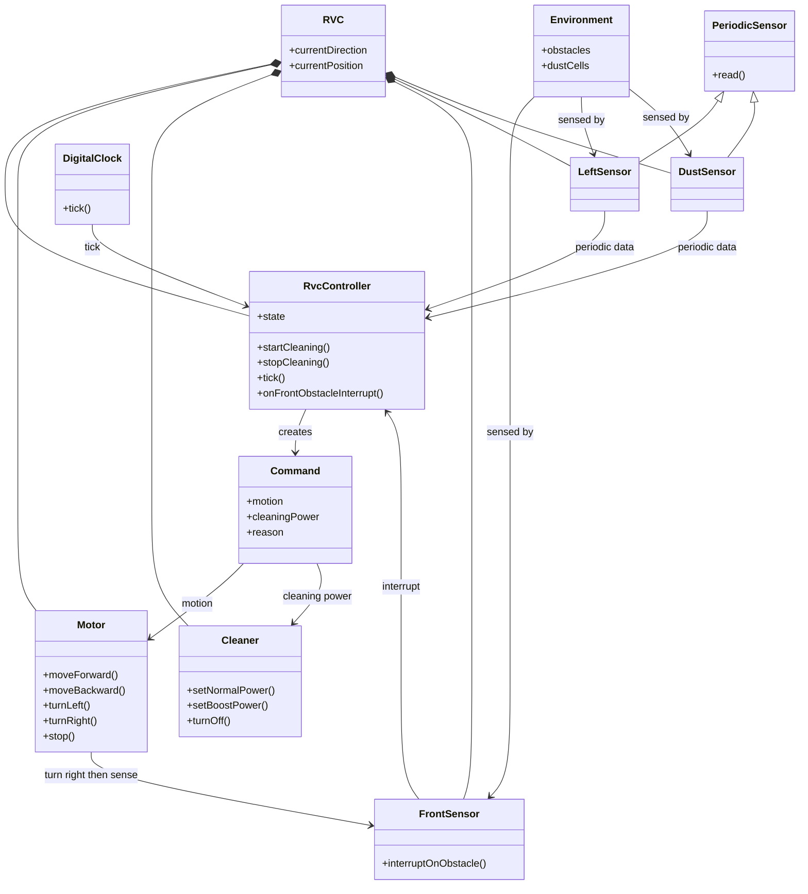

# RVC OOA Domain Diagram

## 1. Domain Model

이 다이어그램의 `Motor`, `Cleaner`, sensor 항목은 문제 영역의 도메인 개념이며 C++ 구현 클래스를 의미하지 않는다. [변경] 설계 문서의 구현 관점에서는 상위 객체 `Rvc`가 `RvcController`와 `RvcHardwareAdapter`를 소유하고, `GridSimulator`는 `SimulatedHardwareAdapter`를 통해 검증용 하드웨어 환경만 제공한다. [R2-변경] 우측 장애물 판단은 별도 RightSensor가 아니라 RVC의 `TurnRight` 동작 후 FrontSensor interrupt로 확인한다.
[삭제] ~~현재 구현에서는 `RvcController`가 `Command`를 생성하고 `GridSimulator`가 이를 검증 환경에 적용한다.~~

## 2. Domain Concepts

| Concept | Responsibility |
| --- | --- |
| RVC | household surface를 자동으로 청소하고 물걸레질하는 물리적 로봇 청소기 전체를 의미한다. |
| Rvc | [추가] 설계상 RVC Control SW의 상위 객체이며 controller와 hardware adapter를 묶어 RVC 시스템 경계를 드러낸다. |
| RvcController | [변경] 센서 입력과 interrupt를 기반으로 motor/cleaner 명령을 결정하되, sensor/actuator 구체 구현은 알지 않는다. |
| RvcHardwareAdapter | [추가] sensor 입력과 actuator command 적용을 추상화하는 경계이다. |
| SimulatedHardwareAdapter | [추가] `GridSimulator`가 제공하는 테스트용 외부 세계를 adapter 계약으로 표현한다. |
| FrontSensor | 전방 장애물을 interrupt로 알린다. |
| LeftSensor | 좌측 장애물 상태를 periodic 방식으로 제공한다. |
| [R2-삭제] ~~RightSensor~~ | ~~우측 장애물 상태를 periodic 방식으로 제공한다.~~ |
| DustSensor | 현재 위치의 먼지 감지 상태를 periodic 방식으로 제공한다. |
| DigitalClock | 제어 tick을 발생시킨다. |
| Motor | 전진, 후진, 좌회전, 우회전, 정지 동작을 수행한다. |
| Cleaner | normal power, boost power, off 상태를 수행하며, 현재 모델에서는 청소/물걸레질 출력을 대표하는 추상 actuator이다. |
| Environment | 장애물과 먼지가 있는 청소 공간이다. |
| Command | controller가 actuator에 전달하는 추상 명령이다. |

## 3. Important Domain Rules

- FrontSensor는 polling 대상이 아니라 interrupt source이다.
- [R2-변경] LeftSensor와 DustSensor는 DigitalClock tick에 맞춰 sampling된다.
- [R2-삭제] ~~RightSensor는 DigitalClock tick에 맞춰 sampling된다.~~
- [R2-추가] 우측 방향은 `Motor.turnRight()` 후 FrontSensor가 기존 우측 방향을 바라보는 방식으로 탐색한다.
- [변경] RvcController는 sensor와 actuator의 구체 구현을 알지 않는다.
- [추가] Rvc는 RvcController와 RvcHardwareAdapter를 소유해 RVC가 메인 시스템임을 드러낸다.
- PDF DFD Level 0의 `Tick`, `Direction`, `Clean` 흐름은 각각 `DigitalClock.tick()`, `Command.motion`, `Command.cleaningPower`에 대응된다.
- 회피/탈출 이동인 `Backward`, `TurnLeft`, `TurnRight` 동안 cleaner output은 `Off`이며, `Forward` 전진 청소에서만 `Normal` 또는 `Boost`가 적용된다.
- [R2-변경] `Escaping` 상태에서는 후방 센서 없이 `Backward`를 수행하고, 매 후진 후 좌측이 막혀 있으면 우측 탐색을 반복한다. 탈출 조건은 좌측 open 또는 우측 탐색 open이다.
- [변경] Simulator의 Environment는 실제 하드웨어가 아니라 `SimulatedHardwareAdapter`로 제공되는 테스트용 외부 세계이다.
