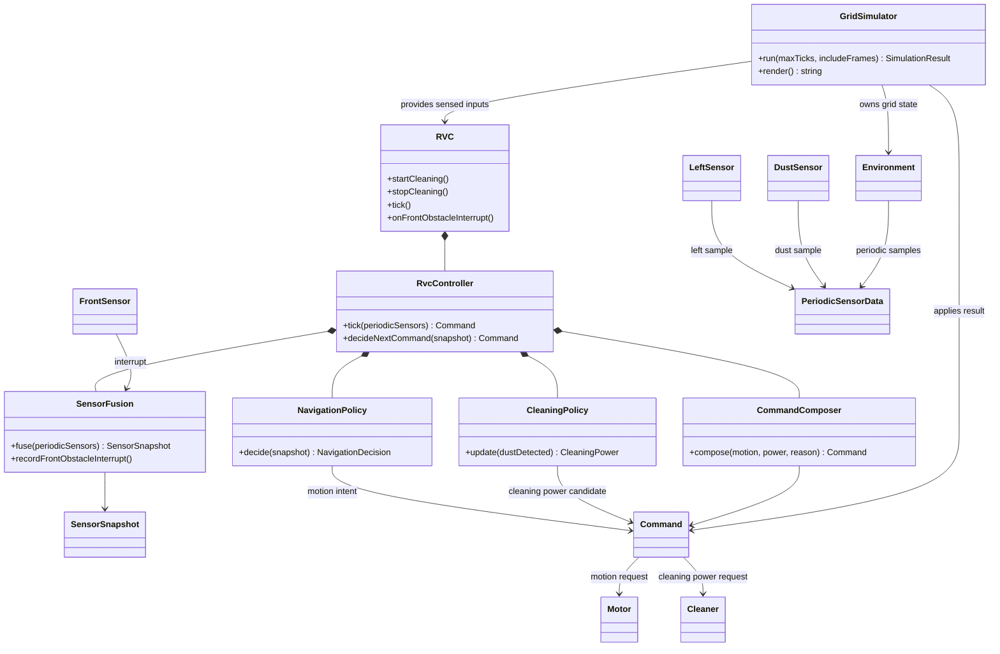

# RVC OOA Domain Diagram

## 1. Domain Model

## 2. Domain Responsibilities

| Concept | Responsibility |
| --- | --- |
| `RVC` | 실제 로봇 전체를 대표하는 facade이며 sensor 입력을 내부 제어 흐름으로 전달하고 최종 `Command`를 반환한다. |
| `SensorFusion` | [변경] front interrupt와 left/dust periodic 값을 `SensorSnapshot`으로 정규화한다. |
| `NavigationPolicy` | [변경] 좌측 회피, 후진, 우측 probe, 원복 회전을 포함한 이동 의도를 결정한다. |
| `CleaningPolicy` | 먼지 감지와 boost tick 예산을 바탕으로 청소 세기 후보를 결정한다. |
| `CommandComposer` | 전진 외 motion에서는 cleaner를 `Off`로 강제한다. |
| `GridSimulator` | [변경] 우측 주기 센서 없이 front interrupt와 left/dust periodic 입력을 생성한다. |

## 3. 변경 이력

| Tag | Item |
| --- | --- |
| [삭제] | Right Sensor domain actor와 right periodic sample 관계를 제거했다. |
| [변경] | `Environment --> PeriodicSensorData` 관계는 left/dust periodic sample만 의미한다. |
| [신규] | 우측 방향 검사는 Sensor actor가 아니라 `NavigationPolicy`의 회전 probe 흐름으로 모델링한다. |
