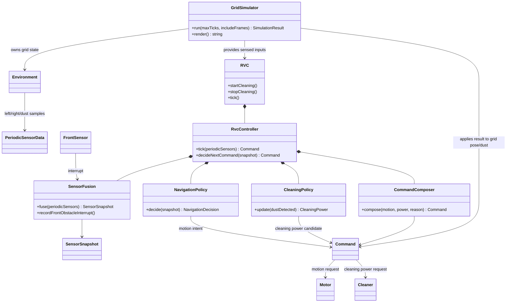

# RVC OOA Domain Diagram

## 1. Domain Model

## 2. Domain Responsibilities

| Concept | Responsibility |
| --- | --- |
| `RVC` | 실제 로봇 전체를 나타내는 facade이다. 외부에서 들어온 감지 입력을 내부 제어 흐름으로 전달하고 최종 `Command`를 반환한다. |
| `RvcController` | RVC 내부 제어 흐름을 조율한다. 직접 센서 결합, 이동 판단, 청소 세기 판단을 모두 구현하지 않고 subsystem에 위임한다. |
| `SensorFusion` | 전방 interrupt와 주기 센서 값을 하나의 `SensorSnapshot`으로 정규화한다. |
| `NavigationPolicy` | 현재 제어 상태와 sensor snapshot을 바탕으로 이동 의도인 `Motion`을 결정한다. |
| `CleaningPolicy` | 먼지 감지와 boost tick 예산을 바탕으로 청소 세기 후보를 결정한다. |
| `CommandComposer` | 이동 의도와 청소 세기 후보를 actuator 요청인 `Command`로 조립한다. 전진 외 동작에서는 cleaner를 `Off`로 강제한다. |
| `GridSimulator` | 검증용 환경이다. 격자 map, 로봇의 격자상 위치와 방향, 먼지 상태를 소유하고 RVC가 반환한 command를 환경에 적용한다. |
| `Motor`, `Cleaner`, `Sensor` | 실제 로봇의 하드웨어 역할이다. 현재 구현에서는 concrete hardware driver 대신 `Command`와 simulator 적용으로 추상화한다. |

## 3. Boundary

- RVC는 실제 로봇 전체의 제어 facade이지만, simulator 전용 좌표인 `Position`과 격자 기준 `Direction`은 소유하지 않는다.
- 위치와 방향은 `GridSimulator`가 검증 환경 상태로 보관한다.
- RVC 내부 SOLID 적용 단위는 `SensorFusion`, `NavigationPolicy`, `CleaningPolicy`, `CommandComposer`이다.
