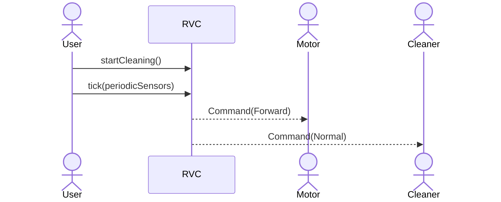
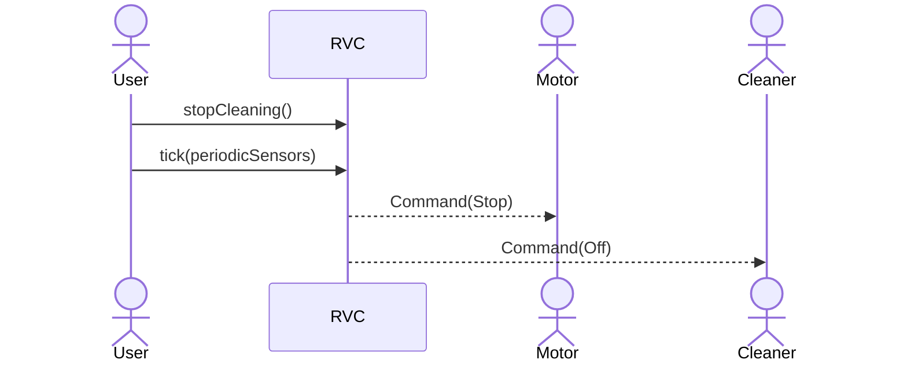
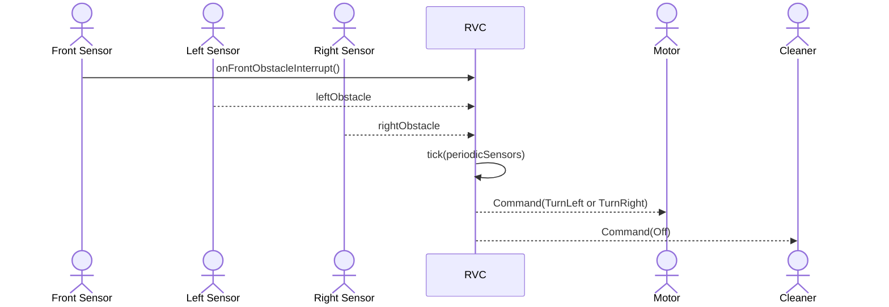
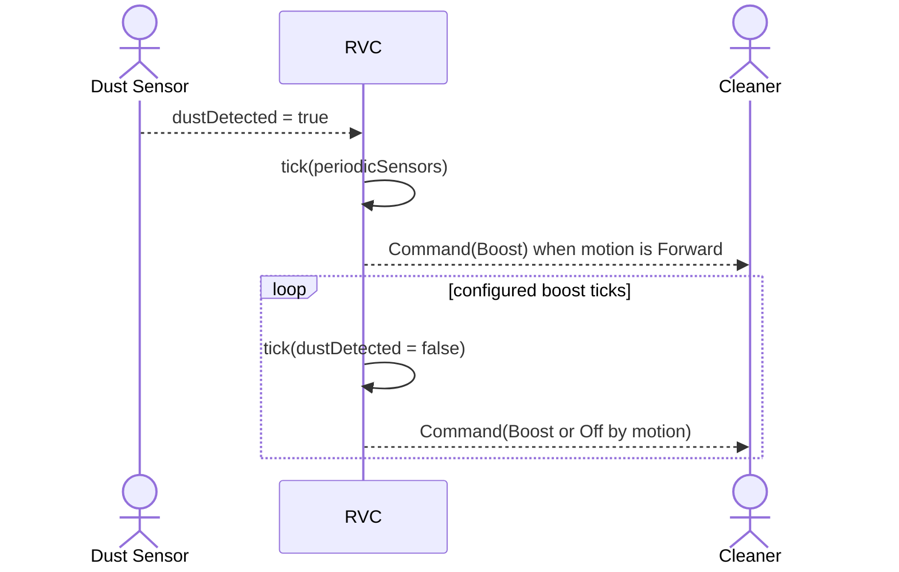
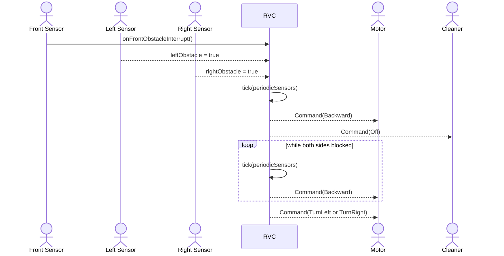
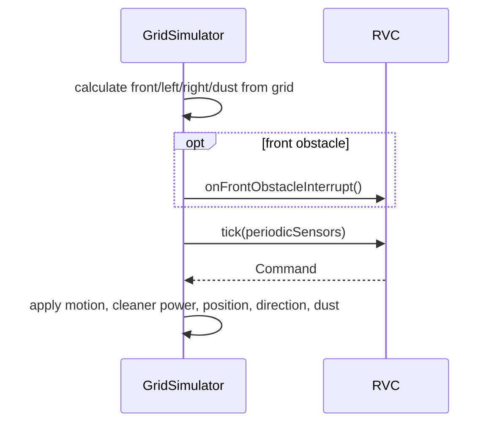

# RVC OOA System Sequence Diagrams

## 1. SSD-01 Start Automatic Cleaning

## 2. SSD-02 Stop Automatic Cleaning

## 3. SSD-03 Front Obstacle Avoidance

## 4. SSD-04 Dust Boost

## 5. SSD-05 Escape From Blocked Area

## 6. SSD-06 Simulator Verification

## 7. System Operations

| Operation | Input | Output | Responsibility |
| --- | --- | --- | --- |
| `startCleaning()` | none | none | RVC를 running 상태로 전환한다. |
| `stopCleaning()` | none | none | RVC를 idle 상태로 전환하고 cleaner output을 끈다. |
| `onFrontObstacleInterrupt()` | none | none | 전방 장애물 event를 pending 상태로 기록한다. |
| `tick(periodicSensors)` | `PeriodicSensorData` | `Command` | 감지 결합, 이동 판단, 청소 세기 판단, command 조립을 수행한다. |
