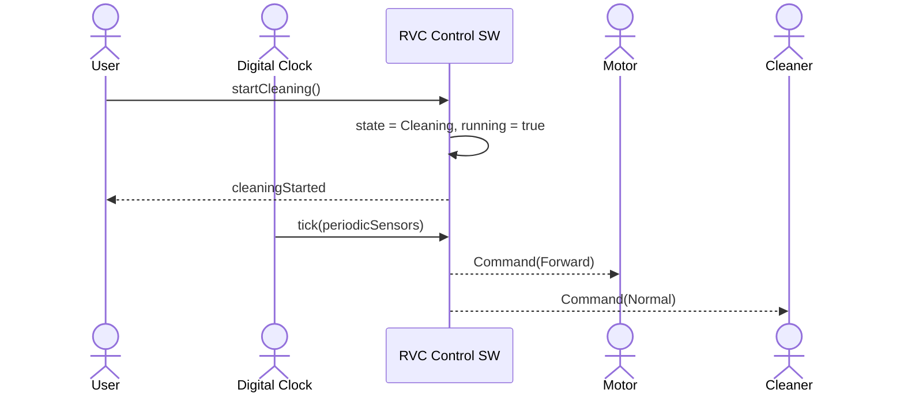
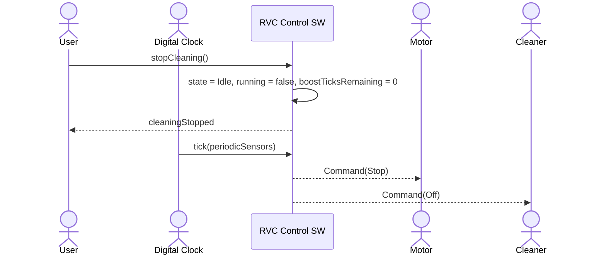
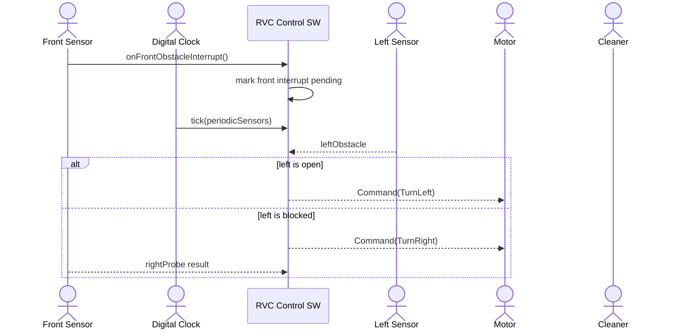
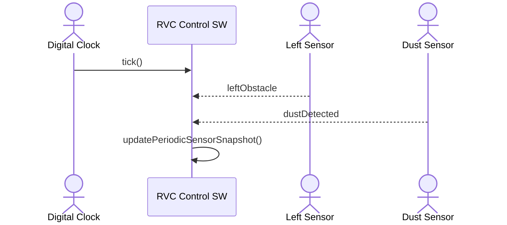
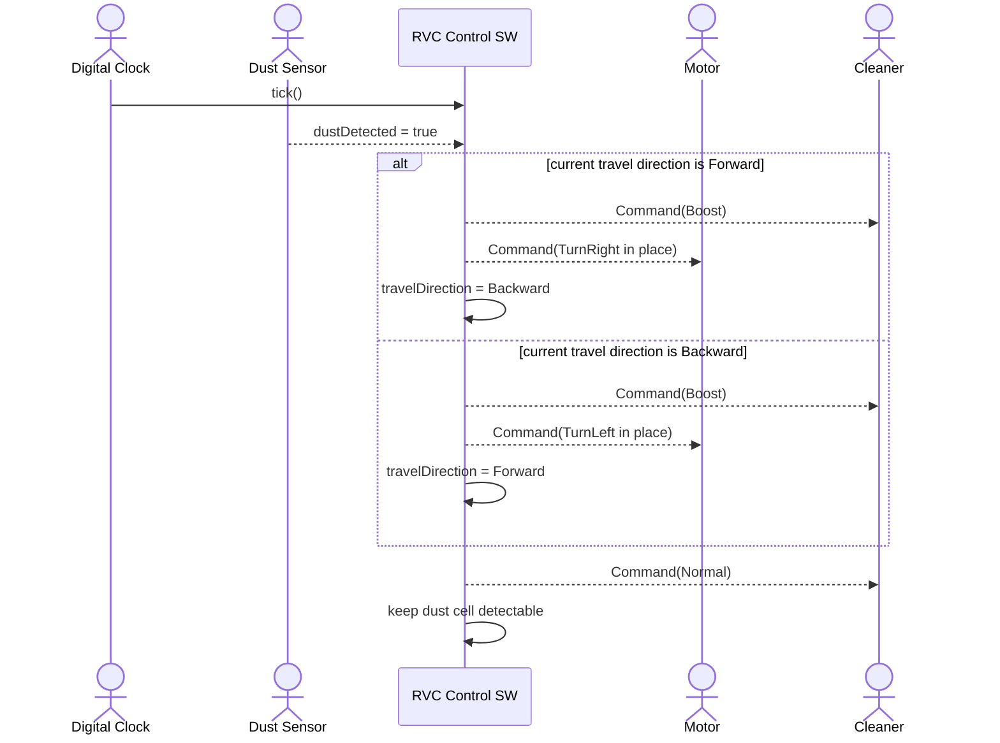
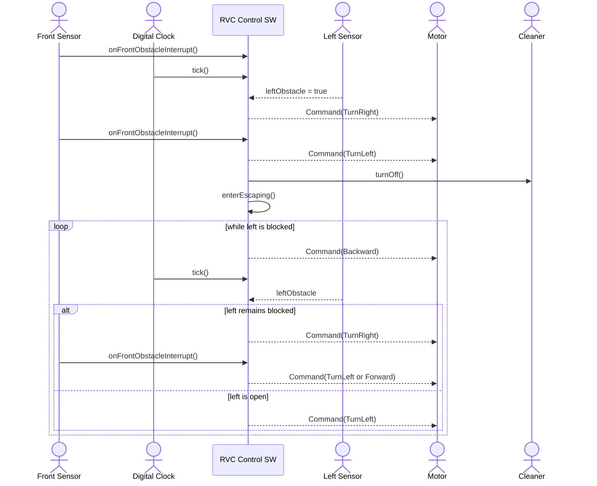
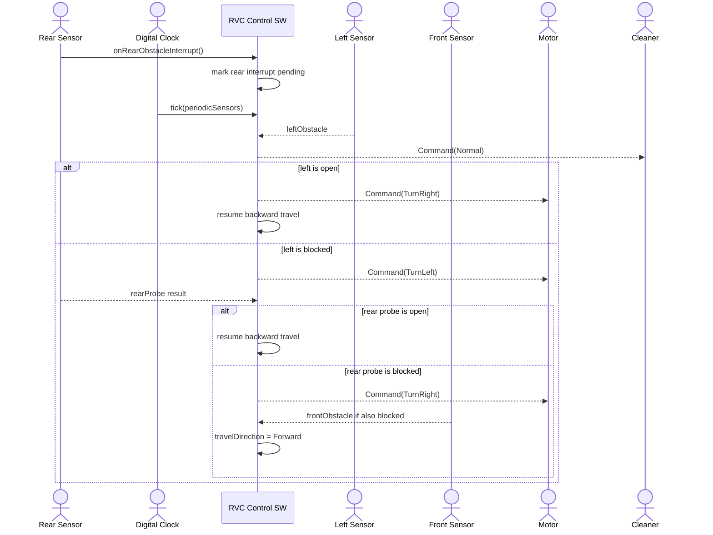

# RVC OOA System Sequence Diagrams

## 1. Overview

이 문서는 RVC Control SW의 OOA 단계 산출물로, 외부 actor와 system 사이의 이벤트 흐름을 System Sequence Diagram으로 정리한다. [R2-변경] 전방 센서는 interrupt actor이고, 좌측/먼지 센서는 periodic actor로 모델링한다. [R2-삭제] ~~우측 센서는 periodic actor로 모델링한다.~~ 우측 방향은 RVC가 우측으로 90도 회전한 뒤 전방 센서로 탐색한다. [R3-추가] 후방 센서는 후진 주행 중 rear obstacle interrupt actor로 모델링한다.

## 2. SSD-01 Start Automatic Cleaning

## 3. SSD-06 Stop Automatic Cleaning

## 4. SSD-02 Front Obstacle Interrupt

## 5. SSD-03 Periodic Sensor Sampling

## 6. SSD-04 Boost Cleaning On Dust

[R3-변경] R3 기준에서는 먼지 감지 시 fixed boost period를 시작하지 않는다. RVC는 현재 주행 방향에 따라 필요한 제자리 회전 동안만 `Boost`를 사용하고, 회전 후 전진/후진 주행 방향을 toggle한다. [R2-기존] ~~먼지 감지 후 설정 tick 동안 `Boost`를 유지한다.~~

## 7. SSD-05 Escape From Blocked Area

## 8. SSD-07 Rear Obstacle Interrupt During Backward Travel

## 9. System Interface

| Operation | Input | Output | Responsibility |
| --- | --- | --- | --- |
| `startCleaning()` | none | none | 자동 청소를 시작하고 controller state를 cleaning으로 전환한다. |
| `stopCleaning()` | none | none | 이동과 청소를 중지하고 controller state를 idle로 전환한다. |
| `onFrontObstacleInterrupt()` | none | none | 전방 장애물 interrupt를 기록하여 다음 제어 판단에서 즉시 회피하게 한다. |
| `onRearObstacleInterrupt()` | none | none | [R3-추가] 후진 주행 중 후방 장애물 interrupt를 기록하여 다음 제어 판단에서 후진 기준 회피를 수행하게 한다. |
| `tick(periodicSensors)` | `PeriodicSensorData` | `Command` | 주기 센서 값을 반영하고 다음 motor/cleaner 명령을 결정한다. |
| `readPeriodicSensors(periodicSensors)` | `PeriodicSensorData` | `SensorSnapshot` | [R2-변경] 좌측, 먼지 periodic 값과 pending front interrupt 및 우측 탐색 결과를 하나의 snapshot으로 결합한다. [R3-추가] rear interrupt와 travel direction도 판단 입력으로 확장한다. [R2-삭제] ~~우측 periodic 값을 결합한다.~~ |
| `decideNextCommand(snapshot)` | `SensorSnapshot` | `Command` | 핵심 제어 규칙에 따라 다음 동작 명령을 계산한다. |

## 10. System Operations

| Operation | Related FR | Notes |
| --- | --- | --- |
| `startCleaning()` | FR-01, FR-03 | 실행 상태를 시작하며 실제 전진/청소 명령은 다음 `tick()`에서 생성된다. |
| `stopCleaning()` | FR-02 | 실행 상태와 dust/cleaner 정책 상태를 초기화하며 다음 `tick()`에서 `Stop`/`Off` command가 생성된다. |
| `onFrontObstacleInterrupt()` | FR-04, FR-05 | interrupt는 다음 `tick()`보다 먼저 들어올 수 있다. |
| `onRearObstacleInterrupt()` | FR-19, FR-20 | [R3-추가] 후진 주행 중 후방 장애물 interrupt가 다음 `tick()` 판단에 반영된다. |
| `tick(periodicSensors)` | FR-06 | Digital Clock의 제어 주기마다 호출된다. |
| `decideNextCommand(snapshot)` | FR-07 to FR-26 | 회피, 탈출, R3 dust rotation, cleaner default `Normal`, rear interrupt, verification support 규칙을 포함한다. |
