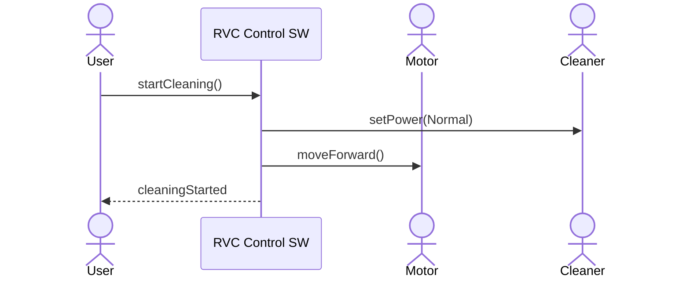
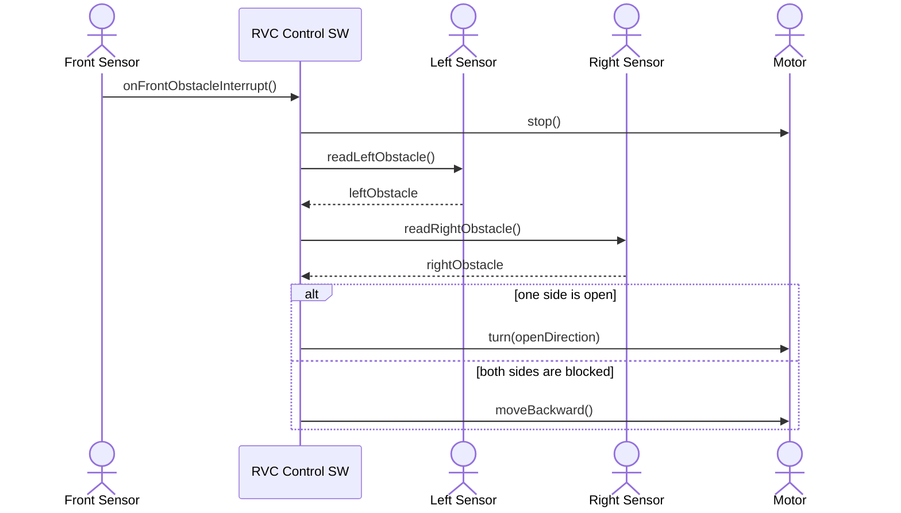
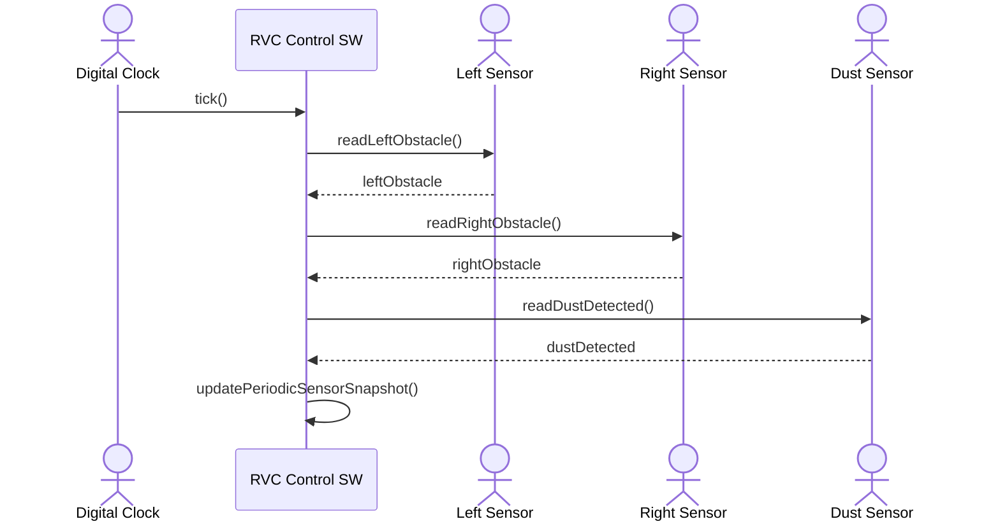
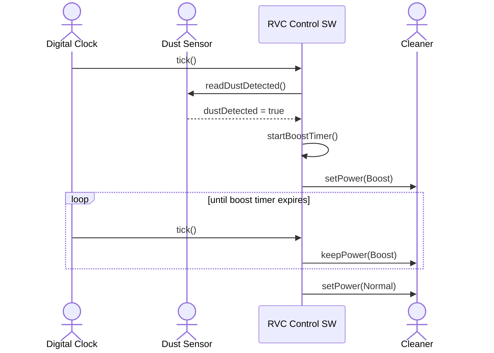
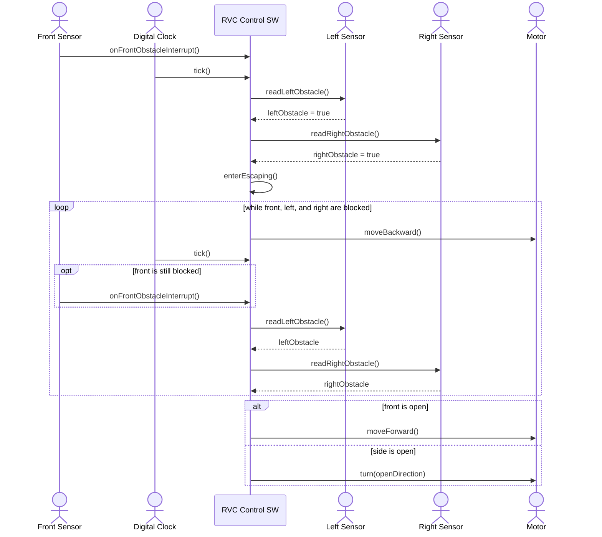

# RVC OOA System Sequence Diagrams

## 1. Overview

이 문서는 RVC Control SW의 OOA 단계 산출물로, 외부 actor와 system 사이의 이벤트 흐름을 System Sequence Diagram으로 정리한다. 전방 센서는 interrupt actor이고, 좌측/우측/먼지 센서는 periodic actor로 모델링한다.

## 2. SSD-01 Start Automatic Cleaning

## 3. SSD-02 Front Obstacle Interrupt

## 4. SSD-03 Periodic Sensor Sampling

## 5. SSD-04 Boost Cleaning On Dust

## 6. SSD-05 Escape From Blocked Area

## 7. System Interface

| Operation | Input | Output | Responsibility |
| --- | --- | --- | --- |
| `startCleaning()` | none | none | 자동 청소를 시작하고 controller state를 cleaning으로 전환한다. |
| `stopCleaning()` | none | none | 이동과 청소를 중지하고 controller state를 idle로 전환한다. |
| `onFrontObstacleInterrupt()` | none | none | 전방 장애물 interrupt를 기록하여 다음 제어 판단에서 즉시 회피하게 한다. |
| `tick(periodicSensors)` | `PeriodicSensorData` | `Command` | 주기 센서 값을 반영하고 다음 motor/cleaner 명령을 결정한다. |
| `readPeriodicSensors(periodicSensors)` | `PeriodicSensorData` | `SensorSnapshot` | 좌측, 우측, 먼지 periodic 값과 pending front interrupt를 하나의 snapshot으로 결합한다. |
| `decideNextCommand(snapshot)` | `SensorSnapshot` | `Command` | 핵심 제어 규칙에 따라 다음 동작 명령을 계산한다. |

## 8. System Operations

| Operation | Related FR | Notes |
| --- | --- | --- |
| `startCleaning()` | FR-01, FR-03 | 기본 전진 청소 흐름을 시작한다. |
| `stopCleaning()` | FR-02 | cleaner off와 motor stop을 의미한다. |
| `onFrontObstacleInterrupt()` | FR-04, FR-05 | interrupt는 다음 `tick()`보다 먼저 들어올 수 있다. |
| `tick(periodicSensors)` | FR-06 | Digital Clock의 제어 주기마다 호출된다. |
| `decideNextCommand(snapshot)` | FR-07 to FR-15 | 회피, 탈출, boost 규칙을 포함한다. |
