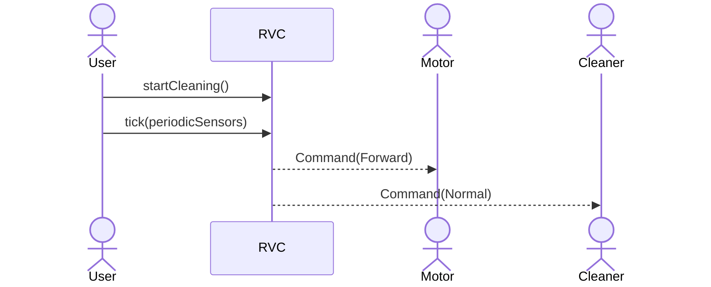
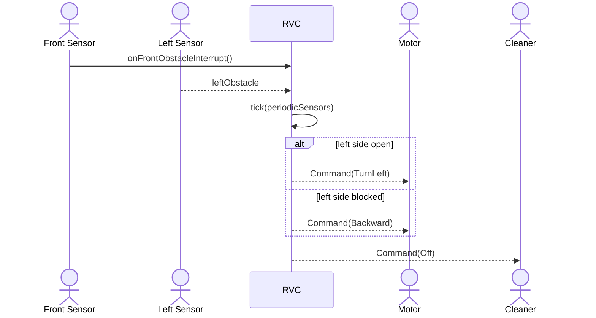
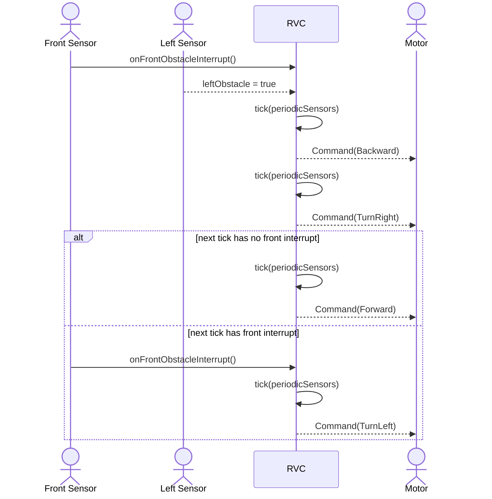
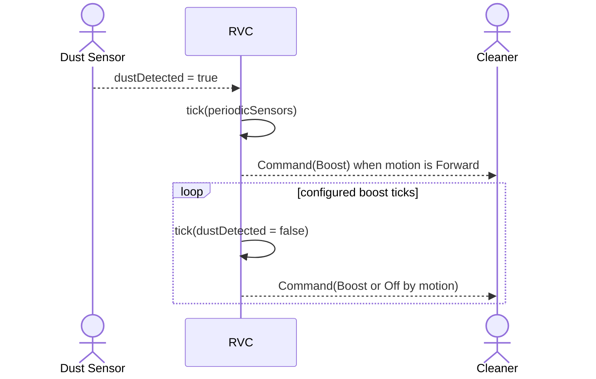

# RVC OOA System Sequence Diagrams

## 1. SSD-01 Start Automatic Cleaning

## 2. SSD-02 Front Obstacle Avoidance

## 3. SSD-03 Escape Right Probe

## 4. SSD-04 Dust Boost

## 5. 변경 이력

| Tag | Item |
| --- | --- |
| [삭제] | `RightSensor` actor와 `rightObstacle` periodic 입력을 제거했다. |
| [변경] | 전방 장애물 회피는 좌측이 열리면 좌회전, 좌측이 막히면 후진 탈출로 분기한다. |
| [신규] | 우측 탈출 확인은 우회전 후 다음 tick의 front interrupt 유무로 판단한다. |
| [신규] | `Backward`, `TurnRight`, `TurnLeft`, `Forward`는 모두 별도 tick을 소비한다. |
