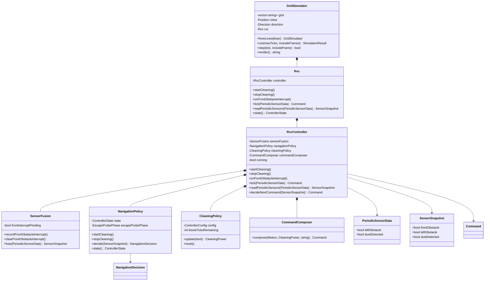

# RVC OOD Class Diagram

## 1. Class Diagram

## 2. Class Responsibilities

| Class | Responsibility |
| --- | --- |
| `SensorFusion` | [변경] front interrupt pending 값과 left/dust periodic data만 결합한다. |
| `NavigationPolicy` | [변경] `EscapeProbePhase`로 후진, 우회전 probe, 전방 interrupt 평가를 관리한다. |
| `PeriodicSensorData` | [변경] `leftObstacle`, `dustDetected`만 가진다. |
| `SensorSnapshot` | [변경] `frontObstacle`, `leftObstacle`, `dustDetected`만 가진다. |
| `GridSimulator` | [변경] 우측 주기 센서 샘플링 없이 command를 적용한다. |

## 3. Design Decisions

| Tag | Decision |
| --- | --- |
| [삭제] | `rightObstacle` 필드와 좌우 교대 회전 상태인 `preferLeftTurn`을 제거했다. |
| [신규] | `EscapeProbePhase`는 `BackingUp`, `TurningRight`, `EvaluatingRightProbe` 흐름을 표현한다. |
| [신규] | 우측 probe 성공은 `EvaluatingRightProbe` tick에서 `frontObstacle == false`인 경우로 판단한다. |
| [신규] | 우측 probe 실패는 `frontObstacle == true`인 경우이며 `TurnLeft`로 원래 방향을 복구한다. |
