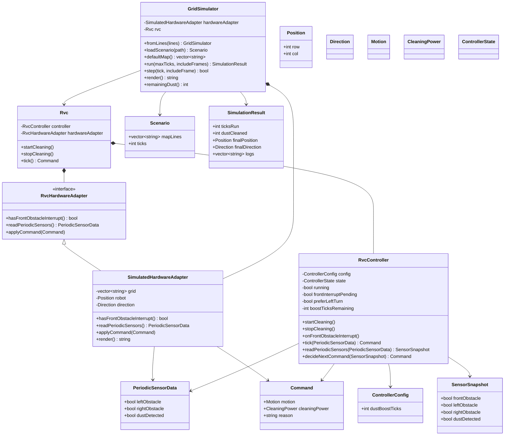

# RVC OOD Class Diagram

## 1. Class Diagram

[변경] 클래스 다이어그램은 `GridSimulator`가 `RvcController`를 직접 소유하는 구조가 아니라, 상위 객체 `Rvc`가 `RvcController`와 `RvcHardwareAdapter`를 소유하는 구조를 기준으로 한다.
[삭제] ~~`GridSimulator *-- RvcController`~~
[추가] `Rvc *-- RvcController`, `Rvc *-- RvcHardwareAdapter`, `RvcHardwareAdapter <|-- SimulatedHardwareAdapter`

## 2. Class Responsibilities

| Class | Responsibility |
| --- | --- |
| `Rvc` | [추가] RVC 상위 시스템 객체로서 `RvcController`와 `RvcHardwareAdapter`를 소유하고, 제어 tick에서 sensor 입력 수집, controller 호출, command 적용 순서를 조율한다. |
| `RvcController` | [변경] 하드웨어나 시뮬레이터를 소유하지 않고, sensor snapshot과 핵심 제어 규칙에 따라 command를 결정한다. |
| `ControllerConfig` | boost duration 같은 제어 정책 값을 제공한다. |
| `PeriodicSensorData` | 좌측, 우측, 먼지 periodic sensor 값을 전달한다. |
| `SensorSnapshot` | pending front interrupt와 periodic sensor 값을 결합한 판단 입력이다. |
| `Command` | motor motion과 cleaner power를 함께 표현하는 추상 actuator 명령이다. `Forward`에서는 `Normal` 또는 `Boost`를 전달하고, `Backward`, `TurnLeft`, `TurnRight`, `Stop`에서는 cleaner output `Off`를 전달한다. |
| `RvcHardwareAdapter` | [추가] 전방 interrupt 확인, periodic sensor 읽기, `Command` 적용을 추상화하는 하드웨어 adapter interface이다. |
| `SimulatedHardwareAdapter` | [추가] 격자 지도에서 테스트용 sensor/event를 만들고 `Command`를 격자 상태에 적용한다. |
| `GridSimulator` | [변경] `SimulatedHardwareAdapter`를 사용해 시나리오 실행, 로그, 렌더링을 제공하는 검증 환경이며 `RvcController`를 직접 소유하지 않는다. |
| `Scenario` | 시나리오 파일에서 읽은 지도와 기본 tick 수를 담는다. |
| `SimulationResult` | 시스템 테스트와 CLI 출력에 필요한 실행 결과를 담는다. |

## 3. SOLID Analysis

| Principle | Application |
| --- | --- |
| SRP | [변경] `RvcController`는 제어 결정만 담당하고, `Rvc`는 controller와 hardware adapter 사이의 실행 흐름만 조율하며, `GridSimulator`는 검증 환경 제공만 담당한다. |
| OCP | sensor 입력은 `PeriodicSensorData`와 interrupt API로 추상화되어 새 sensor 추가 시 controller 확장이 가능하다. |
| LSP | [변경] `SimulatedHardwareAdapter`와 실제 하드웨어 adapter는 같은 `RvcHardwareAdapter` 계약과 `Command` 의미를 따르므로 대체 가능하다. |
| ISP | controller의 public interface는 시작, 중지, interrupt, tick, 판단에 필요한 작은 operation으로 분리된다. |
| DIP | [변경] `Rvc`는 추상 `RvcHardwareAdapter`에 의존하고, `RvcController`는 concrete simulator나 hardware에 의존하지 않고 값 객체와 추상 command에만 의존한다. |

## 4. Design Decisions

- 전방 장애물은 `onFrontObstacleInterrupt()`로만 controller에 전달한다.
- 좌/우/먼지 값은 `tick(PeriodicSensorData)` 호출마다 controller에 전달한다.
- [추가] `Rvc`는 매 tick마다 `RvcHardwareAdapter`에서 전방 interrupt 여부와 periodic sensor 값을 읽고, `RvcController`가 반환한 `Command`를 다시 adapter에 적용한다.
- [추가] `GridSimulator`는 `SimulatedHardwareAdapter`를 구성해 테스트용 지도, sensor/event, command 적용 결과를 제공한다.
- [삭제] ~~`GridSimulator`가 `RvcController`를 직접 소유하고 controller command를 직접 적용한다.~~
- `readPeriodicSensors()`는 pending front interrupt와 periodic 값을 결합하여 `SensorSnapshot`을 만든다.
- `decideNextCommand()`는 단일 판단 지점으로 두어 테스트를 쉽게 한다.
- `Escaping` 상태에서 좌/우가 계속 막혀 있으면 전방 interrupt 여부와 관계없이 반드시 `Backward` command를 반복한다.
- cleaner output 정책은 motion이 우선한다. 회피/탈출 이동 중에는 dust boost 상태가 남아 있어도 `Off`가 command에 기록되고, 전진 청소 재개 시 남은 boost 상태에 따라 `Boost` 또는 `Normal`을 기록한다.
- PDF DFD Level 0의 `Direction`, `Clean`, `Tick`은 각각 `Command.motion`, `Command.cleaningPower`, `tick(PeriodicSensorData)` 설계 요소로 대응된다.
