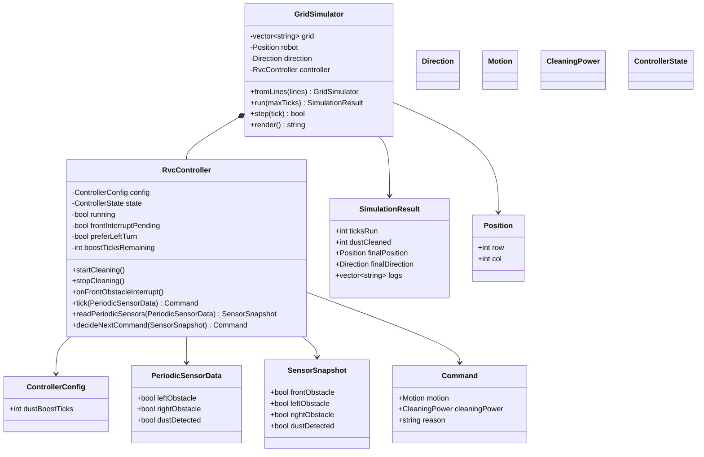

# RVC OOD Class Diagram

## 1. Class Diagram

## 2. Class Responsibilities

| Class | Responsibility |
| --- | --- |
| `RvcController` | 문서의 system interface를 구현하고 핵심 제어 규칙에 따라 command를 결정한다. |
| `ControllerConfig` | boost duration 같은 제어 정책 값을 제공한다. |
| `PeriodicSensorData` | 좌측, 우측, 먼지 periodic sensor 값을 전달한다. |
| `SensorSnapshot` | pending front interrupt와 periodic sensor 값을 결합한 판단 입력이다. |
| `Command` | motor motion과 cleaner power를 함께 표현하는 추상 actuator 명령이다. `Forward`에서는 `Normal` 또는 `Boost`를 전달하고, `Backward`, `TurnLeft`, `TurnRight`, `Stop`에서는 cleaner output `Off`를 전달한다. |
| `GridSimulator` | 격자 환경에서 sensor/event를 만들고 controller command를 적용한다. |
| `SimulationResult` | 시스템 테스트와 CLI 출력에 필요한 실행 결과를 담는다. |

## 3. SOLID Analysis

| Principle | Application |
| --- | --- |
| SRP | `RvcController`는 제어 결정만 담당하고, `GridSimulator`는 환경과 이동 적용만 담당한다. |
| OCP | sensor 입력은 `PeriodicSensorData`와 interrupt API로 추상화되어 새 sensor 추가 시 controller 확장이 가능하다. |
| LSP | simulator와 실제 하드웨어 어댑터는 같은 `Command` 의미를 따르므로 대체 가능하다. |
| ISP | controller의 public interface는 시작, 중지, interrupt, tick, 판단에 필요한 작은 operation으로 분리된다. |
| DIP | controller는 concrete simulator나 hardware에 의존하지 않고 값 객체와 추상 command에만 의존한다. |

## 4. Design Decisions

- 전방 장애물은 `onFrontObstacleInterrupt()`로만 controller에 전달한다.
- 좌/우/먼지 값은 `tick(PeriodicSensorData)` 호출마다 controller에 전달한다.
- `readPeriodicSensors()`는 pending front interrupt와 periodic 값을 결합하여 `SensorSnapshot`을 만든다.
- `decideNextCommand()`는 단일 판단 지점으로 두어 테스트를 쉽게 한다.
- `Escaping` 상태에서 좌/우가 계속 막혀 있으면 전방 interrupt 여부와 관계없이 반드시 `Backward` command를 반복한다.
- cleaner output 정책은 motion이 우선한다. 회피/탈출 이동 중에는 dust boost 상태가 남아 있어도 `Off`가 command에 기록되고, 전진 청소 재개 시 남은 boost 상태에 따라 `Boost` 또는 `Normal`을 기록한다.
- PDF DFD Level 0의 `Direction`, `Clean`, `Tick`은 각각 `Command.motion`, `Command.cleaningPower`, `tick(PeriodicSensorData)` 설계 요소로 대응된다.
