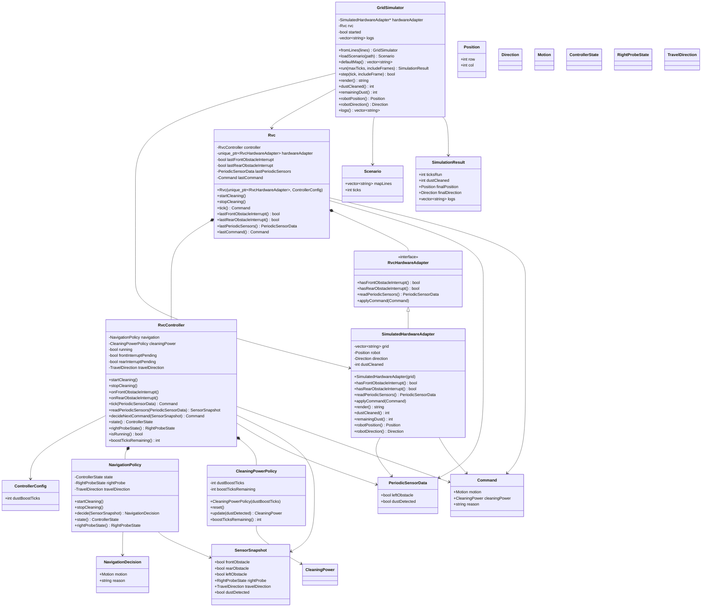

# RVC OOD Class Diagram

## 1. Class Diagram

[r3변경] 클래스 다이어그램은 `GridSimulator`가 `RvcController`를 직접 소유하는 구조가 아니라, 상위 객체 `Rvc`가 `RvcController`와 `RvcHardwareAdapter`를 소유하는 구조를 기준으로 한다. `RvcController`의 navigation/power 판단 책임은 `NavigationPolicy`와 `CleaningPowerPolicy`로 분리된 구조를 반영한다.
[삭제] ~~`GridSimulator *-- RvcController`~~
[추가] `Rvc *-- RvcController`, `Rvc *-- RvcHardwareAdapter`, `RvcHardwareAdapter <|-- SimulatedHardwareAdapter`
[R2-변경] 우측 장애물 입력은 별도 periodic sensor field가 아니라 `TurnRight` 후 front interrupt로 얻는 우측 탐색 결과로 표현한다.
[r3삭제] ~~`RvcController`가 `ControllerState`, `RightProbeState`, `boostTicksRemaining`을 직접 보유해 navigation과 dust boost 정책을 모두 처리한다.~~
[r3추가] `NavigationPolicy`, `CleaningPowerPolicy`, `NavigationDecision`을 별도 설계 요소로 추가한다.
[R3-추가] 후방 장애물 interrupt와 전진/후진 travel direction 상태를 설계 입력에 추가한다.

## 2. Class Responsibilities

| Class | Responsibility |
| --- | --- |
| `Rvc` | [추가] RVC 상위 시스템 객체로서 `RvcController`와 `RvcHardwareAdapter`를 소유하고, 제어 tick에서 sensor 입력 수집, controller 호출, command 적용 순서를 조율한다. |
| `RvcController` | [r3변경] 하드웨어나 시뮬레이터를 소유하지 않고, 실행 상태, front/rear interrupt 소비, travel direction을 조율하며 `NavigationPolicy`와 `CleaningPowerPolicy` 결과를 조합해 command를 반환한다. [r3삭제] ~~navigation 상태 전이와 dust boost tick을 직접 관리한다.~~ |
| `NavigationPolicy` | [r3추가] 전방/후방/좌측 장애물, travel direction, 우측 탐색 상태를 기반으로 다음 motion과 회피/탈출 상태 전이를 결정한다. |
| `CleaningPowerPolicy` | [r3추가] R3 기준에서는 청소 중 기본 `Normal`과 먼지 감지 시 제자리 회전 구간의 `Boost` 후보를 motion 판단과 독립적으로 결정한다. [R2-기존] fixed tick boost 예산을 관리한다. |
| `NavigationDecision` | [r3추가] navigation 판단 결과인 motion과 판단 이유를 담는다. |
| `ControllerConfig` | boost duration, dust rotation duration 같은 제어 정책 값을 제공한다. |
| `PeriodicSensorData` | [R2-변경] 좌측, 먼지 periodic sensor 값을 전달한다. [R2-삭제] ~~우측 periodic sensor 값을 전달한다.~~ |
| `SensorSnapshot` | [R2-변경] pending front interrupt, 좌측/먼지 periodic sensor 값, 우측 탐색 결과를 결합한 판단 입력이다. [R3-추가] pending rear interrupt와 travel direction을 포함하도록 확장한다. |
| `Command` | motor motion과 cleaner power를 함께 표현하는 추상 actuator 명령이다. [R3-변경] 청소 중 이동/회피/탈출 motion은 기본 `Normal`, 먼지 제자리 회전 구간만 `Boost`, 중지 상태는 `Off`를 전달한다. |
| `RvcHardwareAdapter` | [추가] 전방/후방 interrupt 확인, periodic sensor 읽기, `Command` 적용을 추상화하는 하드웨어 adapter interface이다. |
| `SimulatedHardwareAdapter` | [추가] 격자 지도에서 테스트용 front/rear sensor event를 만들고 `Command`를 격자 상태에 적용한다. [R3-변경] 먼지는 청소 후에도 persistent fixture로 남긴다. |
| `GridSimulator` | [변경] `SimulatedHardwareAdapter`를 사용해 시나리오 실행, 로그, 렌더링을 제공하는 검증 환경이며 `RvcController`를 직접 소유하지 않는다. |
| `Scenario` | 시나리오 파일에서 읽은 지도와 기본 tick 수를 담는다. |
| `SimulationResult` | 시스템 테스트와 CLI 출력에 필요한 실행 결과를 담는다. |

## 3. SOLID Analysis

| Principle | Application |
| --- | --- |
| SRP | [r3변경] `RvcController`는 tick 실행과 command 조합을 담당하고, 방향/회피 상태 전이는 `NavigationPolicy`, 먼지 boost 예산은 `CleaningPowerPolicy`, 하드웨어 흐름은 `Rvc`, 검증 환경은 `GridSimulator`가 담당한다. |
| OCP | [R2-변경] sensor 입력은 `PeriodicSensorData`, interrupt API, 우측 탐색 상태로 추상화되어 sensor 변경 시 controller 확장이 가능하다. |
| LSP | [변경] `SimulatedHardwareAdapter`와 실제 하드웨어 adapter는 같은 `RvcHardwareAdapter` 계약과 `Command` 의미를 따르므로 대체 가능하다. |
| ISP | controller의 public interface는 시작, 중지, interrupt, tick, 판단에 필요한 작은 operation으로 분리된다. |
| DIP | [변경] `Rvc`는 추상 `RvcHardwareAdapter`에 의존하고, `RvcController`는 concrete simulator나 hardware에 의존하지 않고 값 객체와 추상 command에만 의존한다. |

## 4. Design Decisions

- 전방 장애물은 `onFrontObstacleInterrupt()`로만 controller에 전달한다.
- [R3-추가] 후방 장애물은 후진 주행 중 `onRearObstacleInterrupt()`로 controller에 전달한다.
- [R2-변경] 좌측/먼지 값은 `tick(PeriodicSensorData)` 호출마다 controller에 전달한다.
- [R2-삭제] ~~우측 값은 `tick(PeriodicSensorData)` 호출마다 controller에 전달한다.~~
- [R2-추가] 우측 장애물 판단은 `TurnRight` 후 front interrupt로 수행하며, 우측 탐색 실패 시 `TurnLeft`로 원래 진행 방향을 복구한 뒤 후진한다.
- [추가] `Rvc`는 매 tick마다 `RvcHardwareAdapter`에서 전방 interrupt 여부와 periodic sensor 값을 읽고, `RvcController`가 반환한 `Command`를 다시 adapter에 적용한다.
- [추가] `GridSimulator`는 `SimulatedHardwareAdapter`를 구성해 테스트용 지도, sensor/event, command 적용 결과를 제공한다.
- [삭제] ~~`GridSimulator`가 `RvcController`를 직접 소유하고 controller command를 직접 적용한다.~~
- `readPeriodicSensors()`는 pending front interrupt와 periodic 값을 결합하여 `SensorSnapshot`을 만든다.
- [r3변경] `decideNextCommand()`는 `NavigationPolicy`의 motion 판단과 `CleaningPowerPolicy`의 cleaner power 판단을 조합하는 지점으로 두어 테스트를 쉽게 한다. [r3삭제] ~~단일 controller 내부에서 회피, 탈출, boost 판단을 모두 처리한다.~~
- [R2-변경] `Escaping` 상태에서는 `Backward` 1회 후 좌측이 계속 막혀 있으면 우측 탐색을 반복한다. 우측 탐색 실패 후에는 원래 진행 방향을 복구한 뒤 후진한다.
- [R2-기존] cleaner output 정책은 motion이 우선한다. 회피/탈출 이동 중에는 dust boost 상태가 남아 있어도 `Off`가 command에 기록되고, 전진 청소 재개 시 남은 boost 상태에 따라 `Boost` 또는 `Normal`을 기록한다.
- [R3-변경] cleaner output 정책은 청소 중 기본 `Normal` 유지로 바뀐다. `Boost`는 dust-triggered in-place rotation 동안만 사용하고, 회피/탈출/후진 중에도 `Normal`을 유지한다.
- [R3-변경] 먼지 감지는 travel direction을 전진/후진으로 toggle하며, 전진 중에는 clockwise, 후진 중에는 counterclockwise 제자리 회전을 수행한다.
- [R3-변경] `SimulatedHardwareAdapter`는 `Boost` 적용 후에도 dust cell을 제거하지 않고 재감지 가능하게 유지한다.
- PDF DFD Level 0의 `Direction`, `Clean`, `Tick`은 각각 `Command.motion`, `Command.cleaningPower`, `tick(PeriodicSensorData)` 설계 요소로 대응된다.
