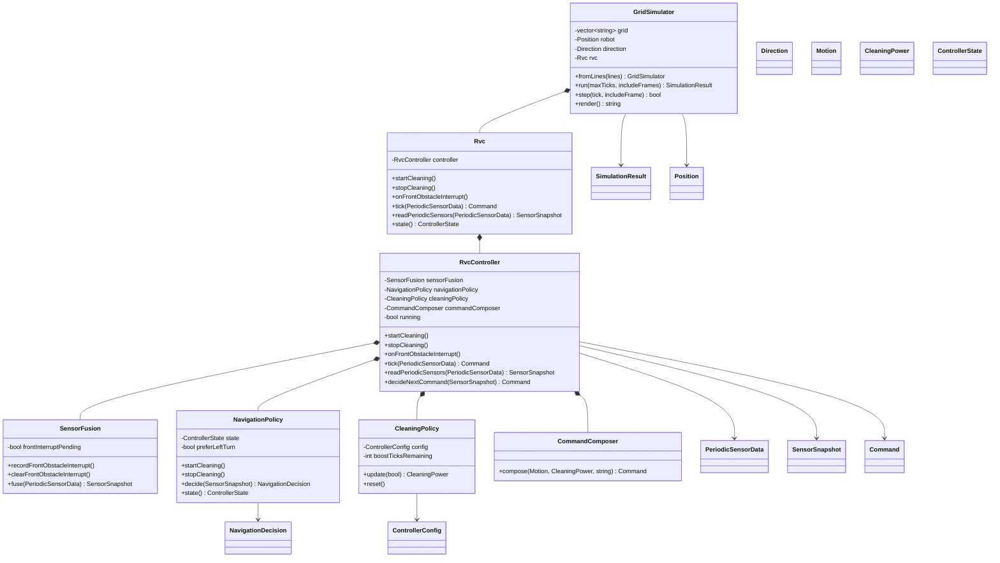

# RVC OOD Class Diagram

## 1. Class Diagram

## 2. Class Responsibilities

| Class | Responsibility |
| --- | --- |
| `Rvc` | 실제 로봇 전체 facade이다. 외부 API를 제공하고 내부 controller에 위임한다. |
| `RvcController` | RVC 내부 subsystem을 조율해 최종 command를 만든다. |
| `SensorFusion` | front interrupt와 periodic sensor data를 판단용 snapshot으로 결합한다. |
| `NavigationPolicy` | 이동 상태와 장애물 정보를 기반으로 motion을 결정한다. |
| `CleaningPolicy` | dust boost duration과 normal/boost 후보 세기를 관리한다. |
| `CommandComposer` | motion과 cleaning power 후보를 최종 actuator command로 변환한다. |
| `GridSimulator` | 격자 환경, robot marker 위치, 방향, 먼지 상태를 소유하고 command를 적용한다. |

## 3. SOLID Analysis

| Principle | Application |
| --- | --- |
| SRP | 감지 결합, 이동 판단, 청소 세기 판단, command 조립이 각각 별도 클래스로 분리된다. |
| OCP | 새 sensor 결합 방식, 이동 정책, 청소 정책은 해당 subsystem 확장으로 다룰 수 있다. |
| LSP | `GridSimulator`는 RVC의 `Command` 계약만 사용하므로 실제 actuator 적용 대상으로 대체 가능하다. |
| ISP | `Rvc`와 `RvcController` public API는 start, stop, interrupt, tick 중심으로 작게 유지된다. |
| DIP | 제어 판단은 concrete simulator나 실제 hardware driver에 의존하지 않고 sensor data와 command 값에 의존한다. |

## 4. Design Decisions

- `Position`과 `Direction`은 simulator 격자 상태이므로 `Rvc`가 소유하지 않는다.
- `Rvc`는 실제 로봇 전체의 facade로 남고, 내부 OOD/SOLID 적용은 subsystem 조합으로 표현한다.
- 전진 중에만 cleaner output을 `Normal` 또는 `Boost`로 내보내고, 회피/후진/정지 중에는 `CommandComposer`가 `Off`로 강제한다.
- 기존 CLI, scenario file, log 의미는 유지한다.
