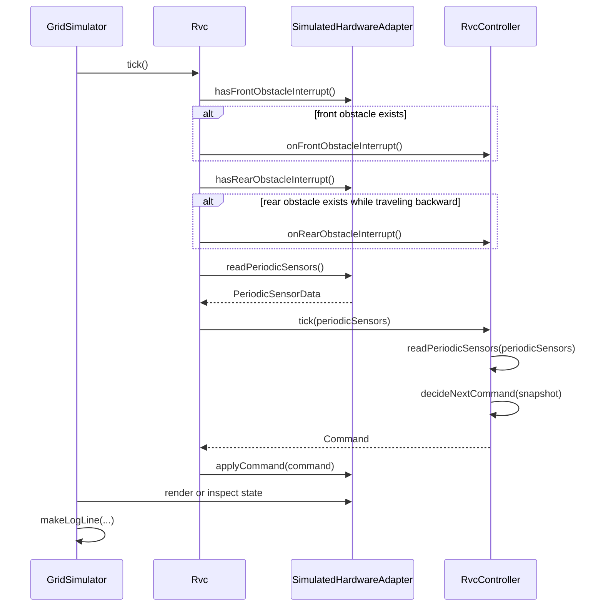
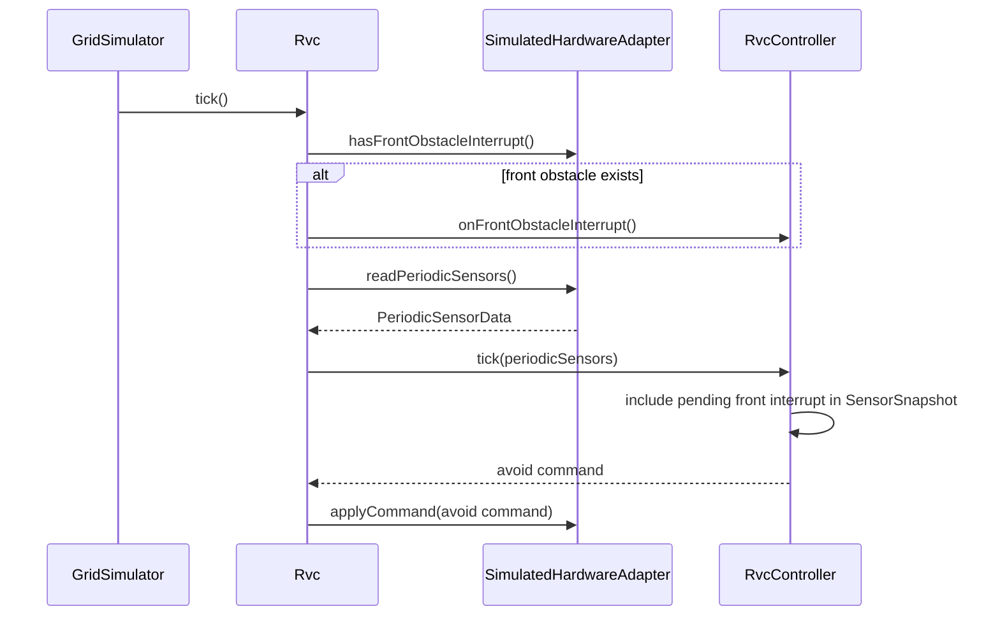
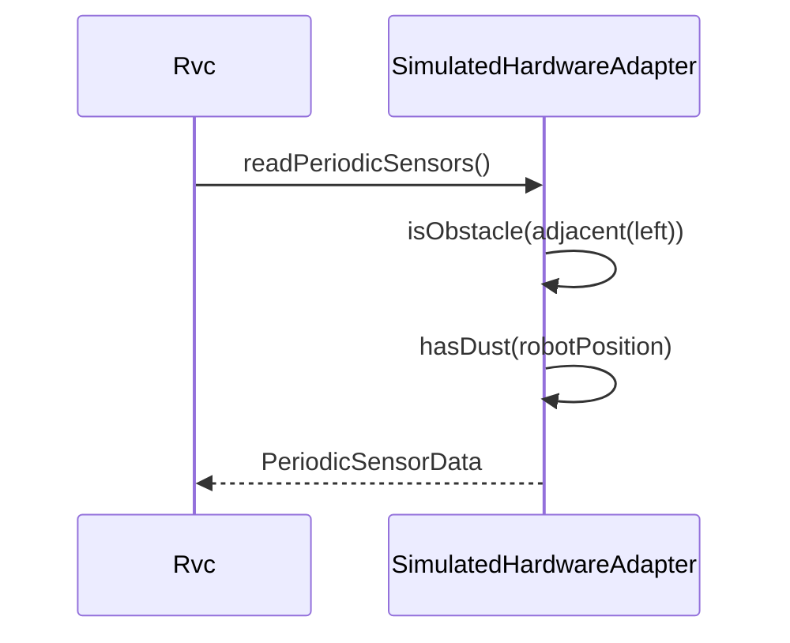
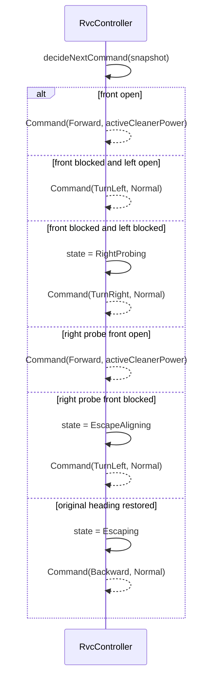
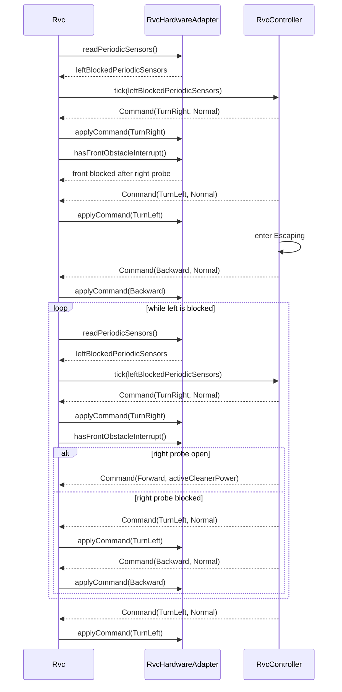
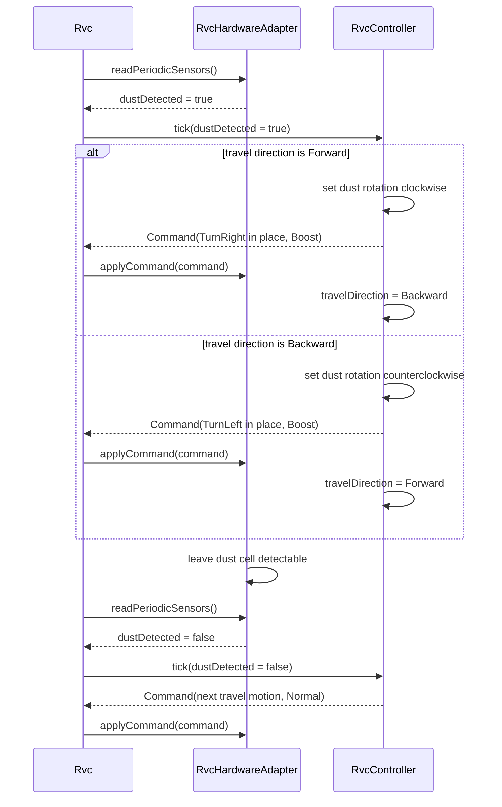
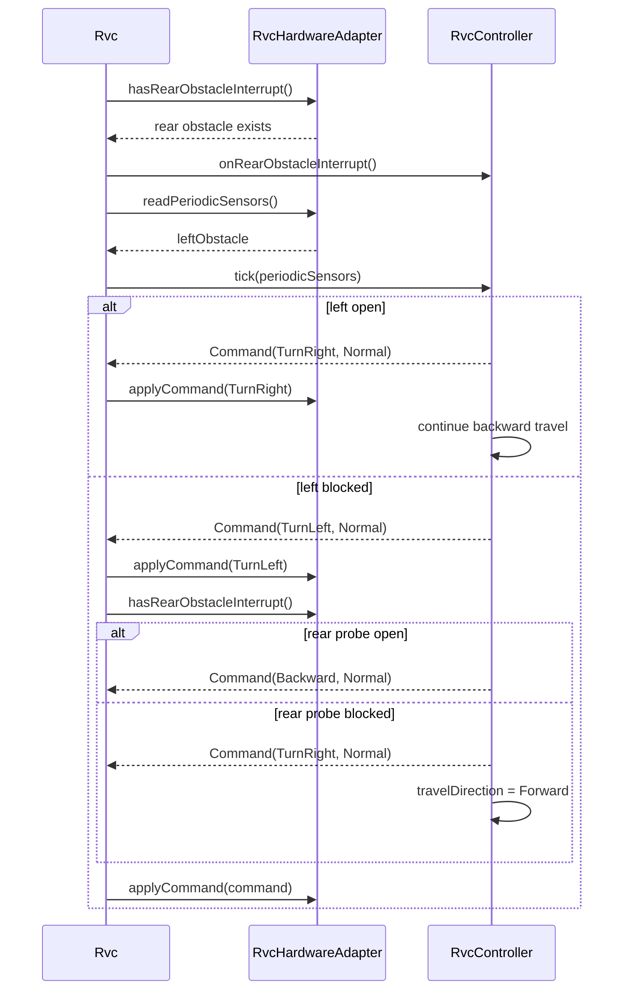

# RVC OOD Sequence Diagrams

## 1. SD-01 Control Tick Loop

[변경] control tick은 `GridSimulator`가 `RvcController`를 직접 호출하지 않고 `Rvc`를 통해 진행한다.
[삭제] ~~`Simulator->>Controller: tick(periodicSensors)`~~
[추가] `Rvc`가 `RvcHardwareAdapter`에서 sensor/event를 읽고 `RvcController` command를 adapter에 적용한다.
[R3-추가] 후진 주행 중에는 rear obstacle interrupt도 같은 tick 입력 흐름에 포함된다.

## 2. SD-02 Front Interrupt Handling

[변경] 전방 interrupt 감지는 `SimulatedHardwareAdapter`가 제공하고, `Rvc`가 이를 `RvcController` interrupt API로 전달한다.
[삭제] ~~`Simulator->>Controller: onFrontObstacleInterrupt()`~~

## 3. SD-03 Periodic Sensor Sampling

[변경] periodic sensor sampling 책임은 `GridSimulator`가 아니라 `SimulatedHardwareAdapter`에 둔다.
[삭제] ~~`Simulator-->>Simulator: PeriodicSensorData`~~
[R2-변경] 우측 장애물은 periodic sensor가 아니라 `TurnRight` 후 front interrupt로 탐색한다.

## 4. SD-04 Obstacle Avoidance

[변경] 장애물 회피 판단은 여전히 `RvcController` 내부 책임이며, controller는 adapter나 simulator 구체 타입을 알지 않는다. [R3-변경] R3 적용 시 회피/탈출 motion도 청소 중 기본 cleaner output을 `Normal`로 유지한다. [R2-기존] ~~회피/탈출 motion에서는 cleaner output을 `Off`로 둔다.~~

## 5. SD-05 Escape Until Possible

[변경] 탈출 반복 흐름도 `Rvc`가 adapter sensor 값을 읽어 controller에 전달하고, 반환 command를 adapter에 적용한다.
[삭제] ~~`Simulator->>Controller: tick(allBlockedSnapshot)`~~

## 6. SD-06 Dust Boost

[변경] 먼지 boost 입력도 adapter를 통해 `Rvc`로 들어오며, controller command는 `Rvc`가 adapter에 적용한다.
[R3-변경] R3 기준에서는 fixed boost tick이 아니라 현재 travel direction에 따른 제자리 회전 구간에만 `Boost`를 적용하고, 회전 후 travel direction을 toggle한다.
[삭제] ~~`Simulator->>Controller: tick(dustDetected = true)`~~

## 7. SD-07 Rear Interrupt Handling

[R3-추가] Rear interrupt는 후진 주행 중 현재 travel direction의 전방 장애물처럼 처리한다. 좌측이 열려 있으면 기존 좌측 공간으로 후진 방향을 돌리고, 좌측이 막혀 있으면 기존 우측 방향을 rear sensor로 탐색한다.

