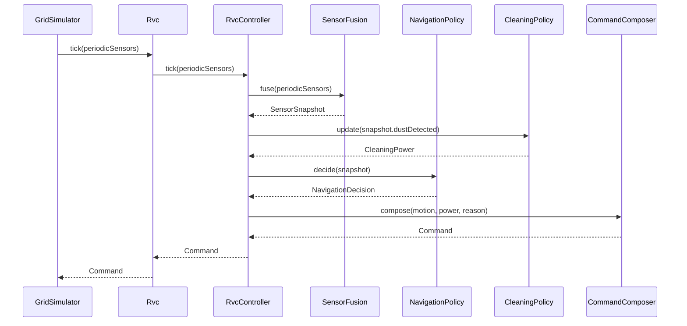
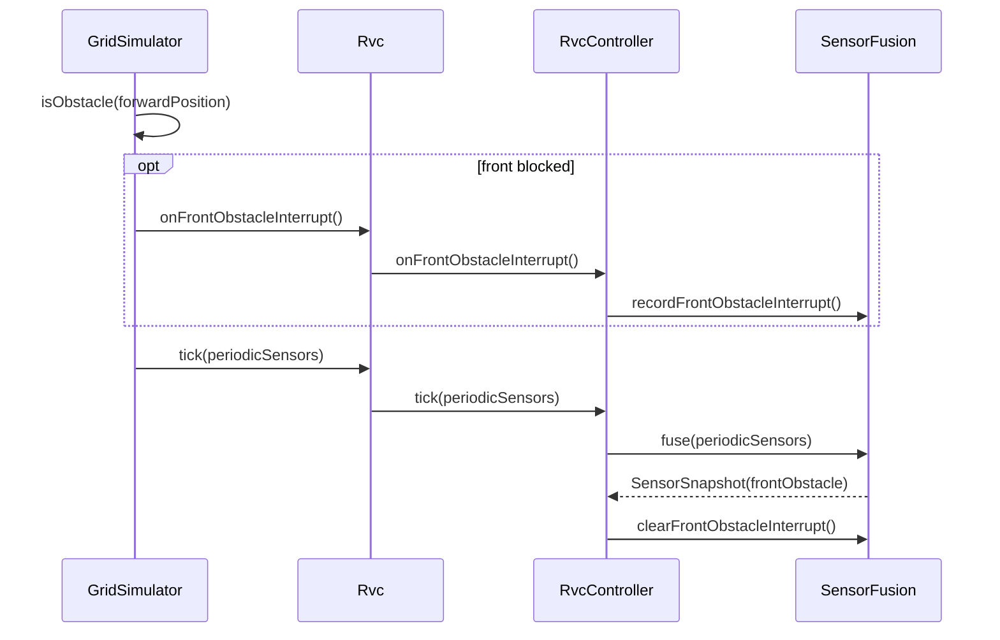
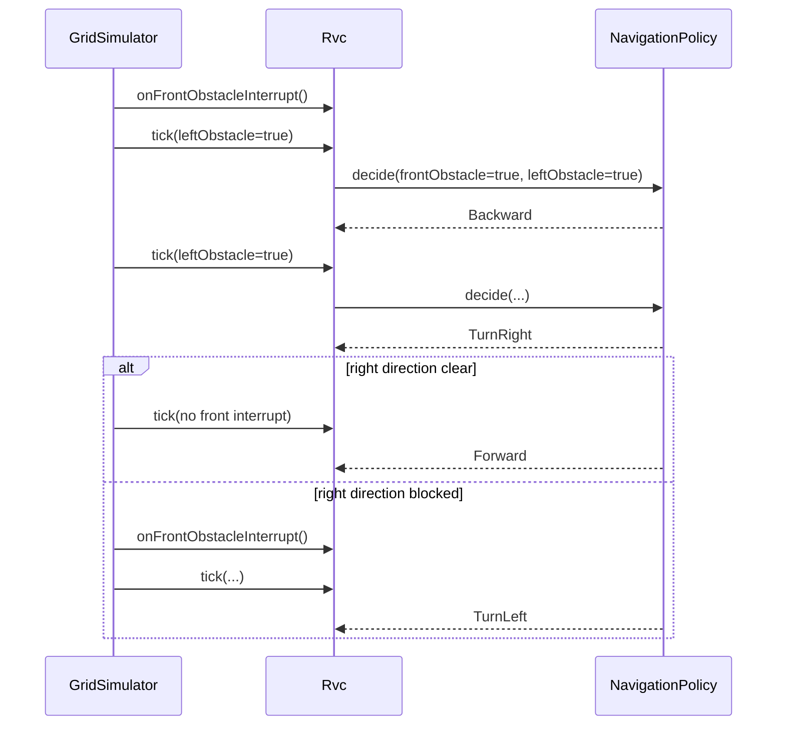

# RVC OOD Sequence Diagrams

## 1. SD-01 Control Tick

## 2. SD-02 Front Interrupt

## 3. SD-03 Escape Right Probe

## 4. Change Notes

| Tag | Item |
| --- | --- |
| [삭제] | Control tick에서 right periodic sample을 전달하지 않는다. |
| [변경] | `SensorSnapshot`에는 `frontObstacle`, `leftObstacle`, `dustDetected`만 포함된다. |
| [신규] | 우측 probe 결과는 다음 tick의 front interrupt 존재 여부로 판단한다. |
| [신규] | probe용 `TurnRight`와 복구용 `TurnLeft` 모두 독립 command이며 tick을 소비한다. |
