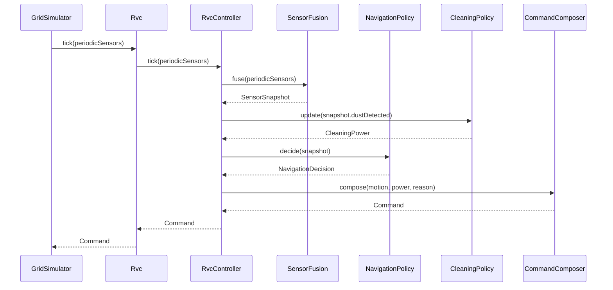
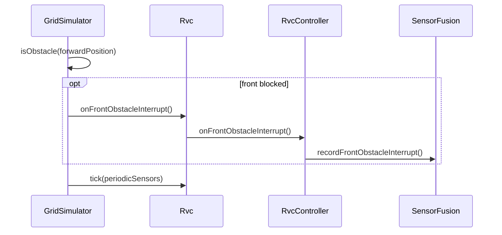
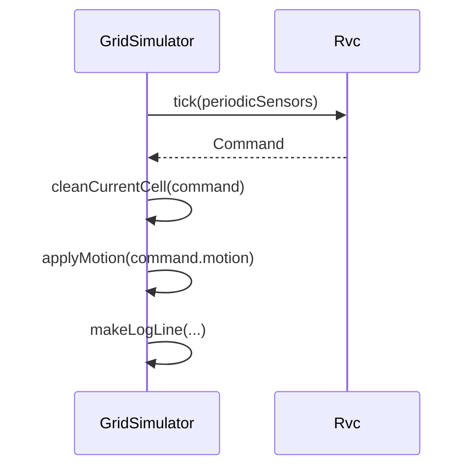
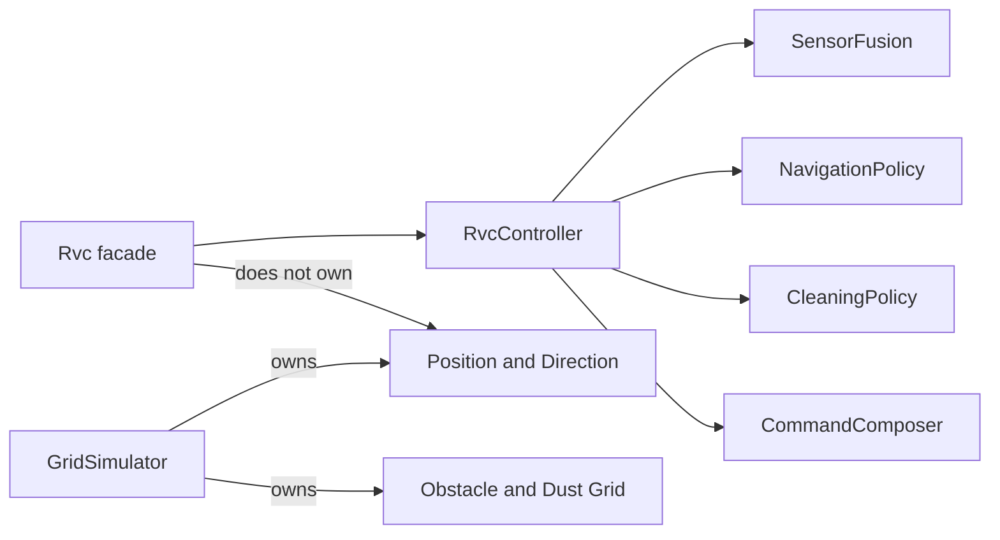

# RVC OOD Sequence Diagrams

## 1. SD-01 Control Tick

```mermaid
sequenceDiagram
    participant Simulator as GridSimulator
    participant RVC as Rvc
    participant Controller as RvcController
    participant Fusion as SensorFusion
    participant Navigation as NavigationPolicy
    participant Cleaning as CleaningPolicy
    participant Composer as CommandComposer

    Simulator->>RVC: tick(periodicSensors)
    RVC->>Controller: tick(periodicSensors)
    Controller->>Fusion: fuse(periodicSensors)
    Fusion-->>Controller: SensorSnapshot
    Controller->>Cleaning: update(snapshot.dustDetected)
    Cleaning-->>Controller: CleaningPower
    Controller->>Navigation: decide(snapshot)
    Navigation-->>Controller: NavigationDecision
    Controller->>Composer: compose(motion, power, reason)
    Composer-->>Controller: Command
    Controller-->>RVC: Command
    RVC-->>Simulator: Command
```

## 2. SD-02 Front Interrupt

```mermaid
sequenceDiagram
    participant Simulator as GridSimulator
    participant RVC as Rvc
    participant Controller as RvcController
    participant Fusion as SensorFusion

    Simulator->>Simulator: isObstacle(forwardPosition)
    opt front blocked
        Simulator->>RVC: onFrontObstacleInterrupt()
        RVC->>Controller: onFrontObstacleInterrupt()
        Controller->>Fusion: recordFrontObstacleInterrupt()
    end
    Simulator->>RVC: tick(periodicSensors)
```

## 3. SD-03 Command Application In Simulator

```mermaid
sequenceDiagram
    participant Simulator as GridSimulator
    participant RVC as Rvc

    Simulator->>RVC: tick(periodicSensors)
    RVC-->>Simulator: Command
    Simulator->>Simulator: cleanCurrentCell(command)
    Simulator->>Simulator: applyMotion(command.motion)
    Simulator->>Simulator: makeLogLine(...)
```

## 4. SD-04 Responsibility Boundary

```mermaid
flowchart LR
    Rvc[Rvc facade] --> Controller[RvcController]
    Controller --> Fusion[SensorFusion]
    Controller --> Nav[NavigationPolicy]
    Controller --> Clean[CleaningPolicy]
    Controller --> Compose[CommandComposer]
    Simulator[GridSimulator] -->|owns| Pose[Position and Direction]
    Simulator -->|owns| Grid[Obstacle and Dust Grid]
    Rvc -->|does not own| Pose
```
