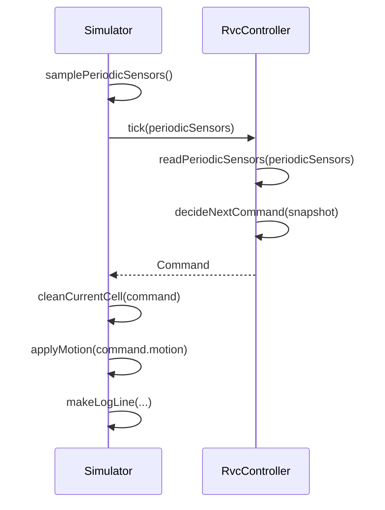
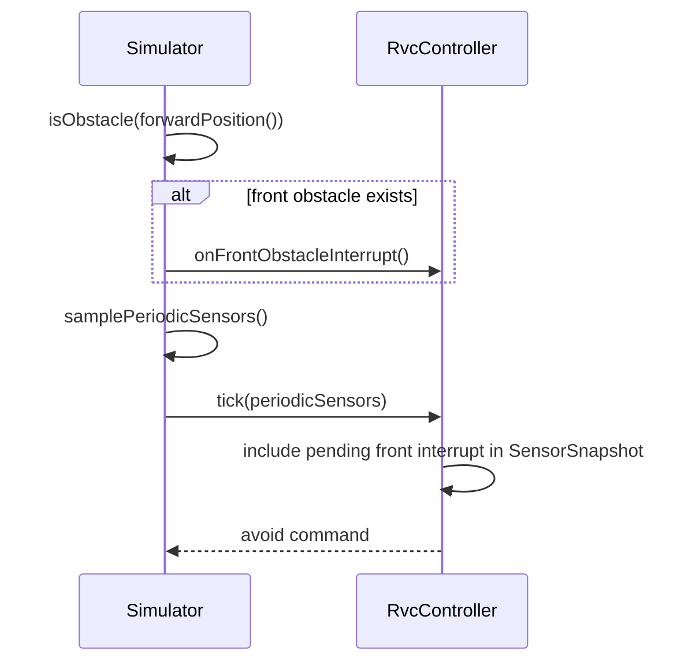
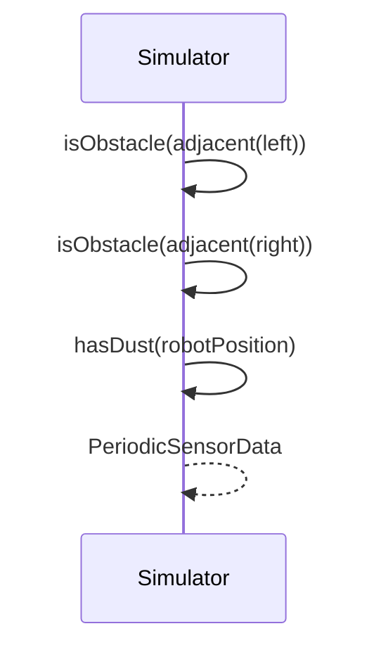
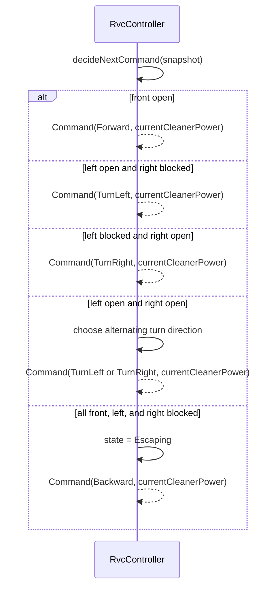
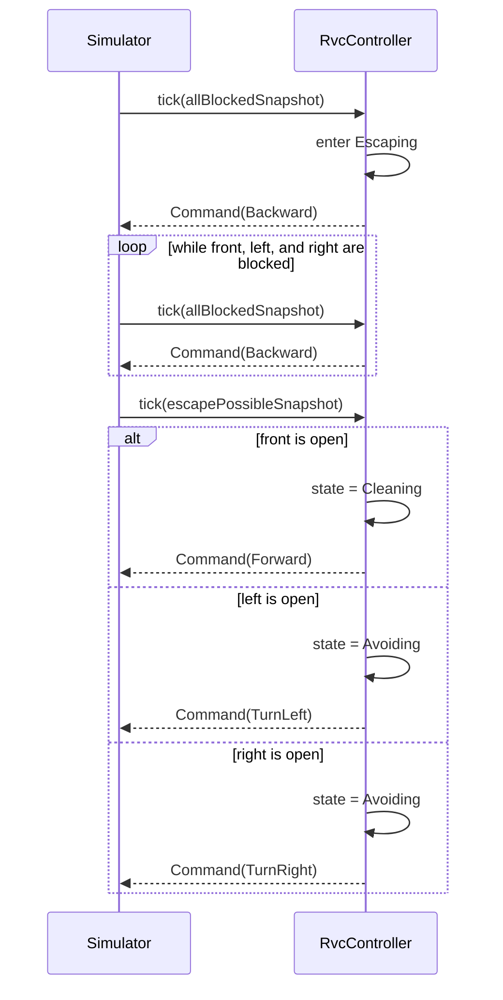
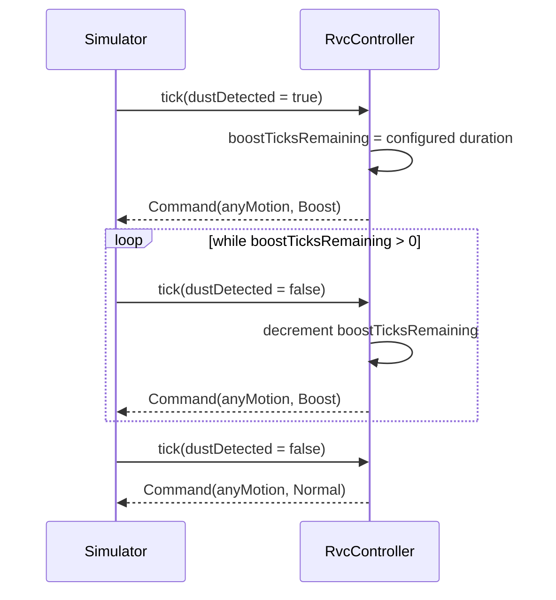

# RVC OOD Sequence Diagrams

## 1. SD-01 Control Tick Loop

## 2. SD-02 Front Interrupt Handling

## 3. SD-03 Periodic Sensor Sampling

## 4. SD-04 Obstacle Avoidance

## 5. SD-05 Escape Until Possible

## 6. SD-06 Dust Boost

