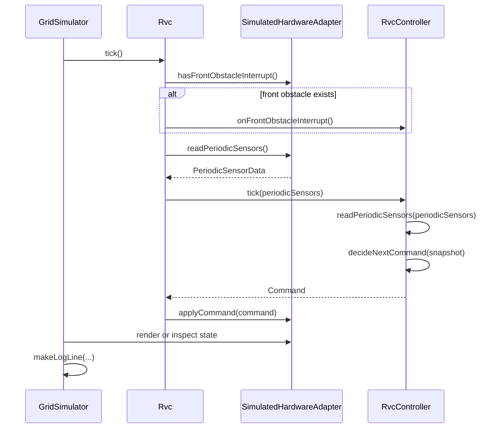
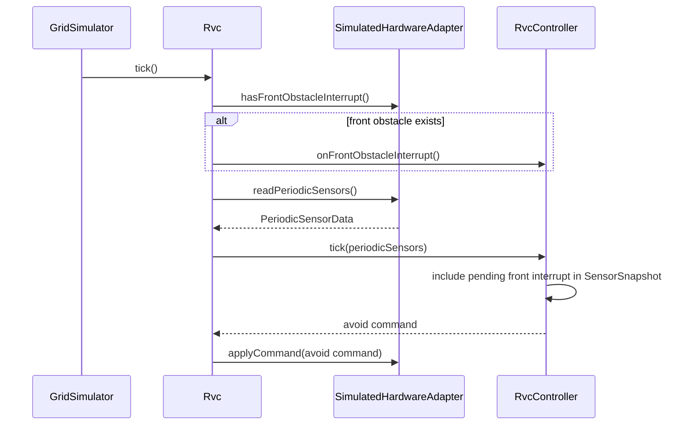
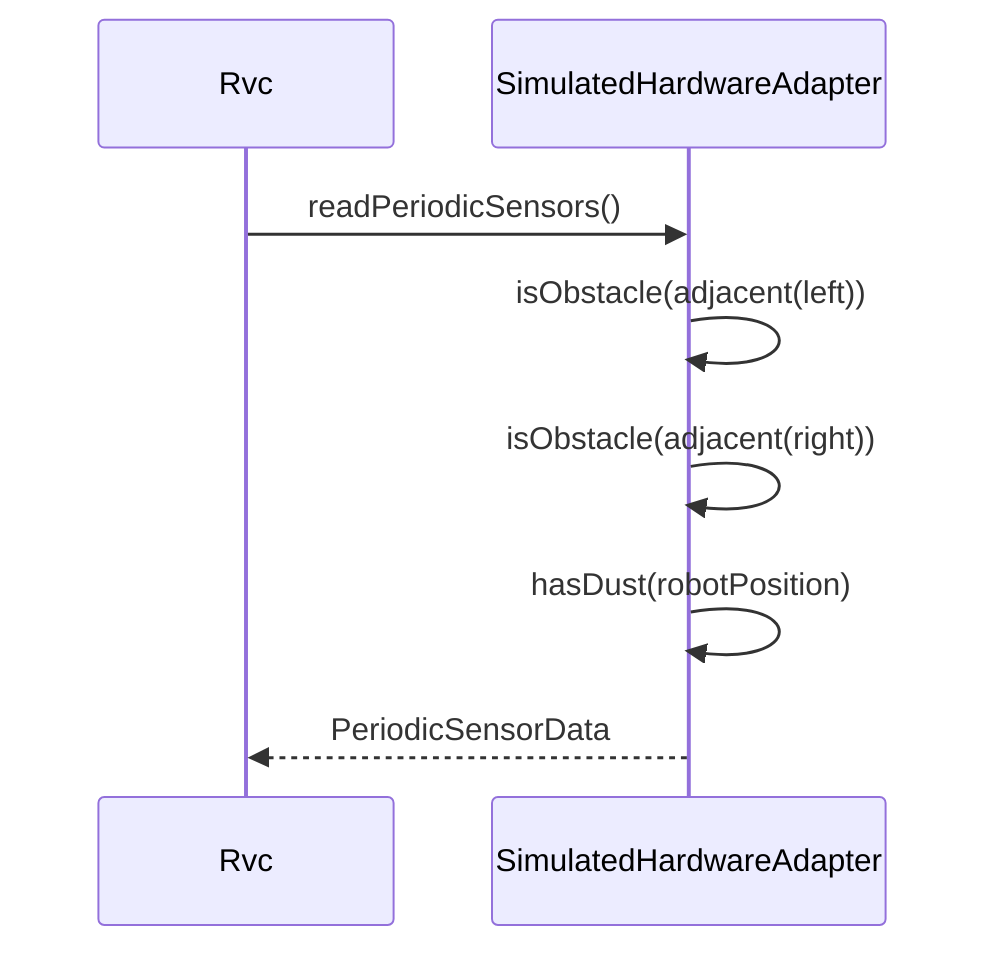
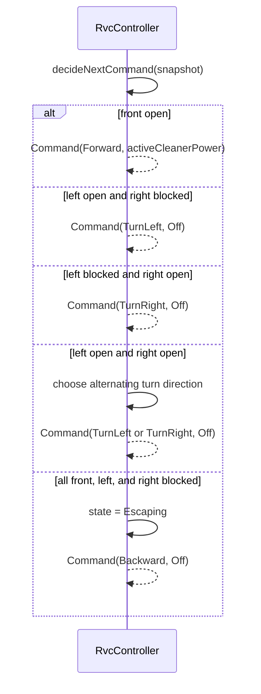
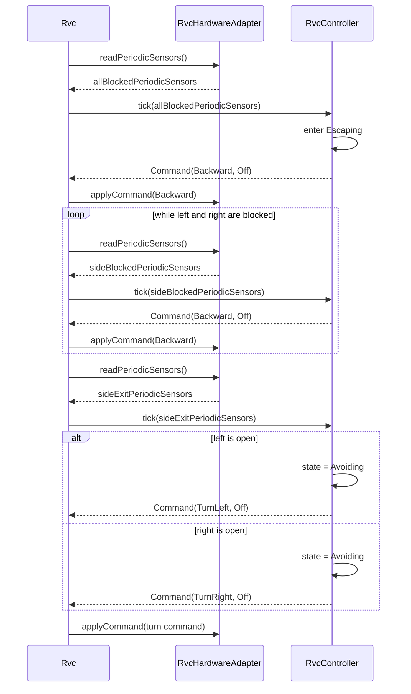
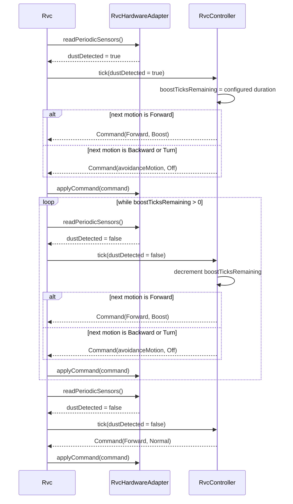

# RVC OOD Sequence Diagrams

## 1. SD-01 Control Tick Loop

[변경] control tick은 `GridSimulator`가 `RvcController`를 직접 호출하지 않고 `Rvc`를 통해 진행한다.
[삭제] ~~`Simulator->>Controller: tick(periodicSensors)`~~
[추가] `Rvc`가 `RvcHardwareAdapter`에서 sensor/event를 읽고 `RvcController` command를 adapter에 적용한다.

## 2. SD-02 Front Interrupt Handling

[변경] 전방 interrupt 감지는 `SimulatedHardwareAdapter`가 제공하고, `Rvc`가 이를 `RvcController` interrupt API로 전달한다.
[삭제] ~~`Simulator->>Controller: onFrontObstacleInterrupt()`~~

## 3. SD-03 Periodic Sensor Sampling

[변경] periodic sensor sampling 책임은 `GridSimulator`가 아니라 `SimulatedHardwareAdapter`에 둔다.
[삭제] ~~`Simulator-->>Simulator: PeriodicSensorData`~~

## 4. SD-04 Obstacle Avoidance

[변경] 장애물 회피 판단은 여전히 `RvcController` 내부 책임이며, controller는 adapter나 simulator 구체 타입을 알지 않는다.

## 5. SD-05 Escape Until Possible

[변경] 탈출 반복 흐름도 `Rvc`가 adapter sensor 값을 읽어 controller에 전달하고, 반환 command를 adapter에 적용한다.
[삭제] ~~`Simulator->>Controller: tick(allBlockedSnapshot)`~~

## 6. SD-06 Dust Boost

[변경] 먼지 boost 입력도 adapter를 통해 `Rvc`로 들어오며, controller command는 `Rvc`가 adapter에 적용한다.
[삭제] ~~`Simulator->>Controller: tick(dustDetected = true)`~~

