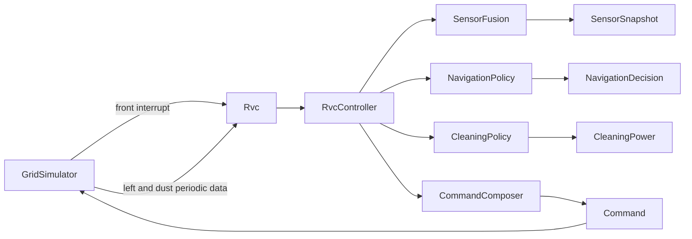
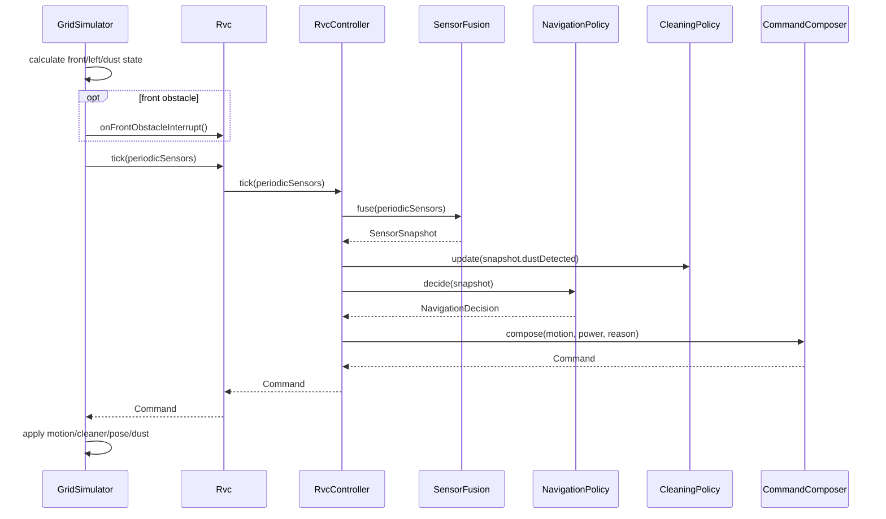

# RVC Software Design Description

## 1. Summary

RVC는 `Rvc` facade와 내부 `RvcController`로 구성된다. `RvcController`는 `SensorFusion`, `NavigationPolicy`, `CleaningPolicy`, `CommandComposer`를 조합한다. `GridSimulator`는 검증 환경으로서 위치, 방향, 장애물, 먼지를 소유한다.

| Tag | Design Change |
| --- | --- |
| [삭제] | 우측 주기 센서와 `rightPeriodic` 로그는 제거되었다. |
| [변경] | `PeriodicSensorData`와 `SensorSnapshot`은 우측 장애물 필드를 갖지 않는다. |
| [신규] | 우측 탈출은 `Backward -> TurnRight -> front interrupt 평가 -> Forward 또는 TurnLeft` 상태 흐름으로 처리한다. |

## 2. Structural View

| Component | Responsibility |
| --- | --- |
| `SensorFusion` | [변경] front interrupt pending 값과 `leftObstacle`, `dustDetected`를 하나의 snapshot으로 만든다. |
| `NavigationPolicy` | [변경] 좌측 회피와 우측 probe escape phase를 관리하며 `Motion`과 reason을 결정한다. |
| `CommandComposer` | 회전, 후진, 정지 중 cleaner를 `Off`로 강제한다. |
| `GridSimulator` | [변경] front interrupt, left periodic, dust periodic을 생성하고 command를 적용한다. |

## 3. Runtime Flow

## 4. Escape Probe Flow

| Step | Tick Command | Meaning |
| --- | --- | --- |
| [변경] 1 | `Backward` | 전방 interrupt와 좌측 막힘으로 `Escaping`에 들어가 먼저 후진한다. |
| [신규] 2 | `TurnRight` | 우측 탈출구를 전방 센서로 확인하기 위해 실제로 우회전한다. |
| [신규] 3a | `Forward` | 우회전 후 다음 tick에 front interrupt가 없으면 우측이 열린 것으로 판단한다. |
| [신규] 3b | `TurnLeft` | 우회전 후 다음 tick에 front interrupt가 있으면 우측이 막힌 것으로 판단하고 원래 방향으로 복구한다. |
| [신규] 4 | repeat | 복구 후에는 다시 후진부터 반복한다. |

## 5. Verification

| Test Group | Coverage |
| --- | --- |
| Controller tests | [변경] 우측 센서 없는 public controller 계약, front interrupt 기반 right probe, cleaner off 규칙 |
| Subsystem tests | [변경] `SensorFusion`, `NavigationPolicy`, `CleaningPolicy`, `CommandComposer` 단위 검증 |
| System tests | [변경] `GridSimulator` 로그에서 `rightPeriodic` 제거와 tick 단위 회전/후진 적용 검증 |
| CLI tests | 기존 simulator CLI 실행 호환성 검증 |
