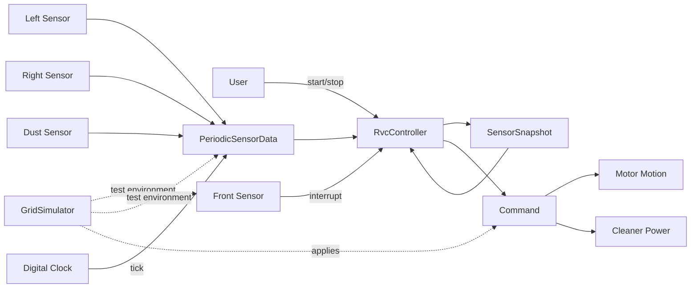
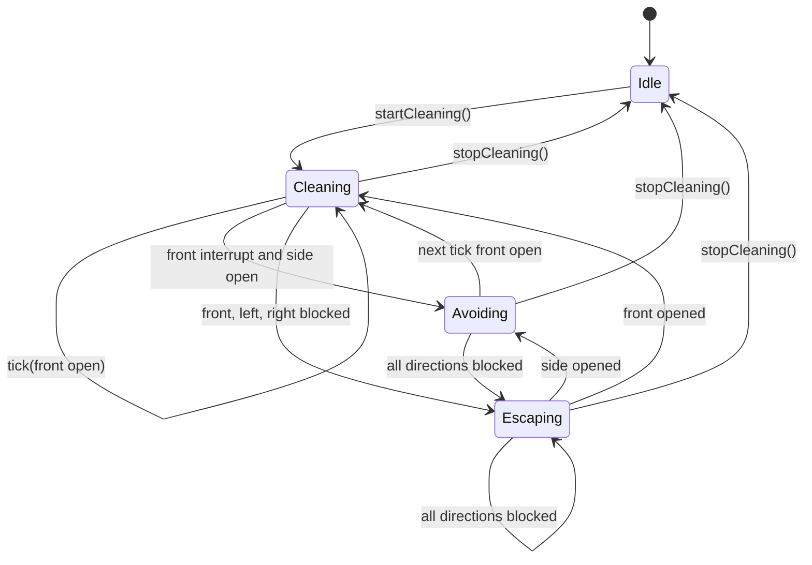

# RVC Control SW Software Design Description

## 1. 문서 개요

### 1.1 목적

이 문서는 RVC(Robotic Vacuum Cleaner) 자동 청소 제어 소프트웨어의 Software Design Description(SDD)이다. 요구사항 문서와 OOA/OOD 산출물에서 정의한 동작을 C++20 구현 구조와 연결하여, 제어 로직, 데이터 구조, 공용 인터페이스, 시뮬레이터 검증 구조를 설명한다.

### 1.2 범위

본 SDD의 범위는 현재 프로젝트에 구현된 `RvcController` 기반 제어 로직과 `GridSimulator` 기반 CLI 시뮬레이터이다. 실제 모터 드라이버, 실제 센서 하드웨어, 배터리, 네트워크, UI, 영구 저장소 설계는 범위에 포함하지 않는다.

### 1.3 설계 목표

| 목표 | 설명 |
| --- | --- |
| 요구사항 충족 | FR-01부터 FR-18까지의 자동 청소, 장애물 회피, 탈출, 먼지 boost, 시뮬레이터 검증 요구사항을 만족한다. |
| 결정적 동작 | 동일한 초기 상태와 동일한 센서 입력 순서에 대해 동일한 명령을 생성한다. |
| 하드웨어 독립성 | controller는 실제 하드웨어나 simulator 구현에 직접 의존하지 않고 값 객체와 command만 사용한다. |
| 테스트 가능성 | controller 단위 테스트와 simulator 시스템 테스트로 핵심 흐름을 검증한다. |
| 단순한 확장성 | sensor 입력과 actuator 명령을 구조체와 enum으로 분리하여 향후 sensor나 command 확장을 쉽게 한다. |

## 2. 참조 문서

| 문서 | 설명 |
| --- | --- |
| `docs/rvc.pdf` | 원본 RVC Control SW 요구사항 |
| `docs/requirements.md` | 유스케이스, FR, NFR, 핵심 제어 규칙 |
| `docs/srs.md` | Software Requirements Specification |
| `docs/ooa_ssd.md` | System Sequence Diagram과 system operation |
| `docs/ooa_domain_diagram.md` | OOA domain model |
| `docs/ood_sequence_diagrams.md` | OOD sequence diagram |
| `docs/ood_class_diagram.md` | OOD class diagram과 SOLID 분석 |
| `docs/traceability.md` | 요구사항, 설계, 테스트 추적성 |
| `include/rvc/*.hpp`, `src/*.cpp` | 현재 C++20 설계와 구현 |
| `tests/*.cpp` | GoogleTest 기반 단위/시스템 테스트 |

## 3. 시스템 설계 개요

RVC Control SW는 sensor 입력을 읽고 actuator 명령을 결정하는 controller 중심 구조이다. 전방 장애물은 interrupt로 controller에 기록되고, 좌측/우측/먼지 sensor는 제어 tick마다 periodic 데이터로 전달된다. controller는 두 입력 흐름을 `SensorSnapshot`으로 결합한 뒤 `Command`를 생성한다.



설계는 production controller와 simulator를 분리한다. `RvcController`는 격자, 위치, 방향, 먼지 제거 같은 simulator 세부 사항을 알지 못한다. `GridSimulator`는 환경을 sensor 입력으로 변환하고 controller 명령을 격자 상태에 적용한다.

## 4. 모듈 및 클래스 설계

### 4.1 모듈 구성

| 모듈 | 주요 파일 | 책임 |
| --- | --- | --- |
| Core type | `include/rvc/Types.hpp`, `src/Types.cpp` | 방향, 동작, 청소 세기, 상태, 위치, sensor data, command type을 정의한다. |
| Controller | `include/rvc/RvcController.hpp`, `src/RvcController.cpp` | 자동 청소 상태와 sensor snapshot을 기반으로 다음 motion/cleaner command를 결정한다. |
| Simulator | `include/rvc/GridSimulator.hpp`, `src/GridSimulator.cpp` | 격자 환경에서 sensor 입력을 생성하고 command를 적용하며 로그와 실행 결과를 만든다. |
| CLI | `src/main.cpp` | simulator 실행 옵션을 파싱하고 초기/최종 지도, tick 로그, summary를 출력한다. |
| Tests | `tests/controller_tests.cpp`, `tests/system_tests.cpp` | controller 규칙과 simulator 통합 흐름을 검증한다. |

### 4.2 핵심 클래스 책임

| 클래스/구조체 | 책임 |
| --- | --- |
| `RvcController` | `startCleaning`, `stopCleaning`, `onFrontObstacleInterrupt`, `tick`을 통해 system interface를 구현하고 핵심 제어 규칙을 적용한다. |
| `ControllerConfig` | `dustBoostTicks` 같은 제어 정책 값을 제공한다. |
| `GridSimulator` | scenario map을 기반으로 sensor 값을 계산하고 controller command를 적용한다. |
| `Scenario` | scenario file에서 읽은 map lines와 tick 수를 보관한다. |
| `SimulationResult` | 실행 tick 수, 청소한 먼지 수, 최종 위치/방향, 로그를 보관한다. |
| `Command` | motor motion과 cleaner power, 판단 이유를 함께 표현한다. |

### 4.3 Controller 내부 설계

`RvcController`는 다음 내부 상태를 유지한다.

| 필드 | 설명 |
| --- | --- |
| `config_` | dust boost duration 등 정책 설정 |
| `state_` | `Idle`, `Cleaning`, `Avoiding`, `Escaping` 중 현재 상태 |
| `running_` | 자동 청소 실행 여부 |
| `frontInterruptPending_` | 다음 tick에서 반영할 전방 장애물 interrupt pending 여부 |
| `preferLeftTurn_` | 좌/우가 모두 열렸을 때 번갈아 회전하기 위한 다음 선호 방향 |
| `boostTicksRemaining_` | boost cleaner power를 유지할 남은 tick 수 |

controller의 설계상 단일 판단 지점은 `decideNextCommand(const SensorSnapshot&)`이다. `tick()`은 idle 여부 확인, sensor snapshot 생성, command 결정, pending interrupt 소비 순서로 동작한다.

## 5. 데이터 설계

### 5.1 주요 데이터 타입

| 타입 | 필드/값 | 설명 |
| --- | --- | --- |
| `ControllerConfig` | `dustBoostTicks` | 먼지 감지 후 boost를 유지할 tick 수이다. 기본값은 3이다. |
| `PeriodicSensorData` | `leftObstacle`, `rightObstacle`, `dustDetected` | tick마다 sampling되는 좌측/우측/먼지 sensor 값이다. |
| `SensorSnapshot` | `frontObstacle`, `leftObstacle`, `rightObstacle`, `dustDetected` | pending front interrupt와 periodic sensor 값을 결합한 판단 입력이다. |
| `Command` | `motion`, `cleaningPower`, `reason` | controller가 actuator 또는 simulator에 전달하는 추상 명령이다. |
| `SimulationResult` | `ticksRun`, `dustCleaned`, `finalPosition`, `finalDirection`, `logs` | simulator 실행 결과와 검증 로그이다. |
| `Position` | `row`, `col` | simulator 격자 내 robot 좌표이다. |

### 5.2 Enum 값

| Enum | 값 | 설명 |
| --- | --- | --- |
| `Direction` | `North`, `East`, `South`, `West` | simulator에서 robot이 바라보는 방향이다. |
| `Motion` | `None`, `Stop`, `Forward`, `Backward`, `TurnLeft`, `TurnRight` | motor에 전달할 추상 이동 명령이다. |
| `CleaningPower` | `Off`, `Normal`, `Boost` | cleaner 출력 세기이다. |
| `ControllerState` | `Idle`, `Cleaning`, `Avoiding`, `Escaping` | controller의 현재 제어 상태이다. |

### 5.3 Scenario 데이터

scenario file은 선택적 `ticks=N` 설정과 `map:` 섹션으로 구성된다. map 문자는 다음 의미를 갖는다.

| 문자 | 의미 |
| --- | --- |
| `#` | 장애물 |
| `.` | 빈 칸 |
| `*` | 먼지 |
| `R`, `^` | 북쪽을 바라보는 robot |
| `>` | 동쪽을 바라보는 robot |
| `v` | 남쪽을 바라보는 robot |
| `<` | 서쪽을 바라보는 robot |

map에는 robot marker가 정확히 하나 있어야 한다. simulator는 robot marker를 읽은 뒤 내부 grid에서는 해당 칸을 빈 칸으로 보관하고, render 시 현재 방향 marker를 다시 표시한다.

## 6. 인터페이스 설계

### 6.1 Controller 공용 인터페이스

| Operation | Input | Output | 책임 | 관련 요구사항 |
| --- | --- | --- | --- | --- |
| `RvcController::startCleaning()` | 없음 | 없음 | 자동 청소 실행 상태로 전환하고 전방 interrupt pending 값을 초기화한다. | FR-01, FR-03 |
| `RvcController::stopCleaning()` | 없음 | 없음 | idle 상태로 전환하고 motor stop/cleaner off 상태가 되도록 내부 실행 상태와 boost timer를 초기화한다. | FR-02 |
| `RvcController::onFrontObstacleInterrupt()` | 없음 | 없음 | 실행 중일 때 전방 장애물 interrupt를 pending 상태로 기록한다. | FR-04, FR-05 |
| `RvcController::tick(const PeriodicSensorData&)` | periodic sensor 값 | `Command` | 제어 tick마다 sensor 값을 반영하고 다음 command를 반환한다. | FR-06 to FR-15 |
| `RvcController::readPeriodicSensors(const PeriodicSensorData&)` | periodic sensor 값 | `SensorSnapshot` | pending front interrupt와 periodic 값을 결합한다. | FR-04, FR-06 |
| `RvcController::decideNextCommand(const SensorSnapshot&)` | sensor snapshot | `Command` | 상태, 장애물, 먼지 정보를 기반으로 motion과 cleaner power를 결정한다. | FR-07 to FR-15 |

### 6.2 Simulator 공용 인터페이스

| Operation | Input | Output | 책임 | 관련 요구사항 |
| --- | --- | --- | --- | --- |
| `GridSimulator::loadScenario(const std::filesystem::path&)` | scenario path | `Scenario` | scenario file에서 tick 설정과 map을 읽는다. | FR-16 |
| `GridSimulator::run(int, bool)` | max tick, frame 포함 여부 | `SimulationResult` | 지정 tick 수만큼 simulation을 실행하고 결과를 반환한다. | FR-16, FR-17, FR-18 |
| `GridSimulator::step(int, bool)` | tick 번호, frame 포함 여부 | `bool` | 한 tick의 sensor 생성, controller 호출, command 적용, log 생성을 수행한다. | FR-17, FR-18 |
| `GridSimulator::render()` | 없음 | `std::string` | 현재 grid와 robot 방향을 문자열 map으로 렌더링한다. | FR-16 |

### 6.3 CLI 인터페이스

실행 형식은 다음과 같다.

```powershell
rvc_simulator [--ticks N] [--scenario FILE] [--quiet-map]
```

| 옵션 | 설명 |
| --- | --- |
| `--help`, `-h` | 사용법을 출력하고 종료한다. |
| `--ticks N` | simulation tick 수를 지정한다. |
| `--scenario FILE` | scenario file을 읽어 초기 map과 기본 tick 수를 설정한다. |
| `--quiet-map` | 초기/최종 map과 tick별 frame 출력을 생략하고 log와 summary 중심으로 출력한다. |

알 수 없거나 값이 부족한 인자는 오류 메시지와 usage를 출력하고 종료 코드 2를 반환한다. scenario 처리나 실행 중 예외가 발생하면 오류 메시지를 출력하고 종료 코드 1을 반환한다.

## 7. 제어 로직 설계

### 7.1 상태 전이



### 7.2 Tick 처리 순서

1. `running_`이 false이면 `Motion::Stop`, `CleaningPower::Off` command를 반환한다.
2. `readPeriodicSensors()`가 `frontInterruptPending_`와 `PeriodicSensorData`를 결합해 `SensorSnapshot`을 만든다.
3. `decideNextCommand()`가 snapshot과 현재 state를 기반으로 command를 결정한다.
4. `tick()`은 command 결정 후 `frontInterruptPending_`를 false로 되돌려 interrupt를 소비한다.

### 7.3 장애물 회피 규칙

| 조건 | 상태 변화 | Motion |
| --- | --- | --- |
| 전방이 열림 | `Cleaning` | `Forward` |
| 전방이 막히고 좌측만 열림 | `Avoiding` | `TurnLeft` |
| 전방이 막히고 우측만 열림 | `Avoiding` | `TurnRight` |
| 전방이 막히고 좌/우 모두 열림 | `Avoiding` | `TurnLeft`와 `TurnRight`를 번갈아 선택 |
| 전방, 좌측, 우측 모두 막힘 | `Escaping` | `Backward` |

### 7.4 탈출 규칙

`Escaping` 상태에서는 전방, 좌측, 우측이 모두 막힌 동안 계속 `Backward` command를 반환한다. 세 방향 중 하나 이상이 열리면 탈출 가능 상태로 판단한다. 전방이 열렸으면 `Cleaning`으로 복귀하며 `Forward`를 반환하고, 전방은 막혔지만 한쪽 측면이 열렸으면 `Avoiding`으로 전환해 열린 방향으로 회전한다.

### 7.5 먼지 Boost 규칙

`updateCleaningPower(bool dustDetected)`는 motion 판단과 독립적으로 cleaner power를 결정한다. 먼지가 감지되면 `boostTicksRemaining_`을 `config_.dustBoostTicks`로 재설정한다. 먼지가 감지되지 않고 남은 boost tick이 있으면 1 감소시킨다. 남은 boost tick이 0보다 크면 `Boost`, 아니면 `Normal`을 반환한다.

## 8. 상태 및 오류 처리

### 8.1 Controller 상태 처리

| 상태 | 의미 | 주요 출력 |
| --- | --- | --- |
| `Idle` | 자동 청소가 실행되지 않는 상태 | `Stop`, `Off` |
| `Cleaning` | 기본 자동 청소 상태 | 전방 open 시 `Forward` |
| `Avoiding` | 전방 장애물 interrupt 후 측면 회피를 수행하는 상태 | `TurnLeft` 또는 `TurnRight` |
| `Escaping` | 삼방향이 모두 막혀 후진 탈출을 수행하는 상태 | `Backward` 반복 |

`onFrontObstacleInterrupt()`는 실행 중일 때만 pending interrupt를 기록한다. idle 상태의 interrupt는 다음 tick 판단에 영향을 주지 않는다.

### 8.2 Simulator 오류 처리

| 상황 | 처리 |
| --- | --- |
| 빈 map으로 simulator 생성 | `std::invalid_argument` 발생 |
| robot marker 없음 | `std::invalid_argument` 발생 |
| robot marker가 둘 이상 | `std::invalid_argument` 발생 |
| scenario file open 실패 | `std::runtime_error` 발생 |
| scenario file에 map section 없음 | `std::runtime_error` 발생 |
| `run()`에 음수 tick 입력 | `std::invalid_argument` 발생 |
| grid 범위 밖 좌표 | 장애물로 간주하여 이동하지 않는다. |

## 9. 검증 및 추적성

### 9.1 테스트 전략

| 테스트 수준 | 대상 | 검증 내용 |
| --- | --- | --- |
| Controller unit test | `RvcController` | 전진, interrupt 회피, 좌/우 회전 선택, 교대 회전, 탈출, dust boost duration |
| Simulator system test | `GridSimulator` | 실제 격자에서 dust 청소, 후진 탈출, boxed-in 반복 후진, front interrupt 후 회전 |
| CLI CTest | `rvc_simulator` | 기본 실행과 scenario 기반 실행 가능 여부 |

### 9.2 요구사항 추적성

| 요구사항 | 핵심 설계 요소 | 검증 |
| --- | --- | --- |
| FR-01 | `RvcController::startCleaning`, `ControllerState::Cleaning` | `ControllerMovesForwardWhenPathIsClear` |
| FR-02 | `RvcController::stopCleaning`, idle command | controller API와 SRS 기준 수동 확인 |
| FR-03 | `decideNextCommand`, `Motion::Forward` | `ControllerMovesForwardWhenPathIsClear` |
| FR-04 | `onFrontObstacleInterrupt`, `frontInterruptPending_` | `FrontInterruptTriggersImmediateAvoidance`, `SimulatorTurnsAfterFrontInterrupt` |
| FR-05 | `tick`, `SensorSnapshot::frontObstacle`, 회피 command | `FrontInterruptTriggersImmediateAvoidance`, `SimulatorTurnsAfterFrontInterrupt` |
| FR-06 | `PeriodicSensorData`, `readPeriodicSensors` | controller unit tests |
| FR-07 | `chooseOpenSideTurn`, `Motion::TurnLeft` | `FrontInterruptTriggersImmediateAvoidance` |
| FR-08 | `chooseOpenSideTurn`, `Motion::TurnRight` | `TurnsTowardOpenSide`, `SimulatorTurnsAfterFrontInterrupt` |
| FR-09 | `preferLeftTurn_`, 좌우 교대 정책 | `AlternatesWhenBothSidesAreOpen` |
| FR-10 | all-blocked 판단, `ControllerState::Escaping` | `AllBlockedEntersEscapingAndKeepsBackingUp`, `SimulatorUsesBackwardEscape` |
| FR-11 | `Escaping` 상태의 `Motion::Backward` 반복 | `AllBlockedEntersEscapingAndKeepsBackingUp`, `SimulatorKeepsCommandingBackwardWhenBoxedIn` |
| FR-12 | 탈출 가능 조건 판단 | `EscapingExitsWhenFrontBecomesOpen` |
| FR-13 | 탈출 후 `Forward` 또는 측면 회전 | `EscapingExitsWhenFrontBecomesOpen` |
| FR-14 | `updateCleaningPower`, `ControllerConfig::dustBoostTicks` | `DustBoostLastsConfiguredTicks`, `SimulatorCleansDustAndLogsCommands` |
| FR-15 | `boostTicksRemaining_` 감소와 `CleaningPower::Normal` 복귀 | `DustBoostLastsConfiguredTicks` |
| FR-16 | `GridSimulator::render`, scenario map symbol | `SimulatorCliDefaultRuns`, `SimulatorCliContinuousBackwardScenarioRuns` |
| FR-17 | `GridSimulator::makeLogLine`, `SimulationResult::logs` | `SimulatorCleansDustAndLogsCommands`, CLI CTest |
| FR-18 | `GridSimulator`가 `RvcController`와 `Command`를 사용 | `SimulatorCleansDustAndLogsCommands`, `SimulatorUsesBackwardEscape` |

### 9.3 설계 제약 충족

| 제약 | 충족 방식 |
| --- | --- |
| C++20 및 CMake 기반 빌드 | `CMakeLists.txt`에서 `CMAKE_CXX_STANDARD 20`과 `rvc_core`, `rvc_simulator`, `rvc_tests` target을 정의한다. |
| UTF-8 문서 | 모든 Markdown 문서는 UTF-8로 작성한다. |
| SOLID 설계 | controller, simulator, type 정의를 책임별로 분리하고 controller가 concrete hardware에 의존하지 않게 한다. |
| 반복 가능한 테스트 | controller 입력을 값 객체로 제공하고 random 또는 wall-clock 의존성을 두지 않는다. |
