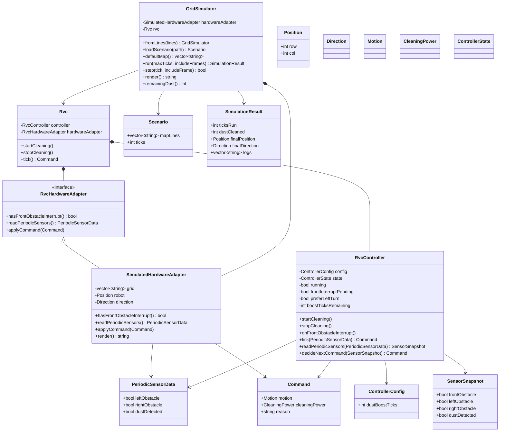
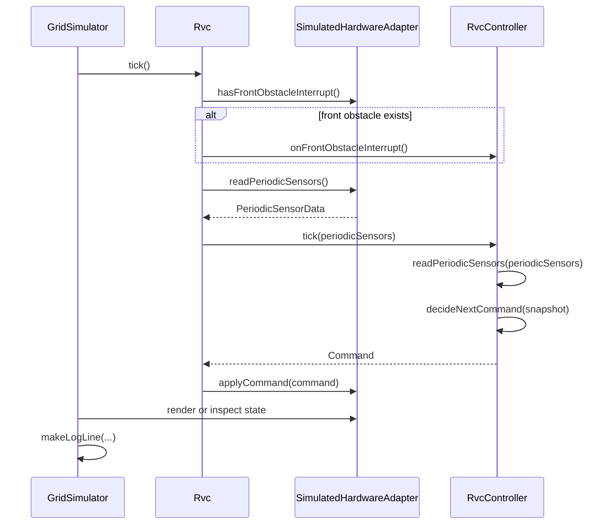
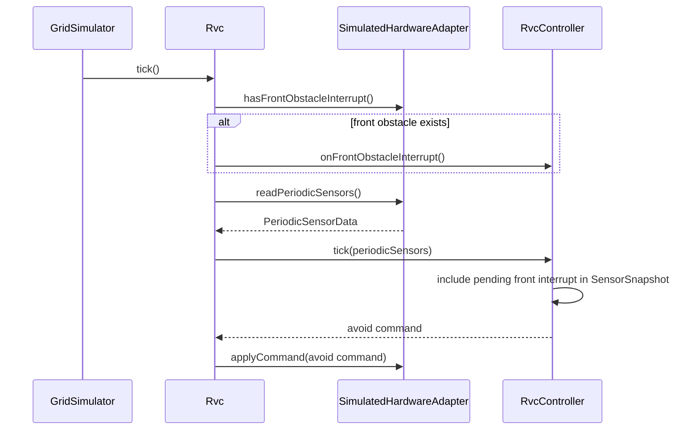
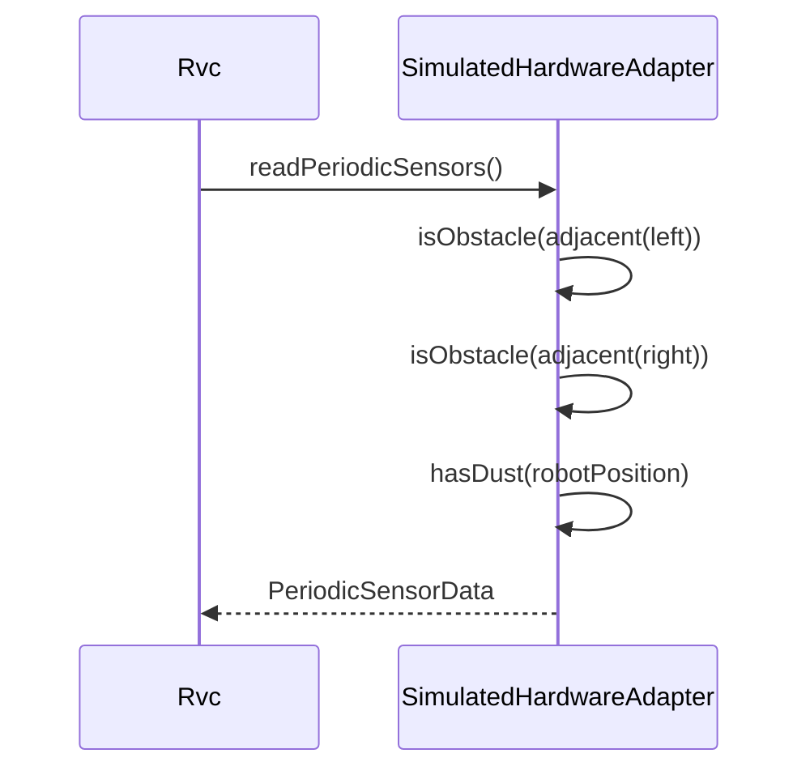
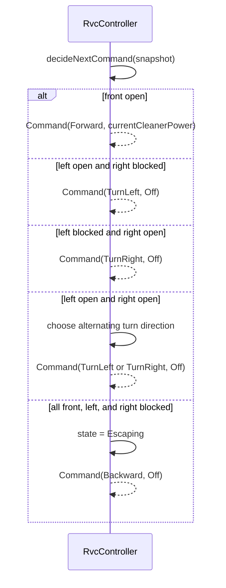
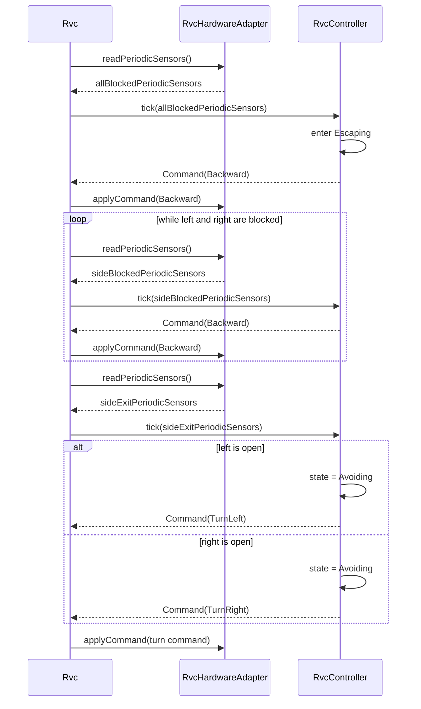
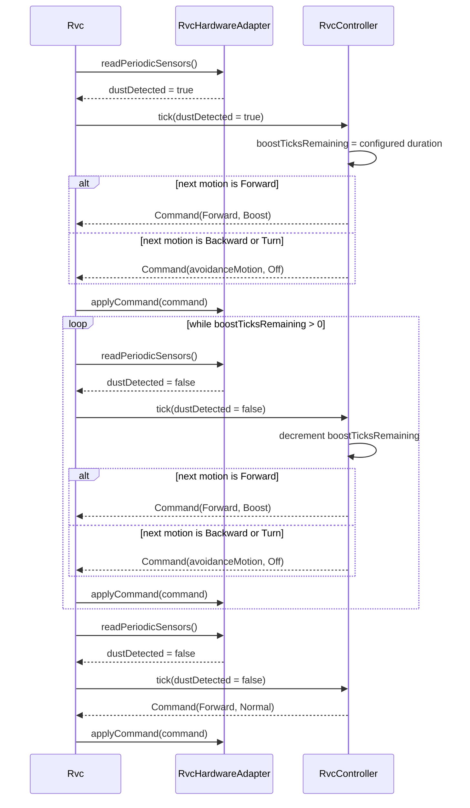
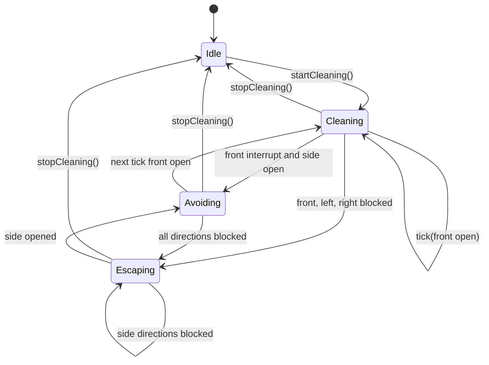

# RVC Control SW Software Design Description

본 문서는 IEEE Std 1016-2009의 SDD 구조를 기준으로 작성한다.

## 1. Scope

### 1.1 Purpose

이 문서는 RVC(Robotic Vacuum Cleaner) 자동 청소 제어 소프트웨어의 Software Design Description(SDD)이다. `docs/srs.md`에 정의된 요구사항을 현재 C++20 구현 구조와 연결하고, 설계 context, stakeholder concern, design viewpoint, design view, design rationale을 정리한다.

### 1.2 System Scope

[변경] 설계 대상은 상위 시스템 객체 `Rvc`, 핵심 제어 객체 `RvcController`, 하드웨어 입출력을 추상화하는 `RvcHardwareAdapter`, 그리고 검증용 `GridSimulator`/`SimulatedHardwareAdapter`이다. `Rvc`는 `RvcController`와 `RvcHardwareAdapter`를 소유하고, sensor 입력 수집과 `Command` 적용 흐름을 조율한다. `GridSimulator`는 실제 RVC 시스템이 아니라 `SimulatedHardwareAdapter`를 통해 테스트용 하드웨어 환경과 CLI 시나리오 실행을 제공한다.
[삭제] ~~설계 대상은 `RvcController` 기반 제어 로직과 `GridSimulator` 기반 CLI 시뮬레이터이다. controller는 sensor 입력을 판단해 motor motion과 cleaner power를 포함한 `Command`를 생성한다. simulator는 검증 환경으로서 scenario map에서 sensor 값을 만들고 command를 적용한다.~~

본 SDD의 범위에 포함하지 않는 항목은 실제 모터 드라이버, 실제 센서 하드웨어, 배터리, 네트워크, UI, 영구 저장소 설계이다.

### 1.3 Design Goals

| 목표 | 설명 |
| --- | --- |
| 요구사항 충족 | FR-01부터 FR-18까지의 자동 청소, 장애물 회피, 탈출, 먼지 boost, 시뮬레이터 검증 요구사항을 만족한다. |
| 결정적 동작 | 동일한 초기 상태와 동일한 센서 입력 순서에 대해 동일한 명령을 생성한다. |
| 하드웨어 독립성 | [변경] `RvcController`는 실제 하드웨어나 simulator 구현에 직접 의존하지 않고, `Rvc`는 `RvcHardwareAdapter` 추상 계약을 통해 하드웨어와 연결된다. |
| 테스트 가능성 | [변경] controller 단위 테스트와 `SimulatedHardwareAdapter` 기반 simulator 시스템 테스트로 핵심 흐름을 검증한다. |
| 단순한 확장성 | [변경] sensor 입력, actuator 명령, hardware adapter 계약을 분리하여 향후 실제 hardware adapter나 sensor 확장을 쉽게 한다. |

## 2. References

| 문서 | 설명 |
| --- | --- |
| IEEE Std 1016-2009 | Software Design Descriptions 작성 기준 |
| `docs/rvc.pdf` | 원본 RVC Control SW 요구사항 |
| `docs/srs.md` | Software Requirements Specification |
| `docs/requirements.md` | 유스케이스, FR, NFR, 핵심 제어 규칙 |
| `docs/ooa_domain_diagram.md` | OOA domain model |
| `docs/ooa_ssd.md` | System Sequence Diagram과 system operation |
| `docs/ood_class_diagram.md` | OOD class diagram과 SOLID 분석 |
| `docs/ood_sequence_diagrams.md` | OOD sequence diagram |
| `docs/traceability.md` | 요구사항, 설계, 테스트 추적성 |
| `include/rvc/*.hpp`, `src/*.cpp` | 현재 C++20 설계와 구현 |
| `tests/*.cpp` | GoogleTest 기반 단위/시스템 테스트 |

## 3. Terms and Definitions

| 용어 | 정의 |
| --- | --- |
| Design Context | 설계 대상 시스템의 경계, 외부 주체, 운영 환경을 설명하는 정보 |
| Design Stakeholder | 설계 결과에 이해관계가 있는 사용자, 검증자, 구현자 |
| Design Concern | stakeholder가 설계에서 확인해야 하는 관심사 |
| Design Viewpoint | 특정 concern을 다루기 위한 표현 규칙과 분석 관점 |
| Design View | viewpoint를 적용해 작성한 실제 설계 표현 |
| Rvc | [추가] RVC 상위 시스템 객체이며 `RvcController`와 `RvcHardwareAdapter`를 소유한다. |
| Controller | [변경] `RvcController`로 구현되는 핵심 제어 객체이며 hardware adapter나 simulator를 직접 소유하지 않는다. |
| Hardware Adapter | [추가] `RvcHardwareAdapter`로 표현되는 sensor 입력 및 actuator command 적용 추상 인터페이스 |
| Simulated Hardware Adapter | [추가] `SimulatedHardwareAdapter`로 표현되는 테스트용 하드웨어 adapter 구현 |
| Simulator | [변경] `GridSimulator`로 구현되는 검증 환경이며 `SimulatedHardwareAdapter`를 통해 테스트용 외부 세계를 제공한다. |
| Command | [변경] controller가 `Rvc`를 거쳐 hardware adapter에 전달하는 추상 명령 |
| SensorSnapshot | pending front interrupt와 periodic sensor 값을 결합한 판단 입력 |
| Escaping | 삼방향이 막힌 상황에서 후진 탈출을 수행하는 controller 상태 |

## 4. Design Context

### 4.1 System Boundary

[변경] RVC Control SW는 `Rvc` 상위 객체를 중심으로 sensor 입력, controller 판단, actuator command 적용을 연결한다. 전방 장애물 interrupt와 periodic sensor 값은 `RvcHardwareAdapter`를 통해 `Rvc`에 전달되고, `Rvc`가 `RvcController` 호출 순서를 조율한다. `RvcController`는 두 입력 흐름을 `SensorSnapshot`으로 결합한 뒤 `Command`를 생성하며, `Rvc`는 이 command를 다시 adapter에 적용한다.
[삭제] ~~RVC Control SW는 sensor 입력을 읽고 actuator 명령을 결정하는 controller 중심 구조이다.~~

```mermaid
flowchart LR
    User[User] -->|start/stop| Rvc[Rvc]
    Rvc -->|control operations| Controller[RvcController]
    Adapter[RvcHardwareAdapter] -->|front interrupt| Rvc
    Adapter -->|PeriodicSensorData| Rvc
    Rvc -->|tick(periodicSensors)| Controller
    Controller --> Snapshot[SensorSnapshot]
    Snapshot --> Controller
    Controller --> Command[Command]
    Rvc -->|applyCommand| Adapter
    Adapter --> Motor[Motor Motion]
    Adapter --> Cleaner[Cleaner Power]
    GridSimulator[GridSimulator] -.configures and runs.-> SimAdapter[SimulatedHardwareAdapter]
    SimAdapter -.implements.-> Adapter
```

### 4.2 External Actors and Environment

| 외부 요소 | 설계상 관계 |
| --- | --- |
| User | `startCleaning()`과 `stopCleaning()` 요청으로 controller 상태를 전환한다. |
| Front Sensor | `onFrontObstacleInterrupt()`로 전방 장애물 event를 전달한다. |
| Left Sensor | `PeriodicSensorData::leftObstacle`로 좌측 장애물 상태를 전달한다. |
| Right Sensor | `PeriodicSensorData::rightObstacle`로 우측 장애물 상태를 전달한다. |
| Dust Sensor | `PeriodicSensorData::dustDetected`로 먼지 감지 상태를 전달한다. |
| Digital Clock | `tick()` 호출 주기를 제공한다. |
| Motor | `Command::motion` 값을 수행한다. |
| Cleaner | `Command::cleaningPower` 값을 수행한다. |
| RvcHardwareAdapter | [추가] `Rvc`가 전방 interrupt, periodic sensor, command 적용을 같은 방식으로 다루게 하는 추상 경계이다. |
| SimulatedHardwareAdapter | [추가] 실제 하드웨어 대신 sensor/event를 만들고 command를 격자 상태에 적용한다. |
| GridSimulator | [변경] `SimulatedHardwareAdapter`를 구성하고 시나리오 실행, 로그, 렌더링을 제공하는 테스트용 환경이다. |

### 4.3 Design Constraints

- C++20과 CMake 기반으로 빌드한다.
- [변경] `RvcController`는 concrete hardware 및 `GridSimulator` 세부 구현에 의존하지 않는다.
- [추가] `Rvc`는 concrete simulator가 아니라 `RvcHardwareAdapter` 추상 계약에 의존한다.
- Front sensor는 interrupt, left/right/dust sensor는 periodic 입력으로 분리한다.
- 출력은 motor motion과 cleaner power를 포함하는 `Command`로 통일한다.
- 테스트는 deterministic input sequence를 기반으로 반복 가능해야 한다.
- 모든 Markdown 문서는 UTF-8로 작성한다.

## 5. Design Stakeholders and Concerns

| Stakeholder | Concern | 설계 대응 |
| --- | --- | --- |
| User | 청소 시작, 중지, 장애물 회피, 먼지 청소가 요구사항대로 동작해야 한다. | controller 상태와 command 규칙을 명시적으로 정의한다. |
| Tester | 요구사항별 동작을 단위 및 시스템 테스트로 재현할 수 있어야 한다. | sensor 입력과 command 출력을 값 객체로 제공하고 simulator 로그를 남긴다. |
| Implementer | 제어 로직, RVC 상위 객체, hardware adapter, simulator, 공용 타입의 책임 경계가 명확해야 한다. | [변경] `Rvc`, `RvcController`, `RvcHardwareAdapter`, `SimulatedHardwareAdapter`, `GridSimulator`, core type을 역할별로 분리한다. |
| Maintainer | sensor나 command 확장 시 영향 범위가 제한되어야 한다. | 입력 구조체와 enum 기반 command를 사용한다. |
| Reviewer | SRS 요구사항과 설계 요소, 테스트가 추적 가능해야 한다. | FR별 설계 요소와 테스트 매핑을 유지한다. |

## 6. Design Viewpoints

| Viewpoint | Concern | 주요 표현 |
| --- | --- | --- |
| Structural Viewpoint | 모듈과 클래스 책임 분리 | 모듈 표, class diagram, 책임 표 |
| Interface Viewpoint | public API와 입출력 계약 | operation table, command table |
| Data Viewpoint | 핵심 데이터 구조와 enum | data type table |
| Interaction Viewpoint | 객체 간 실행 흐름 | sequence diagram |
| State Viewpoint | controller 상태와 전이 | state diagram, 상태 표 |
| Algorithm Viewpoint | 회피, 탈출, boost 판단 규칙 | 절차 목록, 조건 표 |
| Error Handling Viewpoint | simulator 입력 오류와 controller 상태 처리 | 오류 처리 표 |
| Verification Viewpoint | 요구사항과 테스트 연결 | traceability table |

## 7. Design Views

### 7.1 Structural View

#### 7.1.1 Module Structure

| 모듈 | 주요 파일/설계 요소 | 책임 |
| --- | --- | --- |
| Core type | `include/rvc/Types.hpp`, `src/Types.cpp` | 방향, 동작, 청소 세기, 상태, 위치, sensor data, command type을 정의한다. |
| RVC System | [추가] `Rvc` | `RvcController`와 `RvcHardwareAdapter`를 소유하고 start/stop/tick 흐름을 조율한다. |
| Controller | `include/rvc/RvcController.hpp`, `src/RvcController.cpp` | [변경] 자동 청소 상태와 sensor snapshot을 기반으로 다음 motion/cleaner command를 결정하며 hardware adapter를 직접 알지 않는다. |
| Hardware Adapter | [추가] `RvcHardwareAdapter`, `SimulatedHardwareAdapter` | 전방 interrupt 확인, periodic sensor 읽기, `Command` 적용을 추상화하고 테스트 환경에서는 격자 상태로 이를 구현한다. |
| Simulator | `include/rvc/GridSimulator.hpp`, `src/GridSimulator.cpp` | [변경] `SimulatedHardwareAdapter`를 통해 sensor/event와 command 적용 결과를 제공하고 로그와 실행 결과를 만든다. |
| CLI | `src/main.cpp` | simulator 실행 옵션을 파싱하고 초기/최종 지도, tick 로그, summary를 출력한다. |
| Tests | `tests/controller_tests.cpp`, `tests/system_tests.cpp` | controller 규칙과 simulator 통합 흐름을 검증한다. |

#### 7.1.2 OOD Class Diagram

[변경] 이 다이어그램은 `GridSimulator`가 `RvcController`를 직접 소유하는 표현을 제거하고, `Rvc`가 controller와 hardware adapter를 소유하는 구조를 기준으로 한다.
[삭제] ~~`GridSimulator *-- RvcController`~~
[추가] `Rvc *-- RvcController`, `Rvc *-- RvcHardwareAdapter`, `RvcHardwareAdapter <|-- SimulatedHardwareAdapter`



#### 7.1.3 Class Responsibilities

| Class | Responsibility |
| --- | --- |
| `Rvc` | [추가] RVC 상위 시스템 객체로서 `RvcController`와 `RvcHardwareAdapter`를 소유하고 sensor 입력, controller 판단, command 적용 흐름을 조율한다. |
| `RvcController` | [변경] 하드웨어나 시뮬레이터를 소유하지 않고, sensor snapshot과 핵심 제어 규칙에 따라 command를 결정한다. |
| `ControllerConfig` | boost duration 같은 제어 정책 값을 제공한다. |
| `PeriodicSensorData` | 좌측, 우측, 먼지 periodic sensor 값을 전달한다. |
| `SensorSnapshot` | pending front interrupt와 periodic sensor 값을 결합한 판단 입력이다. |
| `Command` | motor motion과 cleaner power를 함께 표현하는 추상 actuator 명령이다. |
| `RvcHardwareAdapter` | [추가] 전방 interrupt 확인, periodic sensor 읽기, `Command` 적용을 추상화한다. |
| `SimulatedHardwareAdapter` | [추가] 격자 지도에서 테스트용 sensor/event를 만들고 `Command`를 격자 상태에 적용한다. |
| `GridSimulator` | [변경] `SimulatedHardwareAdapter`를 사용해 시나리오 실행, 로그, 렌더링을 제공하는 검증 환경이며 `RvcController`를 직접 소유하지 않는다. |
| `Scenario` | 시나리오 파일에서 읽은 지도와 기본 tick 수를 담는다. |
| `SimulationResult` | 시스템 테스트와 CLI 출력에 필요한 실행 결과를 담는다. |

### 7.2 Interface View

#### 7.2.1 RVC System Interface

| Operation | Input | Output | 책임 | 관련 요구사항 |
| --- | --- | --- | --- | --- |
| `Rvc::startCleaning()` | 없음 | 없음 | [추가] 사용자 시작 요청을 `RvcController`에 전달하고 RVC 실행 상태를 시작한다. | FR-01, FR-03 |
| `Rvc::stopCleaning()` | 없음 | 없음 | [추가] 사용자 중지 요청을 `RvcController`에 전달하고 다음 tick에서 정지 command가 적용되게 한다. | FR-02 |
| `Rvc::tick()` | 없음 | `Command` | [추가] `RvcHardwareAdapter`에서 front interrupt와 periodic sensor 값을 읽고, `RvcController`가 생성한 `Command`를 adapter에 적용한다. | FR-04 to FR-18 |

#### 7.2.2 Controller Interface

| Operation | Input | Output | 책임 | 관련 요구사항 |
| --- | --- | --- | --- | --- |
| `RvcController::startCleaning()` | 없음 | 없음 | 자동 청소 실행 상태로 전환하고 전방 interrupt pending 값을 초기화한다. | FR-01, FR-03 |
| `RvcController::stopCleaning()` | 없음 | 없음 | idle 상태로 전환하고 motor stop/cleaner off 상태가 되도록 내부 실행 상태와 boost timer를 초기화한다. | FR-02 |
| `RvcController::onFrontObstacleInterrupt()` | 없음 | 없음 | 실행 중일 때 전방 장애물 interrupt를 pending 상태로 기록한다. | FR-04, FR-05 |
| `RvcController::tick(const PeriodicSensorData&)` | periodic sensor 값 | `Command` | 제어 tick마다 sensor 값을 반영하고 다음 command를 반환한다. | FR-06 to FR-15 |
| `RvcController::readPeriodicSensors(const PeriodicSensorData&)` | periodic sensor 값 | `SensorSnapshot` | pending front interrupt와 periodic 값을 결합한다. | FR-04, FR-06 |
| `RvcController::decideNextCommand(const SensorSnapshot&)` | sensor snapshot | `Command` | 상태, 장애물, 먼지 정보를 기반으로 motion과 cleaner power를 결정한다. | FR-07 to FR-15 |

#### 7.2.3 Hardware Adapter Interface

| Operation | Input | Output | 책임 | 관련 요구사항 |
| --- | --- | --- | --- | --- |
| `RvcHardwareAdapter::hasFrontObstacleInterrupt()` | 없음 | `bool` | [추가] 전방 장애물 interrupt 발생 여부를 `Rvc`에 제공한다. | FR-04, FR-05 |
| `RvcHardwareAdapter::readPeriodicSensors()` | 없음 | `PeriodicSensorData` | [추가] 좌측, 우측, 먼지 periodic sensor 값을 한 tick 단위로 제공한다. | FR-06 |
| `RvcHardwareAdapter::applyCommand(const Command&)` | `Command` | 없음 | [추가] controller가 결정한 motor/cleaner command를 실제 하드웨어 또는 시뮬레이션 상태에 적용한다. | FR-03, FR-07 to FR-18 |

#### 7.2.4 Simulator Interface

| Operation | Input | Output | 책임 | 관련 요구사항 |
| --- | --- | --- | --- | --- |
| `GridSimulator::loadScenario(const std::filesystem::path&)` | scenario path | `Scenario` | scenario file에서 tick 설정과 map을 읽는다. | FR-16 |
| `GridSimulator::run(int, bool)` | max tick, frame 포함 여부 | `SimulationResult` | [변경] 지정 tick 수만큼 `Rvc`와 `SimulatedHardwareAdapter` 기반 simulation을 실행하고 결과를 반환한다. | FR-16, FR-17, FR-18 |
| `GridSimulator::step(int, bool)` | tick 번호, frame 포함 여부 | `bool` | [변경] 한 tick에서 `Rvc::tick()`을 실행하고 `SimulatedHardwareAdapter`의 적용 결과를 log로 남긴다. | FR-17, FR-18 |
| `GridSimulator::render()` | 없음 | `std::string` | 현재 grid와 robot 방향을 문자열 map으로 렌더링한다. | FR-16 |

#### 7.2.5 CLI Interface

```powershell
rvc_simulator [--ticks N] [--scenario FILE] [--quiet-map]
```

| 옵션 | 설명 |
| --- | --- |
| `--help`, `-h` | 사용법을 출력하고 종료한다. |
| `--ticks N` | simulation tick 수를 지정한다. |
| `--scenario FILE` | scenario file을 읽어 초기 map과 기본 tick 수를 설정한다. |
| `--quiet-map` | 초기/최종 map과 tick별 frame 출력을 생략하고 log와 summary 중심으로 출력한다. |

알 수 없거나 값이 부족한 인자는 오류 메시지와 usage를 출력하고 종료 코드 2를 반환한다. scenario 처리나 실행 중 예외가 발생하면 오류 메시지를 출력하고 종료 코드 1을 반환한다.

### 7.3 Data View

#### 7.3.1 Core Data Types

| 타입 | 필드/값 | 설명 |
| --- | --- | --- |
| `ControllerConfig` | `dustBoostTicks` | 먼지 감지 후 boost를 유지할 tick 수이다. 기본값은 3이다. |
| `PeriodicSensorData` | `leftObstacle`, `rightObstacle`, `dustDetected` | tick마다 sampling되는 좌측/우측/먼지 sensor 값이다. |
| `SensorSnapshot` | `frontObstacle`, `leftObstacle`, `rightObstacle`, `dustDetected` | pending front interrupt와 periodic sensor 값을 결합한 판단 입력이다. |
| `Command` | `motion`, `cleaningPower`, `reason` | [변경] `RvcController`가 생성하고 `Rvc`가 `RvcHardwareAdapter`에 적용하는 추상 명령이다. |
| `SimulationResult` | `ticksRun`, `dustCleaned`, `finalPosition`, `finalDirection`, `logs` | simulator 실행 결과와 검증 로그이다. |
| `Position` | `row`, `col` | `SimulatedHardwareAdapter` 격자 내 robot 좌표이다. |

#### 7.3.2 Enum Values

| Enum | 값 | 설명 |
| --- | --- | --- |
| `Direction` | `North`, `East`, `South`, `West` | `SimulatedHardwareAdapter`에서 robot이 바라보는 방향이다. |
| `Motion` | `None`, `Stop`, `Forward`, `Backward`, `TurnLeft`, `TurnRight` | motor에 전달할 추상 이동 명령이다. |
| `CleaningPower` | `Off`, `Normal`, `Boost` | cleaner 출력 세기이다. |
| `ControllerState` | `Idle`, `Cleaning`, `Avoiding`, `Escaping` | controller의 현재 제어 상태이다. |

#### 7.3.3 Scenario Data

scenario file은 선택적 `ticks=N` 설정과 `map:` 섹션으로 구성된다. map 문자는 다음 의미를 갖는다.

| 문자 | 의미 |
| --- | --- |
| `#` | 장애물 |
| `.` | 빈 칸 |
| `*` | 먼지 |
| `R`, `^` | 북쪽을 바라보는 robot |
| `>` | 동쪽을 바라보는 robot |
| `v` | 남쪽을 바라보는 robot |
| `<` | 서쪽을 바라보는 robot |

map에는 robot marker가 정확히 하나 있어야 한다. simulator는 robot marker를 읽은 뒤 내부 grid에서는 해당 칸을 빈 칸으로 보관하고, render 시 현재 방향 marker를 다시 표시한다.

### 7.4 Interaction View

#### 7.4.1 SD-01 Control Tick Loop

[변경] control tick은 `GridSimulator`가 `RvcController`를 직접 호출하지 않고 `Rvc`를 통해 진행한다.
[삭제] ~~`Simulator->>Controller: tick(periodicSensors)`~~



#### 7.4.2 SD-02 Front Interrupt Handling

[변경] 전방 interrupt 감지는 `SimulatedHardwareAdapter`가 제공하고, `Rvc`가 이를 `RvcController` interrupt API로 전달한다.
[삭제] ~~`Simulator->>Controller: onFrontObstacleInterrupt()`~~



#### 7.4.3 SD-03 Periodic Sensor Sampling

[변경] periodic sensor sampling 책임은 `GridSimulator`가 아니라 `SimulatedHardwareAdapter`에 둔다.
[삭제] ~~`Simulator-->>Simulator: PeriodicSensorData`~~



#### 7.4.4 SD-04 Obstacle Avoidance

[변경] 회피, 후진, 회전 command에서는 cleaner output을 `Off`로 둔다.



#### 7.4.5 SD-05 Escape Until Possible

[변경] 탈출 반복 흐름도 `Rvc`가 adapter sensor 값을 읽어 controller에 전달하고, 반환 command를 adapter에 적용한다.
[삭제] ~~`Simulator->>Controller: tick(allBlockedSnapshot)`~~



#### 7.4.6 SD-06 Dust Boost

[변경] 먼지 boost 입력도 adapter를 통해 `Rvc`로 들어오며, controller command는 `Rvc`가 adapter에 적용한다.
[삭제] ~~`Simulator->>Controller: tick(dustDetected = true)`~~



### 7.5 State View

#### 7.5.1 Controller State Transition



#### 7.5.2 Controller States

| 상태 | 의미 | 주요 출력 |
| --- | --- | --- |
| `Idle` | 자동 청소가 실행되지 않는 상태 | `Stop`, `Off` |
| `Cleaning` | 기본 자동 청소 상태 | 전방 open 시 `Forward` |
| `Avoiding` | 전방 장애물 interrupt 후 측면 회피를 수행하는 상태 | `TurnLeft` 또는 `TurnRight` |
| `Escaping` | 삼방향이 모두 막혀 후진 탈출을 수행하는 상태 | `Backward` 반복 |

`onFrontObstacleInterrupt()`는 실행 중일 때만 pending interrupt를 기록한다. idle 상태의 interrupt는 다음 tick 판단에 영향을 주지 않는다.

### 7.6 Algorithm View

#### 7.6.1 Tick Processing

1. [추가] `Rvc::tick()`은 `RvcHardwareAdapter::hasFrontObstacleInterrupt()`로 전방 interrupt 여부를 확인한다.
2. [추가] interrupt가 있으면 `Rvc::tick()`은 `RvcController::onFrontObstacleInterrupt()`를 호출한다.
3. [추가] `Rvc::tick()`은 `RvcHardwareAdapter::readPeriodicSensors()`로 periodic sensor 값을 읽는다.
4. [변경] `Rvc::tick()`은 읽은 sensor 값을 `RvcController::tick(periodicSensors)`에 전달하고 `Command`를 받는다.
5. [추가] `Rvc::tick()`은 반환된 `Command`를 `RvcHardwareAdapter::applyCommand(command)`로 적용한다.
6. `RvcController` 내부에서 `running_`이 false이면 `Motion::Stop`, `CleaningPower::Off` command를 반환한다.
7. `readPeriodicSensors()`가 `frontInterruptPending_`와 `PeriodicSensorData`를 결합해 `SensorSnapshot`을 만든다.
8. `decideNextCommand()`가 snapshot과 현재 state를 기반으로 command를 결정한다.
9. `RvcController::tick()`은 command 결정 후 `frontInterruptPending_`를 false로 되돌려 interrupt를 소비한다.

#### 7.6.2 Obstacle Avoidance

| 조건 | 상태 변화 | Motion |
| --- | --- | --- |
| 전방이 열림 | `Cleaning` | `Forward` |
| 전방이 막히고 좌측만 열림 | `Avoiding` | `TurnLeft` |
| 전방이 막히고 우측만 열림 | `Avoiding` | `TurnRight` |
| 전방이 막히고 좌/우 모두 열림 | `Avoiding` | `TurnLeft`와 `TurnRight`를 번갈아 선택 |
| 전방, 좌측, 우측 모두 막힘 | `Escaping` | `Backward` |

#### 7.6.3 Escape Rule

`Escaping` 상태에서는 좌측과 우측이 모두 막힌 동안 계속 `Backward` command를 반환한다. 좌측 또는 우측 중 하나 이상이 열리면 탈출 가능 상태로 판단한다. 탈출 가능 상태가 되면 `Avoiding`으로 전환해 열린 측면 방향으로 회전한다.

#### 7.6.4 Dust Boost Rule

`updateCleaningPower(bool dustDetected)`는 motion 판단과 독립적으로 cleaner power 후보를 결정한다. 먼지가 감지되면 `boostTicksRemaining_`을 `config_.dustBoostTicks`로 재설정한다. 먼지가 감지되지 않고 남은 boost tick이 있으면 1 감소시킨다. 남은 boost tick이 0보다 크면 `Boost`, 아니면 `Normal`을 반환한다. 최종 `Command` 생성 시에는 `Forward` 동작에서만 해당 power를 출력하고, 회피 회전, 후진, 정지 동작에서는 cleaner power를 `Off`로 내보낸다.

### 7.7 Error Handling View

| 상황 | 처리 |
| --- | --- |
| 빈 map으로 simulator 생성 | `std::invalid_argument` 발생 |
| robot marker 없음 | `std::invalid_argument` 발생 |
| robot marker가 둘 이상 | `std::invalid_argument` 발생 |
| scenario file open 실패 | `std::runtime_error` 발생 |
| scenario file에 map section 없음 | `std::runtime_error` 발생 |
| `run()`에 음수 tick 입력 | `std::invalid_argument` 발생 |
| grid 범위 밖 좌표 | 장애물로 간주하여 이동하지 않는다. |
| 알 수 없는 CLI option | usage를 출력하고 종료 코드 2를 반환한다. |
| 실행 중 scenario 예외 | 오류 메시지를 출력하고 종료 코드 1을 반환한다. |

### 7.8 Verification View

#### 7.8.1 Test Strategy

| 테스트 수준 | 대상 | 검증 내용 |
| --- | --- | --- |
| Controller unit test | `RvcController` | 전진, 중지, interrupt 회피, 좌/우 회전 선택, 교대 회전, 탈출 유지와 측면 탈출, dust boost duration, 회피 중 cleaner off |
| RVC integration test | [추가] `Rvc`, `RvcHardwareAdapter` | adapter 입력을 읽어 controller에 전달하고 command를 adapter에 적용하는 tick orchestration |
| Simulator system test | `GridSimulator`, `SimulatedHardwareAdapter` | [변경] 테스트용 adapter가 실제 격자에서 dust 청소, 후진 탈출, boxed-in 반복 후진, 측면 탈출구 확인, boost 중 cleaner off, front interrupt 후 회전을 재현하는지 검증 |
| CLI CTest | `rvc_simulator` | 기본 실행과 scenario 기반 실행 가능 여부 |

#### 7.8.2 Requirement Traceability

| 요구사항 | 핵심 설계 요소 | 검증 |
| --- | --- | --- |
| FR-01 | `RvcController::startCleaning`, `ControllerState::Cleaning` | `ControllerMovesForwardWhenPathIsClear` |
| FR-02 | `RvcController::stopCleaning`, idle command | `StopCleaningReturnsStopAndOff` |
| FR-03 | `decideNextCommand`, `Motion::Forward` | `ControllerMovesForwardWhenPathIsClear` |
| FR-04 | `onFrontObstacleInterrupt`, `frontInterruptPending_` | `FrontInterruptTriggersImmediateAvoidance`, `SimulatorTurnsAfterFrontInterrupt` |
| FR-05 | `tick`, `SensorSnapshot::frontObstacle`, 회피 command | `FrontInterruptTriggersImmediateAvoidance`, `SimulatorTurnsAfterFrontInterrupt` |
| FR-06 | `PeriodicSensorData`, `readPeriodicSensors` | controller unit tests |
| FR-07 | `chooseOpenSideTurn`, `Motion::TurnLeft` | `FrontInterruptTriggersImmediateAvoidance` |
| FR-08 | `chooseOpenSideTurn`, `Motion::TurnRight` | `TurnsTowardOpenSide`, `SimulatorTurnsAfterFrontInterrupt` |
| FR-09 | `preferLeftTurn_`, 좌우 교대 정책 | `AlternatesWhenBothSidesAreOpen` |
| FR-10 | all-blocked 판단, `ControllerState::Escaping` | `AllBlockedEntersEscapingAndKeepsBackingUp`, `SimulatorUsesBackwardEscape`, `SimulatorKeepsCleanerOffDuringBoostedEscape` |
| FR-11 | `Escaping` 상태의 `Motion::Backward` 반복 | `AllBlockedEntersEscapingAndKeepsBackingUp`, `SimulatorKeepsCommandingBackwardWhenBoxedIn`, `SimulatorKeepsBackingUpUntilSideExitOpens` |
| FR-12 | 측면 탈출 가능 조건 판단 | `EscapingIgnoresOpenFrontUntilSideOpens`, `SimulatorKeepsBackingUpUntilSideExitOpens` |
| FR-13 | 탈출 후 측면 회전 | `EscapingIgnoresOpenFrontUntilSideOpens`, `SimulatorKeepsBackingUpUntilSideExitOpens` |
| FR-14 | `updateCleaningPower`, `ControllerConfig::dustBoostTicks` | `DustBoostLastsConfiguredTicks`, `AvoidanceOutputStaysOffWhileBoostStateIsMaintained`, `SimulatorCleansDustAndLogsCommands`, `SimulatorKeepsCleanerOffDuringBoostedEscape` |
| FR-15 | `boostTicksRemaining_` 감소와 `CleaningPower::Normal` 복귀 | `DustBoostLastsConfiguredTicks`, `AvoidanceOutputStaysOffWhileBoostStateIsMaintained` |
| FR-16 | `GridSimulator::render`, scenario map symbol | `SimulatorCliDefaultRuns`, `SimulatorCliContinuousBackwardScenarioRuns` |
| FR-17 | `GridSimulator::makeLogLine`, `SimulationResult::logs` | `SimulatorCleansDustAndLogsCommands`, CLI CTest |
| FR-18 | [변경] `Rvc`가 `RvcHardwareAdapter` 계약을 통해 `RvcController`와 `Command`를 연결하고, `GridSimulator`는 `SimulatedHardwareAdapter`로 같은 흐름을 검증 | `SimulatorCleansDustAndLogsCommands`, `SimulatorUsesBackwardEscape` |

## 8. Design Rationale

### 8.1 Major Design Decisions

| 결정 | 근거 |
| --- | --- |
| 전방 장애물은 `onFrontObstacleInterrupt()`로만 controller에 전달한다. | 요구사항에서 front sensor가 interrupt 방식으로 동작해야 하기 때문이다. |
| 좌/우/먼지 값은 `tick(PeriodicSensorData)` 호출마다 controller에 전달한다. | periodic sensor sampling 요구사항을 controller API에 직접 반영하기 위해서이다. |
| `readPeriodicSensors()`는 pending front interrupt와 periodic 값을 결합하여 `SensorSnapshot`을 만든다. | 서로 다른 입력 timing을 단일 판단 입력으로 정리하기 위해서이다. |
| `decideNextCommand()`는 단일 판단 지점으로 둔다. | 회피, 탈출, boost 판단을 단위 테스트하기 쉽게 만들기 위해서이다. |
| `Escaping` 상태에서 삼방향이 계속 막혀 있으면 반드시 `Backward` command를 반복한다. | FR-11의 탈출 가능 시점까지 후진 유지 요구사항을 직접 만족하기 위해서이다. |
| `Rvc`는 `RvcController`와 `RvcHardwareAdapter`를 소유한다. | [추가] 수업 의도에 맞게 RVC 자체를 메인 시스템으로 드러내고 controller와 hardware 경계를 명확히 하기 위해서이다. |
| `SimulatedHardwareAdapter`는 controller command를 실제 하드웨어 대신 격자 상태에 적용한다. | [변경] 실제 하드웨어 없이도 같은 adapter 계약으로 요구사항을 반복 검증하기 위해서이다. |
| [삭제] ~~`GridSimulator`는 controller command를 실제 하드웨어 대신 격자 상태에 적용한다.~~ | ~~시뮬레이터가 controller 소유자처럼 보이는 표현을 제거한다.~~ |

### 8.2 SOLID Analysis

| Principle | Application |
| --- | --- |
| SRP | [변경] `RvcController`는 제어 결정만 담당하고, `Rvc`는 실행 흐름 조율만 담당하며, `GridSimulator`는 검증 환경 제공만 담당한다. |
| OCP | sensor 입력은 `PeriodicSensorData`와 interrupt API로 추상화되어 새 sensor 추가 시 controller 확장이 가능하다. |
| LSP | [변경] `SimulatedHardwareAdapter`와 실제 하드웨어 adapter는 같은 `RvcHardwareAdapter` 계약과 `Command` 의미를 따르므로 대체 가능하다. |
| ISP | controller의 public interface는 시작, 중지, interrupt, tick, 판단에 필요한 작은 operation으로 분리된다. |
| DIP | [변경] `Rvc`는 concrete hardware가 아니라 `RvcHardwareAdapter`에 의존하고, `RvcController`는 concrete simulator나 hardware에 의존하지 않고 값 객체와 추상 command에만 의존한다. |

### 8.3 Constraint Satisfaction

| 제약 | 충족 방식 |
| --- | --- |
| C++20 및 CMake 기반 빌드 | `CMakeLists.txt`에서 `CMAKE_CXX_STANDARD 20`과 `rvc_core`, `rvc_simulator`, `rvc_tests` target을 정의한다. |
| UTF-8 문서 | 모든 Markdown 문서는 UTF-8로 작성한다. |
| 하드웨어 독립성 | [변경] `RvcController`가 concrete hardware에 의존하지 않고 sensor data와 command value만 다루며, `Rvc`는 `RvcHardwareAdapter` 추상 계약을 통해 하드웨어를 교체할 수 있다. |
| 반복 가능한 테스트 | controller 입력을 값 객체로 제공하고 random 또는 wall-clock 의존성을 두지 않는다. |
| 요구사항 추적성 | FR별 설계 요소와 테스트 이름을 SRS, SDD, traceability 문서에 유지한다. |
