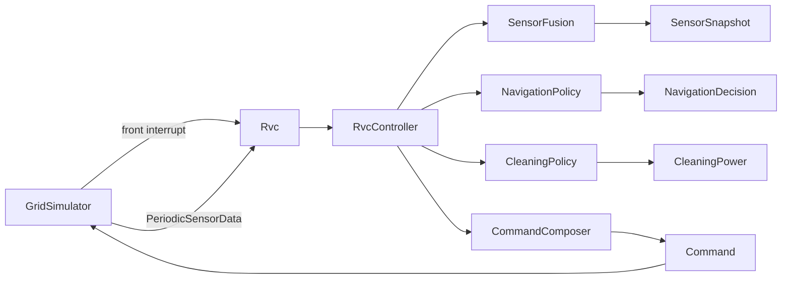
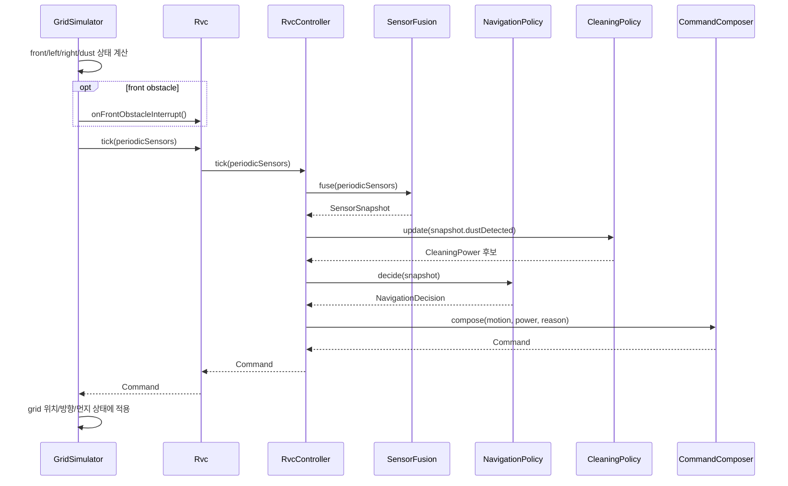

# RVC Software Design Description

## 1. Summary

이 설계는 RVC를 실제 로봇 전체 facade로 모델링한다. `Rvc`는 외부 API를 제공하고, 내부 `RvcController`는 감지 결합, 이동 판단, 청소 세기 판단, command 조립을 각각 별도 subsystem에 위임한다. `GridSimulator`는 검증 환경이며 격자 위치와 방향을 계속 소유한다.

## 2. Structural View

| Component | Responsibility |
| --- | --- |
| `Rvc` | 실제 로봇 전체 facade. 외부 요청을 controller로 전달하고 command를 반환한다. |
| `RvcController` | RVC 내부 control flow coordinator. running 상태를 관리하고 subsystem 결과를 조합한다. |
| `SensorFusion` | front interrupt pending 값과 periodic sensor data를 하나의 `SensorSnapshot`으로 만든다. |
| `NavigationPolicy` | `ControllerState`, 장애물 상태, 좌우 교대 회전 상태를 관리하며 `Motion`과 reason을 결정한다. |
| `CleaningPolicy` | dust boost tick 예산을 관리하고 `Normal` 또는 `Boost` 후보 세기를 결정한다. |
| `CommandComposer` | 전진 중에만 cleaner power를 허용하고 나머지 motion에서는 `Off`를 강제한다. |
| `GridSimulator` | map, robot grid position, grid direction, dust state를 소유한다. sensor 입력을 만들고 command를 적용한다. |

## 3. Interface View

| API | Input | Output | Notes |
| --- | --- | --- | --- |
| `Rvc::startCleaning()` | none | none | 자동 청소 상태로 진입한다. |
| `Rvc::stopCleaning()` | none | none | idle 상태로 돌아가고 boost 예산을 초기화한다. |
| `Rvc::onFrontObstacleInterrupt()` | none | none | 실행 중일 때만 front interrupt를 pending으로 기록한다. |
| `Rvc::tick(periodicSensors)` | `PeriodicSensorData` | `Command` | sensor fusion, navigation, cleaning, composition을 한 tick 수행한다. |
| `RvcController::decideNextCommand(snapshot)` | `SensorSnapshot` | `Command` | 기존 controller test 호환성을 위해 유지한다. |
| `GridSimulator::step(tick, includeFrame)` | tick, render flag | bool | sensor 값을 계산해 RVC에 전달하고 command를 환경에 적용한다. |

## 4. Runtime Flow

## 5. Design Rationale And SOLID

| Principle | Design Application |
| --- | --- |
| SRP | sensor fusion, navigation, cleaning policy, command composition이 각각 하나의 변경 이유를 가진다. |
| OCP | 새 sensor 결합 방식, 이동 정책, 청소 정책은 해당 subsystem 교체 또는 확장으로 다룬다. |
| LSP | simulator와 실제 actuator는 `Command` 계약을 기준으로 대체 가능하다. |
| ISP | `Rvc` facade는 start, stop, interrupt, tick만 노출한다. |
| DIP | RVC 내부 제어는 simulator 구체 타입이 아니라 `PeriodicSensorData`, `SensorSnapshot`, `Command` 같은 추상 값에 의존한다. |

## 6. Verification

| Test Group | Coverage |
| --- | --- |
| Controller tests | 기존 public controller 계약과 command 결과 회귀 검증 |
| Subsystem tests | `SensorFusion`, `NavigationPolicy`, `CleaningPolicy`, `CommandComposer` 단위 검증 |
| Facade tests | `Rvc`가 기존 controller 계약과 같은 최종 command를 반환하는지 검증 |
| System tests | `GridSimulator`가 위치/방향을 계속 소유하고 command 적용 결과가 기존과 같은지 검증 |
| CLI tests | 기존 CLI 옵션, scenario 실행, 로그 출력 회귀 검증 |
