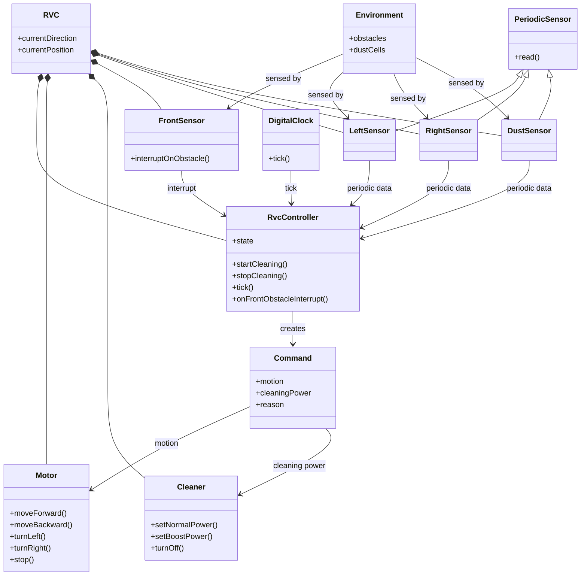
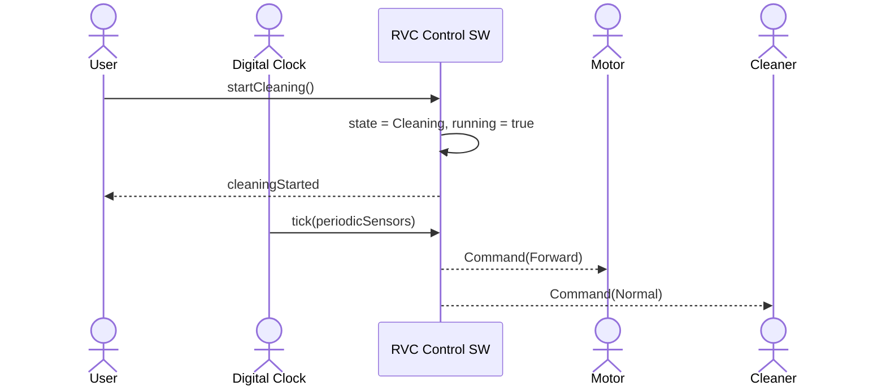
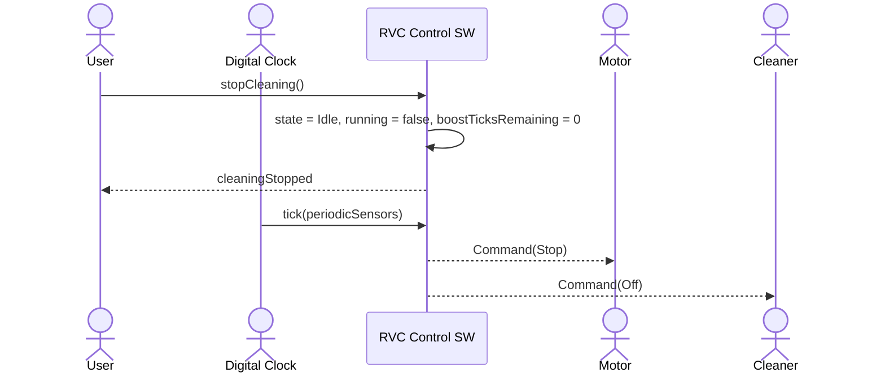
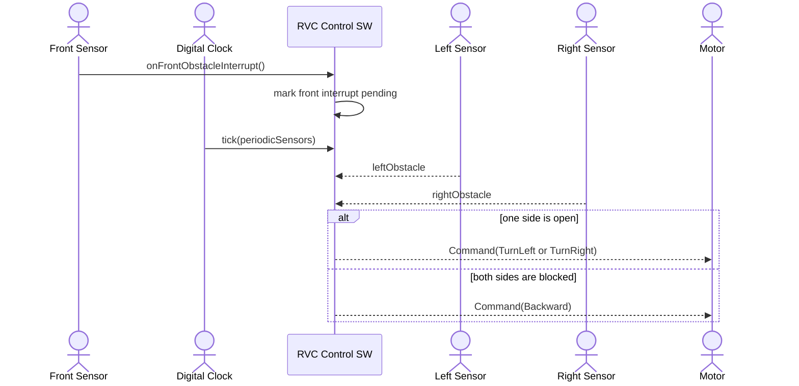
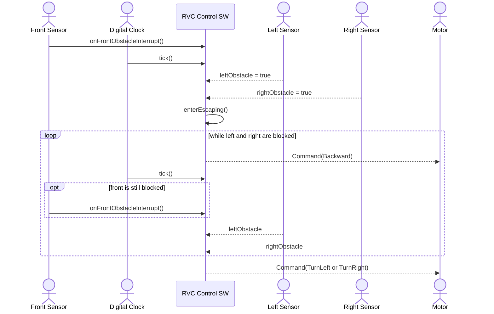
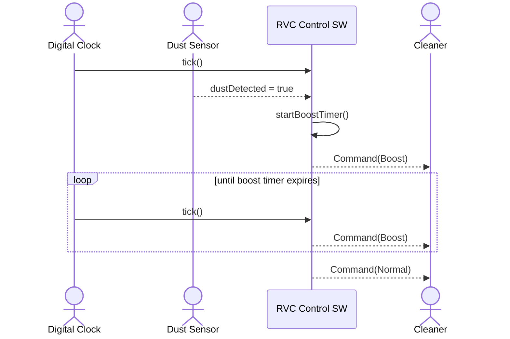
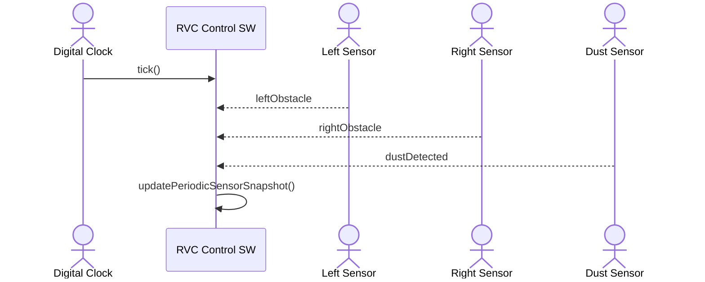

# RVC Control SW Software Requirements Specification

본 문서는 IEEE Std 830-1998의 SRS 구조를 기준으로 작성한다.

## 1. Introduction

### 1.1 Purpose

이 문서는 RVC(Robotic Vacuum Cleaner) 자동 청소 제어 소프트웨어의 Software Requirements Specification(SRS)을 정의한다. 요구사항은 `docs/rvc.pdf`의 원본 문제 정의, OOA 산출물, 현재 C++20 구현 및 테스트 가능한 CLI 시뮬레이터 범위를 기준으로 정리한다.

본 문서는 구현 방법이 아니라 시스템이 제공해야 할 외부 동작, 인터페이스, 기능 요구사항, 비기능 요구사항, 검증 기준을 명세한다.

### 1.2 Scope

[변경] 대상 시스템은 상위 객체 `Rvc`가 `RvcController`와 `RvcHardwareAdapter`를 소유하는 RVC 자동 청소 제어 소프트웨어이며, CLI 그리드 시뮬레이터는 이를 검증하기 위한 테스트 환경이다. 제어 소프트웨어는 adapter를 통해 추상화된 센서 입력을 받고 이동 및 청소 명령을 adapter에 적용한다.
[삭제] ~~대상 시스템은 RVC 자동 청소 제어 로직과 이를 검증하기 위한 CLI 그리드 시뮬레이터이다.~~

범위에 포함하는 항목은 다음과 같다.

- 자동 청소 시작 및 중지
- 전방 장애물 interrupt 처리
- 좌측, 우측, 먼지 센서의 periodic sampling
- 장애물 회피 및 막힌 영역 탈출
- 먼지 감지 시 boost 청소
- CLI 시뮬레이터를 통한 요구사항 검증

범위에 포함하지 않는 항목은 다음과 같다.

- 실제 모터 드라이버
- 실제 센서 하드웨어
- 배터리, 충전, 전원 관리
- 사용자 앱, 네트워크, 영구 저장소
- 물리적 모터 가속도, 센서 노이즈, 지도 작성 알고리즘

### 1.3 Definitions, Acronyms, and Abbreviations

| 용어 | 정의 |
| --- | --- |
| RVC | Robotic Vacuum Cleaner, 자동 청소 로봇 |
| Control SW | 센서 입력을 해석해 이동 및 청소 명령을 결정하는 제어 소프트웨어 |
| Rvc | [추가] `RvcController`와 `RvcHardwareAdapter`를 소유하는 RVC 상위 시스템 객체 |
| Controller | [변경] `RvcController`로 구현되는 핵심 제어 객체이며 concrete hardware 또는 simulator를 직접 소유하지 않는다. |
| Hardware Adapter | [추가] `RvcHardwareAdapter`로 표현되는 센서 입력 및 actuator command 적용 추상 인터페이스 |
| Simulated Hardware Adapter | [추가] `SimulatedHardwareAdapter`로 표현되는 그리드 기반 테스트용 hardware adapter |
| Simulator | [변경] `GridSimulator`로 구현되는 그리드 기반 검증 환경이며 `SimulatedHardwareAdapter`를 통해 테스트용 하드웨어 환경을 제공한다. |
| Tick | periodic 센서 값을 읽고 다음 명령을 결정하는 제어 주기 |
| Interrupt | 전방 장애물처럼 즉시 반응해야 하는 비동기 이벤트 |
| Periodic Sensor | tick마다 주기적으로 샘플링되는 센서 |
| Front Sensor | 전방 장애물 감지 센서이며 interrupt 방식으로 동작 |
| Left Sensor | 좌측 장애물 감지 센서이며 periodic 방식으로 동작 |
| Right Sensor | 우측 장애물 감지 센서이며 periodic 방식으로 동작 |
| Dust Sensor | 현재 위치의 먼지 감지 센서이며 periodic 방식으로 동작 |
| Cleaner | 일반 청소 또는 강화 청소를 수행하는 청소 장치 |
| Boost | 먼지 감지 후 일정 tick 동안 유지되는 강화 청소 세기 |
| Escaping | 전방, 좌측, 우측이 모두 막혔을 때 탈출을 위해 후진하는 상태 |
| OOA | Object-Oriented Analysis |
| SSD | System Sequence Diagram |

### 1.4 References

| 문서 | 설명 |
| --- | --- |
| IEEE Std 830-1998 | Software Requirements Specifications 작성 기준 |
| `docs/rvc.pdf` | 원본 RVC Control SW 요구사항 |
| `docs/requirements.md` | 유스케이스, 기능 요구사항, 비기능 요구사항, 핵심 제어 규칙 |
| `docs/ooa_domain_diagram.md` | OOA Domain Diagram |
| `docs/ooa_ssd.md` | OOA System Sequence Diagram 및 System Interface |
| `docs/sdd.md` | Software Design Description |
| `docs/traceability.md` | 요구사항, 설계, 테스트 추적성 |
| `include/rvc/*.hpp`, `src/*.cpp` | 현재 C++20 구현 |
| `tests/*.cpp` | GoogleTest 기반 단위 및 시스템 테스트 |

### 1.5 Overview

2장은 제품 관점, 주요 기능, 사용자와 외부 주체, 제약 및 가정을 설명한다. 3장은 외부 인터페이스, 기능 요구사항, 비기능 요구사항, 상태와 데이터, 제어 규칙을 명세한다. 부록은 OOA 분석 산출물, 검증 기준, 요구사항 추적성을 포함한다.

## 2. Overall Description

### 2.1 Product Perspective

RVC Control SW는 센서 입력과 사용자 요청을 받아 actuator 명령을 생성하는 제어 소프트웨어이다. [변경] `Rvc`는 사용자 요청과 `RvcHardwareAdapter` 입력을 받아 `RvcController`에 전달하고, controller가 반환한 motor motion과 cleaner power command를 adapter에 적용한다. 전방 장애물은 interrupt로 전달되고, 좌측/우측/먼지 센서는 제어 tick마다 periodic 데이터로 전달된다.

[변경] 시뮬레이터는 실제 하드웨어가 아니라 요구사항 검증을 위한 외부 환경이다. `GridSimulator`는 `SimulatedHardwareAdapter`를 구성해 지도에서 센서 값을 생성하고, `Rvc`가 adapter에 적용한 command 결과를 로그와 실행 결과로 만든다.
[삭제] ~~시뮬레이터는 지도에서 센서 값을 생성하고, controller가 반환한 command를 적용해 로그와 실행 결과를 만든다.~~

#### 2.1.1 OOA Domain Model

다음 도메인 모델은 문제 영역의 개념과 외부 주체 사이의 관계를 표현한다. `Motor`, `Cleaner`, sensor 항목은 도메인 개념이며 C++ 구현 클래스를 의미하지 않는다.



### 2.2 Product Functions

시스템은 다음 주요 기능을 제공해야 한다.

- 사용자의 자동 청소 시작 및 중지 요청을 처리한다.
- 전방 장애물 interrupt를 수신하면 즉시 회피 판단으로 전환한다.
- 좌측, 우측, 먼지 센서 값을 tick마다 주기적으로 샘플링한다.
- 전방 장애물 상황에서 열린 좌측 또는 우측 방향으로 회전한다.
- 좌우가 모두 열린 경우 좌우 회전 방향을 번갈아 선택한다.
- 전방, 좌측, 우측이 모두 막힌 경우 `Escaping` 상태로 전환하고 후진 명령을 지속한다.
- 먼지 감지 시 설정된 tick 동안 청소 세기를 `Boost`로 유지한다.
- [변경] CLI 시뮬레이터를 통해 `Rvc`와 `SimulatedHardwareAdapter` 기반 지도, 센서, 명령, 위치, 방향, 청소 결과를 검증한다.

### 2.3 User Characteristics

| 주체 | 특성 및 역할 |
| --- | --- |
| User | 자동 청소 시작 또는 중지를 요청한다. 내부 제어 상태나 센서 구조를 직접 다루지 않는다. |
| Tester | CLI 시뮬레이터와 테스트 코드를 통해 요구사항 충족 여부를 검증한다. |
| Front Sensor | 전방 장애물을 interrupt 이벤트로 알린다. |
| Left Sensor | 좌측 장애물 상태를 주기적으로 제공한다. |
| Right Sensor | 우측 장애물 상태를 주기적으로 제공한다. |
| Dust Sensor | 먼지 감지 상태를 주기적으로 제공한다. |
| Digital Clock | tick 기반 제어 주기를 제공한다. |
| Motor | `Forward`, `Backward`, `TurnLeft`, `TurnRight`, `Stop` 명령을 수행한다. |
| Cleaner | `Off`, `Normal`, `Boost` 청소 세기를 수행한다. |

### 2.4 Constraints

- 전방 센서는 interrupt 방식으로 처리해야 한다.
- 좌측 센서, 우측 센서, 먼지 센서는 periodic 방식으로 처리해야 한다.
- 핵심 제어 로직은 하드웨어와 직접 결합되지 않아야 한다.
- 컨트롤러의 판단은 동일 입력에 대해 결정적이어야 한다.
- 프로젝트는 CMake와 C++20로 빌드되어야 한다.
- 단위 테스트는 GoogleTest 기반이어야 한다.
- 문서와 소스 파일은 UTF-8 인코딩을 사용해야 한다.

### 2.5 Assumptions and Dependencies

- 사용자의 자동 청소 시작 요청은 `startCleaning()` 호출로 추상화한다.
- 사용자의 자동 청소 중지 요청은 `stopCleaning()` 호출로 추상화한다.
- 전방 장애물 interrupt는 `onFrontObstacleInterrupt()` 호출로 추상화한다.
- tick마다 좌측, 우측, 먼지 센서 값이 `PeriodicSensorData`로 제공된다.
- [추가] `Rvc`는 `RvcHardwareAdapter`에서 interrupt와 periodic sensor 값을 읽고, `RvcController`의 command를 adapter에 적용한다.
- [추가] 검증 환경에서는 `SimulatedHardwareAdapter`가 `RvcHardwareAdapter` 계약을 구현한다.
- 실제 하드웨어의 물리적 지연, 모터 가속도, 센서 노이즈, 배터리 상태는 본 SRS의 범위 밖이다.
- 시뮬레이터에서 지도 밖 영역은 장애물로 간주한다.

### 2.6 Apportioning of Requirements

향후 실제 하드웨어 연동, 사용자 앱, 배터리 관리, 지도 작성 기능은 본 버전의 요구사항에 포함하지 않는다. 현재 버전은 추상화된 controller API와 CLI 시뮬레이터 검증에 초점을 둔다.

## 3. Specific Requirements

### 3.1 External Interface Requirements

#### 3.1.1 User Interfaces

| 인터페이스 | 설명 | 기대 결과 |
| --- | --- | --- |
| 청소 시작 | 사용자가 자동 청소를 시작한다. | 컨트롤러가 `Cleaning` 상태가 되고 cleaner가 켜진 전진 청소 명령을 생성한다. |
| 청소 중지 | 사용자가 자동 청소를 중지한다. | 컨트롤러가 `Idle` 상태가 되고 motor는 정지, cleaner는 off가 된다. |

#### 3.1.2 Hardware Interfaces

본 SRS는 실제 하드웨어 드라이버를 정의하지 않는다. 다만 다음 추상 hardware interface 의미를 요구한다.

| 입력 또는 출력 | 방식 | 데이터 | 설명 |
| --- | --- | --- | --- |
| 전방 장애물 | Interrupt | `frontObstacle` | 전방 장애물이 감지되면 즉시 컨트롤러에 이벤트를 전달한다. |
| 좌측 장애물 | Periodic | `leftObstacle` | tick마다 좌측 방향의 장애물 여부를 제공한다. |
| 우측 장애물 | Periodic | `rightObstacle` | tick마다 우측 방향의 장애물 여부를 제공한다. |
| 먼지 감지 | Periodic | `dustDetected` | tick마다 현재 위치의 먼지 감지 여부를 제공한다. |
| Motor command | Actuator output | `motion` | 이동, 회전, 정지 명령을 수행한다. |
| Cleaner command | Actuator output | `cleaningPower` | 청소 장치 세기를 수행한다. |

#### 3.1.3 Software Interfaces

| API | 설명 |
| --- | --- |
| `Rvc::startCleaning()` | [추가] 사용자 시작 요청을 RVC 상위 객체로 받아 controller에 전달한다. |
| `Rvc::stopCleaning()` | [추가] 사용자 중지 요청을 RVC 상위 객체로 받아 controller에 전달한다. |
| `Rvc::tick()` | [추가] `RvcHardwareAdapter`에서 sensor/event를 읽고 `RvcController`가 반환한 `Command`를 adapter에 적용한다. |
| `RvcController::startCleaning()` | 자동 청소를 시작한다. |
| `RvcController::stopCleaning()` | 자동 청소를 중지하고 boost 잔여 tick을 초기화한다. |
| `RvcController::onFrontObstacleInterrupt()` | 실행 중 전방 장애물 interrupt를 기록한다. |
| `RvcController::tick(const PeriodicSensorData&)` | periodic 센서 값을 받아 다음 명령을 반환한다. |
| `RvcController::readPeriodicSensors(const PeriodicSensorData&)` | 전방 interrupt 상태와 periodic 센서 값을 하나의 snapshot으로 결합한다. |
| `RvcController::decideNextCommand(const SensorSnapshot&)` | 센서 snapshot을 기반으로 다음 명령을 결정한다. |
| `RvcHardwareAdapter::hasFrontObstacleInterrupt()` | [추가] 전방 장애물 interrupt 여부를 제공한다. |
| `RvcHardwareAdapter::readPeriodicSensors()` | [추가] 좌측, 우측, 먼지 periodic sensor 값을 제공한다. |
| `RvcHardwareAdapter::applyCommand(const Command&)` | [추가] motor/cleaner command를 하드웨어 또는 테스트 환경에 적용한다. |
| `GridSimulator::run(int, bool)` | [변경] 지정된 tick 수만큼 `Rvc`와 `SimulatedHardwareAdapter` 기반 시뮬레이션을 실행한다. |
| `GridSimulator::loadScenario(const std::filesystem::path&)` | 시나리오 파일을 읽어 tick 수와 지도 정보를 구성한다. |

컨트롤러는 매 tick마다 다음 형태의 `Command`를 생성한다.

| 출력 | 값 | 설명 |
| --- | --- | --- |
| `motion` | `None`, `Stop`, `Forward`, `Backward`, `TurnLeft`, `TurnRight` | 모터 이동 또는 회전 명령 |
| `cleaningPower` | `Off`, `Normal`, `Boost` | 청소 장치 세기 |
| `reason` | 문자열 | 명령 결정 사유를 설명하는 디버그 및 로그용 메시지 |

#### 3.1.4 Communications Interfaces

본 시스템은 네트워크 또는 외부 통신 프로토콜을 요구하지 않는다. CLI 시뮬레이터는 표준 입력이 아니라 command line argument와 scenario file을 사용한다.

실행 형식은 다음과 같다.

```powershell
rvc_simulator [--ticks N] [--scenario FILE] [--quiet-map]
```

| 옵션 | 설명 |
| --- | --- |
| `--help`, `-h` | 사용법을 출력하고 종료한다. |
| `--ticks N` | 실행할 제어 tick 수를 지정한다. |
| `--scenario FILE` | 지정한 시나리오 파일을 로드한다. |
| `--quiet-map` | 초기/최종 지도와 tick별 frame 출력을 생략하고 로그 중심으로 출력한다. |

#### 3.1.5 Scenario File Format

시나리오 파일은 선택적 tick 설정과 지도 섹션으로 구성된다.

```text
ticks=10
map:
##########
#..*.....#
#.>..*#..#
##########
```

| 문자 | 의미 |
| --- | --- |
| `#` | 장애물 |
| `.` | 빈 칸 |
| `*` | 먼지 |
| `R` | 북쪽을 바라보는 로봇 |
| `^` | 북쪽을 바라보는 로봇 |
| `>` | 동쪽을 바라보는 로봇 |
| `v` | 남쪽을 바라보는 로봇 |
| `<` | 서쪽을 바라보는 로봇 |

시나리오 지도에는 로봇이 정확히 하나 있어야 한다. 지도 섹션이 없거나 로봇이 없거나 로봇이 둘 이상이면 오류로 처리한다.

#### 3.1.6 Log Output Format

시뮬레이터는 tick마다 다음 정보를 포함하는 로그를 출력한다.

| 필드 | 설명 |
| --- | --- |
| `tick` | 현재 제어 tick 번호 |
| `frontInterrupt` | 전방 장애물 interrupt 발생 여부 |
| `leftPeriodic` | 좌측 periodic 센서 상태 |
| `rightPeriodic` | 우측 periodic 센서 상태 |
| `dustPeriodic` | 먼지 periodic 센서 상태 |
| `motion` | 컨트롤러가 생성한 이동 명령 |
| `cleaner` | 컨트롤러가 생성한 청소 세기 |
| `position` | 명령 적용 후 로봇 위치 |
| `direction` | 명령 적용 후 로봇 방향 |
| `cleaned` | 누적 청소 먼지 수 |
| `reason` | 명령 결정 사유 |

실행 종료 시 summary는 실행 tick 수, 청소된 먼지 수, 남은 먼지 수, 최종 위치, 최종 방향을 포함해야 한다.

### 3.2 Functional Requirements

#### 3.2.1 UC-01 Start Automatic Cleaning / SSD-01

| 항목 | 내용 |
| --- | --- |
| 주요 주체 | User |
| 목표 | RVC가 자동 청소를 시작한다. |
| 사전 조건 | 제어 소프트웨어가 초기화되어 있다. |
| 기본 흐름 | 사용자가 청소 시작을 요청하면 시스템은 `Cleaning` 상태로 전환하고 cleaner를 켠 상태로 전진 청소를 시작한다. |
| 사후 조건 | RVC는 자동 청소 상태가 된다. |



#### 3.2.2 UC-02 Stop Automatic Cleaning / SSD-06

| 항목 | 내용 |
| --- | --- |
| 주요 주체 | User |
| 목표 | RVC가 자동 청소를 중지한다. |
| 사전 조건 | RVC가 자동 청소 중이다. |
| 기본 흐름 | 사용자가 청소 중지를 요청하면 시스템은 motor를 정지하고 cleaner를 끈다. |
| 사후 조건 | RVC는 `Idle` 상태가 된다. |



#### 3.2.3 UC-03 Avoid Front Obstacle / SSD-02

| 항목 | 내용 |
| --- | --- |
| 주요 주체 | Front Sensor |
| 목표 | 전방 장애물 감지 시 충돌 없이 회피한다. |
| 사전 조건 | RVC가 자동 청소 중이다. |
| 기본 흐름 | 전방 센서가 interrupt를 발생시키면 시스템은 즉시 전진을 중단하고 좌측/우측 periodic 센서 값을 기준으로 열린 방향을 선택한다. |
| 대안 흐름 | 좌우가 모두 열려 있으면 이전 선택과 반대 방향을 선택하여 좌우를 번갈아 회전한다. |
| 사후 조건 | RVC는 장애물을 회피하고 청소를 계속한다. |



#### 3.2.4 UC-04 Escape From Blocked Area / SSD-05

| 항목 | 내용 |
| --- | --- |
| 주요 주체 | Front Sensor, Left Sensor, Right Sensor |
| 목표 | 전방, 좌측, 우측이 모두 막힌 상황에서 탈출 가능한 상태까지 이동한다. |
| 사전 조건 | RVC가 자동 청소 중이며 전방, 좌측, 우측이 모두 막혀 있다. |
| 기본 흐름 | 시스템은 `Escaping` 상태로 전환하고 좌측 또는 우측 측면 탈출구가 열릴 때까지 후진 명령을 지속한다. |
| 사후 조건 | 탈출 가능해지면 열린 측면 방향으로 회전하고 청소를 계속할 수 있는 상태로 복귀한다. |



#### 3.2.5 UC-05 Boost Cleaning On Dust / SSD-04

| 항목 | 내용 |
| --- | --- |
| 주요 주체 | Dust Sensor |
| 목표 | 먼지 감지 구간에서 청소 세기를 높인다. |
| 사전 조건 | RVC가 자동 청소 중이다. |
| 기본 흐름 | 먼지 센서가 먼지를 감지하면 시스템은 cleaner를 `Boost`로 설정하고 설정된 tick 동안 유지한다. |
| 사후 조건 | boost 시간이 만료되고 새 먼지가 감지되지 않으면 cleaner는 `Normal`로 복귀한다. |



#### 3.2.6 Periodic Sensor Sampling / SSD-03



#### 3.2.7 Functional Requirement Table

| ID | 요구사항 | 수용 기준 | 관련 항목 |
| --- | --- | --- | --- |
| FR-01 | System shall start automatic cleaning when requested. | `startCleaning()` 호출 후 컨트롤러는 실행 중 상태가 되고 다음 tick에서 청소 명령을 생성한다. | UC-01 |
| FR-02 | System shall stop motor and cleaner when cleaning is stopped. | `stopCleaning()` 호출 후 tick 결과는 `motion=Stop`, `cleaningPower=Off`가 된다. | UC-02 |
| FR-03 | System shall move forward while cleaning when no obstacle blocks the front direction. | 전방 interrupt가 없으면 `motion=Forward`, `cleaningPower=Normal` 또는 `Boost`를 반환한다. | UC-01 |
| FR-04 | Front obstacle detection shall be handled as an interrupt event. | 전방 장애물은 periodic 입력이 아니라 `onFrontObstacleInterrupt()` 이벤트로 컨트롤러에 전달된다. | UC-03 |
| FR-05 | System shall stop forward motion immediately when a front obstacle interrupt is received. | interrupt가 pending 상태인 tick에서 컨트롤러는 `Forward` 대신 회피, 회전, 또는 후진 명령을 반환한다. | UC-03 |
| FR-06 | Left, right, and dust sensors shall be sampled periodically on control tick. | `tick()`은 `PeriodicSensorData`의 좌측, 우측, 먼지 값을 사용하여 명령을 결정한다. | UC-03, UC-05 |
| FR-07 | If front is blocked and only left is open, System shall turn left. | `frontObstacle=true`, `leftObstacle=false`, `rightObstacle=true`이면 `motion=TurnLeft`를 반환한다. | UC-03 |
| FR-08 | If front is blocked and only right is open, System shall turn right. | `frontObstacle=true`, `leftObstacle=true`, `rightObstacle=false`이면 `motion=TurnRight`를 반환한다. | UC-03 |
| FR-09 | If front is blocked and both left and right are open, System shall choose turn direction by alternating left and right. | 동일 조건이 반복되면 첫 선택은 좌회전, 다음 선택은 우회전처럼 방향을 번갈아 반환한다. | UC-03 |
| FR-10 | If front, left, and right are all blocked, System shall enter `Escaping` state. | 세 방향이 모두 막힌 tick 이후 컨트롤러 상태는 `Escaping`이 된다. | UC-04 |
| FR-11 | In `Escaping` state, System shall keep moving backward until escape is possible. | `Escaping` 상태에서 좌우 측면이 계속 막혀 있으면 매 tick `motion=Backward`를 반환한다. | UC-04 |
| FR-12 | Escape shall be considered possible when at least one side direction is open. | `Escaping` 상태에서 좌측 또는 우측 중 하나 이상이 열리면 탈출 가능 상태로 판단한다. | UC-04 |
| FR-13 | After escape becomes possible, System shall turn toward an open side. | 열린 측면 방향으로 `TurnLeft` 또는 `TurnRight` 명령을 반환한다. | UC-04 |
| FR-14 | If dust is detected, System shall set cleaner power to boost for a configured number of ticks. | `dustDetected=true`인 tick에서 `cleaningPower=Boost`가 되고 `dustBoostTicks` 동안 유지된다. | UC-05 |
| FR-15 | If boost duration expires and no new dust is detected, System shall return cleaner power to normal. | 먼지가 새로 감지되지 않고 boost 잔여 tick이 끝나면 `cleaningPower=Normal`로 복귀한다. | UC-05 |
| FR-16 | Simulator shall render a grid map with robot, obstacle, dust, and empty cells. | 지도 출력은 로봇 방향 문자, `#`, `.`, `*`를 사용해 현재 상태를 표현한다. | VS-01 |
| FR-17 | Simulator shall log tick, sensor values, command, robot position, direction, and cleaning power. | 각 tick 로그는 센서 상태, motion, cleaner, position, direction, cleaned, reason을 포함한다. | VS-01 |
| FR-18 | [변경] Simulator shall exercise the same `RvcHardwareAdapter` contract as the production control SW. | 시뮬레이터는 `SimulatedHardwareAdapter`를 통해 `Rvc`가 controller와 adapter를 연결하는 흐름을 검증한다. [삭제] ~~시뮬레이터는 `RvcController`에 interrupt와 periodic 데이터를 전달하고 반환된 `Command`를 적용한다.~~ | VS-01 |

### 3.3 Performance Requirements

- 컨트롤러의 tick 판단은 단일 제어 주기 안에서 완료되어야 한다.
- 현재 범위에서는 실시간 deadline, memory limit, CPU limit을 정량적으로 요구하지 않는다.
- 같은 초기 상태와 같은 입력 순서에 대해 같은 command sequence가 생성되어야 한다.

### 3.4 Logical Database Requirements

본 시스템은 데이터베이스 또는 영구 저장소를 요구하지 않는다. 시나리오 파일과 실행 로그는 검증용 입출력으로만 사용한다.

### 3.5 Design Constraints

- 구현 언어는 C++20이다.
- 빌드 시스템은 CMake를 사용한다.
- 단위 테스트와 시스템 테스트는 GoogleTest 및 CTest 기반으로 수행한다.
- 센서 입력과 actuator 명령은 구조체와 enum으로 추상화되어야 한다.
- Controller logic은 concrete hardware 및 simulator 구현에 직접 의존하지 않아야 한다.

### 3.6 Software System Attributes

| ID | 요구사항 | 수용 기준 |
| --- | --- | --- |
| NFR-01 | Controller logic shall be independent from concrete hardware and simulator classes. | [변경] 핵심 제어 결정은 concrete hardware, simulator, adapter 구현 타입에 직접 의존하지 않는다. |
| NFR-02 | Controller shall be testable through deterministic inputs without real hardware. | 단위 테스트에서 `PeriodicSensorData`와 interrupt 호출만으로 동작을 검증할 수 있다. |
| NFR-03 | The project shall build with CMake and C++20. | `cmake -S . -B build` 및 CMake build 구성을 지원한다. |
| NFR-04 | Unit tests shall be written with GoogleTest. | 컨트롤러 단위 테스트는 GoogleTest 기반으로 작성된다. |
| NFR-05 | [변경] System tests shall exercise the RVC system through the simulator. | 시스템 테스트는 `GridSimulator`와 `SimulatedHardwareAdapter`를 통해 `Rvc`의 tick orchestration, 컨트롤러 명령, command 적용 결과를 검증한다. |
| NFR-06 | Sensor and actuator abstractions shall allow future sensor changes or additions. | 센서 입력과 명령 출력은 구조체와 enum으로 추상화되어 있다. |
| NFR-07 | CLI simulator output shall be human-readable for manual review. | 로그는 key-value 형식과 readable reason 문자열을 포함한다. |
| NFR-08 | Core control decisions shall be deterministic for repeatable tests. | 같은 초기 상태와 같은 입력 순서는 같은 명령 순서를 생성한다. |
| NFR-09 | Source files and documents shall be encoded in UTF-8. | 한글 문서가 깨지지 않아야 하며 UTF-8로 저장되어야 한다. |
| NFR-10 | The design shall follow SOLID principles where applicable. | 제어 로직, 시뮬레이션, 타입 정의가 역할별로 분리되어야 한다. |

### 3.7 State and Data Requirements

#### 3.7.1 Controller States

| 상태 | 설명 | 진입 조건 | 이탈 조건 |
| --- | --- | --- | --- |
| `Idle` | 청소하지 않는 대기 상태 | 초기 상태 또는 청소 중지 요청 | 청소 시작 요청 |
| `Cleaning` | 기본 자동 청소 상태 | 청소 시작, 전방이 열린 상태, 탈출 완료 | 전방 interrupt, 청소 중지 |
| `Avoiding` | 전방 장애물 회피를 위해 회전하는 상태 | 전방 interrupt 후 열린 좌/우 방향 존재 | 다음 tick에서 전방 상태에 따라 청소 또는 탈출 |
| `Escaping` | 세 방향 막힘 상황에서 후진하는 상태 | 전방, 좌측, 우측이 모두 막힘 | 좌측 또는 우측 중 하나 이상 열림 또는 청소 중지 |

#### 3.7.2 Core Data Types

| 타입 | 필드 또는 값 | 설명 |
| --- | --- | --- |
| `PeriodicSensorData` | `leftObstacle`, `rightObstacle`, `dustDetected` | tick마다 샘플링되는 센서 입력 |
| `SensorSnapshot` | `frontObstacle`, `leftObstacle`, `rightObstacle`, `dustDetected` | interrupt와 periodic 센서를 결합한 판단용 snapshot |
| `Command` | `motion`, `cleaningPower`, `reason` | 컨트롤러가 생성하는 actuator 명령 |
| `Motion` | `None`, `Stop`, `Forward`, `Backward`, `TurnLeft`, `TurnRight` | 이동 또는 회전 명령 종류 |
| `CleaningPower` | `Off`, `Normal`, `Boost` | cleaner 출력 세기 |
| `ControllerState` | `Idle`, `Cleaning`, `Avoiding`, `Escaping` | 컨트롤러 내부 상태 |
| `Position` | `row`, `col` | 시뮬레이터 내 로봇 좌표 |
| `Direction` | `North`, `East`, `South`, `West` | 시뮬레이터 내 로봇 방향 |

#### 3.7.3 Core Control Rules

1. 청소가 시작되면 RVC는 cleaner를 켠 상태로 전진 청소를 수행한다.
2. 전방 장애물이 감지되면 interrupt 이벤트로 처리하고 해당 tick에서 전진 명령을 내리지 않는다.
3. 좌측, 우측, 먼지 센서는 tick마다 periodic 데이터로 반영한다.
4. 전방이 막히고 좌측만 열려 있으면 좌회전한다.
5. 전방이 막히고 우측만 열려 있으면 우회전한다.
6. 전방이 막히고 좌측과 우측이 모두 열려 있으면 좌우를 번갈아 선택한다.
7. 전방, 좌측, 우측이 모두 막히면 `Escaping` 상태로 전환한다.
8. `Escaping` 상태에서는 측면 탈출구가 열릴 때까지 후진 명령을 지속한다.
9. 탈출 가능 조건은 좌측 또는 우측 중 하나 이상이 열린 상태이다.
10. 탈출 가능해진 뒤 열린 측면 방향으로 회전한다.
11. 먼지가 감지되면 `dustBoostTicks`만큼 `Boost`를 유지한다.
12. boost 유지 시간이 끝나고 새 먼지가 감지되지 않으면 `Normal`로 복귀한다.

## Appendix A. OOA Analysis Summary

### A.1 Domain Concepts

| Concept | Responsibility |
| --- | --- |
| RVC | 물리적 로봇 청소기 전체를 의미한다. |
| Rvc | [추가] controller와 hardware adapter를 소유하는 소프트웨어 상위 객체이다. |
| RvcController | [변경] 센서 입력과 interrupt를 기반으로 motor/cleaner 명령을 결정하며 hardware adapter를 직접 소유하지 않는다. |
| RvcHardwareAdapter | [추가] 전방 interrupt, periodic sensor 읽기, command 적용을 추상화한다. |
| SimulatedHardwareAdapter | [추가] 격자 환경에서 `RvcHardwareAdapter` 계약을 구현하는 테스트용 adapter이다. |
| FrontSensor | 전방 장애물을 interrupt로 알린다. |
| LeftSensor | 좌측 장애물 상태를 periodic 방식으로 제공한다. |
| RightSensor | 우측 장애물 상태를 periodic 방식으로 제공한다. |
| DustSensor | 현재 위치의 먼지 감지 상태를 periodic 방식으로 제공한다. |
| DigitalClock | 제어 tick을 발생시킨다. |
| Motor | 전진, 후진, 좌회전, 우회전, 정지 동작을 수행한다. |
| Cleaner | normal power, boost power, off 상태를 수행한다. |
| Environment | 장애물과 먼지가 있는 청소 공간이다. |
| Command | controller가 actuator에 전달하는 추상 명령이다. |

### A.2 Important Domain Rules

- FrontSensor는 polling 대상이 아니라 interrupt source이다.
- LeftSensor, RightSensor, DustSensor는 DigitalClock tick에 맞춰 sampling된다.
- [변경] RvcController는 sensor와 actuator의 구체 구현을 알지 않는다.
- [추가] Rvc는 RvcHardwareAdapter 추상 계약을 통해 sensor 입력과 actuator 출력을 연결한다.
- [추가] GridSimulator는 SimulatedHardwareAdapter를 통해 테스트용 외부 세계를 제공한다.
- `Escaping` 상태에서는 후방 센서 없이 backward command를 반복한다.
- Simulator의 Environment는 실제 하드웨어가 아니라 테스트용 외부 세계이다.

### A.3 System Operations

| Operation | Related FR | Notes |
| --- | --- | --- |
| `Rvc::startCleaning()` | FR-01, FR-03 | [추가] 사용자 시작 요청을 controller에 위임한다. |
| `Rvc::stopCleaning()` | FR-02 | [추가] 사용자 중지 요청을 controller에 위임한다. |
| `Rvc::tick()` | FR-04 to FR-18 | [추가] adapter에서 sensor/event를 읽고 controller command를 adapter에 적용한다. |
| `startCleaning()` | FR-01, FR-03 | 실행 상태를 시작하며 실제 전진/청소 명령은 다음 `tick()`에서 생성된다. |
| `stopCleaning()` | FR-02 | 실행 상태와 boost timer를 초기화하며 다음 `tick()`에서 `Stop`/`Off` command가 생성된다. |
| `onFrontObstacleInterrupt()` | FR-04, FR-05 | interrupt는 다음 `tick()`보다 먼저 들어올 수 있다. |
| `tick(periodicSensors)` | FR-06 | Digital Clock의 제어 주기마다 호출된다. |
| `decideNextCommand(snapshot)` | FR-07 to FR-15 | 회피, 탈출, boost 규칙을 포함한다. |

## Appendix B. Verification Criteria

### B.1 Build and Test Commands

프로젝트 검증은 다음 명령을 기준으로 수행할 수 있다.

```powershell
cmake -S . -B build
cmake --build build --config Debug
ctest --test-dir build -C Debug --output-on-failure
```

### B.2 Unit Test Criteria

| 테스트 | 검증 요구사항 |
| --- | --- |
| `ControllerMovesForwardWhenPathIsClear` | FR-01, FR-03 |
| `StopCleaningReturnsStopAndOff` | FR-02 |
| `FrontInterruptTriggersImmediateAvoidance` | FR-04, FR-05 |
| `TurnsTowardOpenSide` | FR-07, FR-08 |
| `AlternatesWhenBothSidesAreOpen` | FR-09 |
| `AllBlockedEntersEscapingAndKeepsBackingUp` | FR-10, FR-11 |
| `EscapingIgnoresOpenFrontUntilSideOpens` | FR-12, FR-13 |
| `DustBoostLastsConfiguredTicks` | FR-14, FR-15 |
| `AvoidanceOutputStaysOffWhileBoostStateIsMaintained` | FR-05, FR-14, FR-15 |

### B.3 System Test Criteria

| 테스트 | 검증 요구사항 |
| --- | --- |
| `SimulatorCleansDustAndLogsCommands` | FR-14, FR-15, FR-17 |
| `SimulatorUsesBackwardEscape` | FR-10, FR-11, FR-18 |
| `SimulatorKeepsCommandingBackwardWhenBoxedIn` | FR-11 |
| `SimulatorKeepsBackingUpUntilSideExitOpens` | FR-11, FR-12, FR-13 |
| `SimulatorKeepsCleanerOffDuringBoostedEscape` | FR-10, FR-11, FR-14, FR-15 |
| `SimulatorTurnsAfterFrontInterrupt` | FR-04, FR-05, FR-08 |
| `SimulatorCliDefaultRuns` | FR-16, FR-17 |
| `SimulatorCliContinuousBackwardScenarioRuns` | FR-10, FR-11, FR-16, FR-17 |

### B.4 Manual Review Criteria

- 시뮬레이터 로그에서 전방 장애물 interrupt와 회피 명령이 같은 tick 흐름에서 확인되어야 한다.
- 먼지가 있는 칸에서 `dustPeriodic=detected`와 `cleaner=Boost`가 확인되어야 한다.
- 세 방향이 막힌 지도에서는 `motion=Backward`가 반복되어야 한다.
- `--quiet-map` 옵션을 사용하면 지도 frame 출력 없이 로그와 summary 중심으로 확인할 수 있어야 한다.
- 문서의 요구사항 ID와 테스트 추적성이 `docs/traceability.md`와 모순되지 않아야 한다.

### B.5 Verification Support Item

시뮬레이터 시나리오 실행은 RVC의 사용자 또는 센서 중심 유스케이스가 아니라 제어 소프트웨어 구현을 검증하기 위한 지원 기능으로 분리한다.

| ID | 목적 | 관련 요구사항 |
| --- | --- | --- |
| VS-01 | CLI 그리드 시뮬레이터로 컨트롤러 구현을 실행하고 지도 렌더링, tick 로그, production controller interface 사용 여부를 검증한다. | FR-16, FR-17, FR-18 |

## Appendix C. Requirements Traceability

### C.1 Requirement to Design Traceability

| Requirement | Use Case / Verification Item | OOA SSD | OOD SD | Class |
| --- | --- | --- | --- | --- |
| FR-01 | UC-01 | SSD-01 | SD-01 | `RvcController` |
| FR-02 | UC-02 | SSD-06 | SD-01 | `RvcController` |
| FR-03 | UC-01 | SSD-01 | SD-01, SD-04 | `RvcController`, `Command` |
| FR-04 | UC-03 | SSD-02 | SD-02 | `RvcController` |
| FR-05 | UC-03 | SSD-02 | SD-02, SD-04 | `RvcController`, `Command` |
| FR-06 | UC-03, UC-05 | SSD-03 | SD-03 | `PeriodicSensorData`, `SensorSnapshot` |
| FR-07 | UC-03 | SSD-02 | SD-04 | `RvcController` |
| FR-08 | UC-03 | SSD-02 | SD-04 | `RvcController` |
| FR-09 | UC-03 | SSD-02 | SD-04 | `RvcController` |
| FR-10 | UC-04 | SSD-05 | SD-05 | `RvcController` |
| FR-11 | UC-04 | SSD-05 | SD-05 | `RvcController` |
| FR-12 | UC-04 | SSD-05 | SD-05 | `SensorSnapshot` |
| FR-13 | UC-04 | SSD-05 | SD-05 | `RvcController` |
| FR-14 | UC-05 | SSD-04 | SD-06 | `RvcController` |
| FR-15 | UC-05 | SSD-04 | SD-06 | `RvcController` |
| FR-16 | VS-01 | SSD-03 | SD-01 | `GridSimulator` |
| FR-17 | VS-01 | SSD-03 | SD-01 | `GridSimulator`, `SimulationResult` |
| FR-18 | VS-01 | SSD-01 to SSD-05 | SD-01 | [변경] `Rvc`, `RvcHardwareAdapter`, `SimulatedHardwareAdapter`, `GridSimulator` |

### C.2 Requirement to Test Traceability

| Requirement | Test Case |
| --- | --- |
| FR-01, FR-03 | `ControllerMovesForwardWhenPathIsClear` |
| FR-02 | `StopCleaningReturnsStopAndOff` |
| FR-04, FR-05 | `FrontInterruptTriggersImmediateAvoidance`, `SimulatorTurnsAfterFrontInterrupt` |
| FR-07, FR-08 | `FrontInterruptTriggersImmediateAvoidance`, `TurnsTowardOpenSide`, `SimulatorTurnsAfterFrontInterrupt` |
| FR-09 | `AlternatesWhenBothSidesAreOpen` |
| FR-10, FR-11 | `AllBlockedEntersEscapingAndKeepsBackingUp`, `SimulatorUsesBackwardEscape`, `SimulatorKeepsCommandingBackwardWhenBoxedIn`, `SimulatorKeepsCleanerOffDuringBoostedEscape` |
| FR-12, FR-13 | `EscapingIgnoresOpenFrontUntilSideOpens`, `SimulatorKeepsBackingUpUntilSideExitOpens` |
| FR-14, FR-15 | `DustBoostLastsConfiguredTicks`, `AvoidanceOutputStaysOffWhileBoostStateIsMaintained`, `SimulatorCleansDustAndLogsCommands`, `SimulatorKeepsCleanerOffDuringBoostedEscape` |
| FR-16, FR-17, FR-18 | [변경] `SimulatorCleansDustAndLogsCommands`, `SimulatorUsesBackwardEscape`, `SimulatorKeepsBackingUpUntilSideExitOpens`, `SimulatorCliDefaultRuns`, `SimulatorCliContinuousBackwardScenarioRuns`는 `GridSimulator`와 `SimulatedHardwareAdapter`로 `Rvc` 흐름을 검증한다. |
